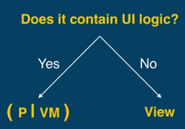

### Introduction
MVP is famous now, and a lot of developer knows about MVP. I also imported MVP to the project of our company. My colleagues are not receptive at first, but at last, they found out the beauty of MVP and were willing to use MVP. I'd really glad to see that. However, I found my colleagues are still have some confusion when they really write code about MVP. Today I will try to explain some typical questions about MVP.

### Question 01: Which parts belong to presenter?
We used to write view and controller in Activity/Fragment, and have a Model layer seperated. Now taking away the Model, if the code is logic code, it belongs to Presenter. On the other hand, if the code is refreshing/creating views, it should belongs to View.




### Question 02: Activity is Presenter or View?
Okay, that's really a good question. 

Most people treat Activity/Fragment as a View, and create a related Presenter with it. That's because Activity and fragment can use "findViewById()" and "onTouchEvent()", which seems like view code. By the way, Google's MVP sample is working this way too. 

But only Activity/Fragment has the "startActivity()" and "startActivityForResult()", so for some people, Activity/Fragment seems like a Controller to them. 

That's all because the Activity is designed not that great. Ideally, it should not contain both the view method and the controller method. But for us, the application developer, what should we do?

It's like "Vim & Emacs". I really can't say which way is great:
* Activity/Fragment is View, create a Presenter class to handle logic. 
* Activity/Fragment is Controller, create a View class to create and to refresh view
You can use either solution. But don't use both. Otherwise, the code of your project would be chaos.

### Question 03: Does Fragment needs a presenter?
That depends.

If your fragment is just like a View, which is not a full screen page, your fragment does not need a related Presenter.

If your activity has many scenarioes, and each scenario is a full screen fragment, then yes, your each fragment need different Presenter.

### Question 04: Does Adapter needs a presenter?
Normally, No. 

That's because we want to put the logic of one page together, that's easy for data access and modification. Adapter is nomarally for a AdapterView/ViewPager/RecyclerView. Just like what I said in the *Question 03*, a single View does not need a Presenter.

What if our adapter has logic to deal with? Say we have such logic in adapter:
```java

```

### Question 05: What if my presenter need Context object?

### Question 06: How to reuse code in Presenters?

### Question 07: How MVP make your code much more testable?


### A Typical Scenario
We now have a RecyclerView to show the data from back-end. The data from back-end is like this:
```
List<Country>
    Each "Country" class contains : List<Province>
```

Our RecyclerView need to show "Country-Province" in a grid layout. 


How could we deal with this kind of scenario with MVP?

Here is what we should do:
1. Create a UI-logic class, called "CellInfo"
2. Createa a Presenter for our Activity. (not for Adapter)
3. Activity call "presenter.getDataFromServer()"
4. Presenter.getDataFromServer() will go get the data. And in the callback, we will need to convert the List<Country> data to List<CellInfo>. In this case, each CellInfo is actually the value of "$country - $province".
5. After the conversion, presenter call "view.onRefrshList(cellInfoList)"
6. Activity.onRefreshList(List<CellInfo>):  pass the cellInfoList to the Adapter, so the Adapter only cares about showing the View, and do not care about the logic. 


### Reference
Here is [a really good video introducing MVP](https://www.youtube.com/watch?v=QrbhPcbZv0I). And the speaker really lead to to the wonderland of MV*(MVP/MVVM) one step by one step. I strongly recommend you watch this video.

