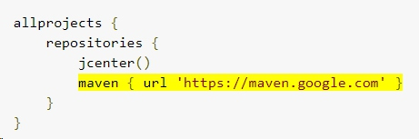

Google has released the Architecture Component library since Google I/O 2017. Now it's nearly half year since then. I think it's time to talk about it right now. Today I will focus on the lifecycle library.

### 1. Why I Think Fragment Is a Failure
Getting back to Year 2011, Google released its Android 3.0. The biggest change of Android 3.0 is that it supports tablet. The second biggest change of it is the Fragment.

The official concept of Fragment is "A fragment represents a behavior or a portion of user interface in an Activity." And this also points out what is bad about Fragment. It could a behavior, or it could be a part of UI. 

A class does more than one responsibility may the source of your problems.  A typical example of such a class is `Activity`. Activity could deal with touch event, it could deal with all the UI (findViewById, request full screen UI, ...), and it also could send Http request.  Normally our solution is MVP. MVP could decouple your code, separate the logic and UI, so your code could be testable, maintable, stable. 

Like I said , Activity has a tendency to couple logic and UI. The invention of Fragment did help Activity with it. Fragments only makes the problem smaller , as your Activity may contain a couple of Fragment, do not make this problem vanish. 

Of course, Fragemnt has other disadvantages. But for our architecture, Fragment can not help us improve our app. That's why I said Fragment is a failure.

### 2. The Beauty of the Lifecycle Library
Fourtunately, Google finally realized the tendency of couple logic and UI in the Activity, and release the Architect Component library. 

The Architect Component library actually is a collection of libraries: Lifecycle, Room, LiveData, and ViewModel. The lifecyle library is the brightest library in my eyes, and it exactly solve the coupling problem I just mentioned. 

Let's take a old code as an example. 
```java
public class FeatureListActivity extends Activity{
    @Override
    public void onResume(){
        // for featureA
        gcm.register(this);
        
        // for featureB
        FeatureBUtils.addObserver(this);
        
        // for featureC
        featureC.setContext(this);
        featureC.refreshAd();        
    }
    
    @Override
    public void onPause(){
        gcm.unregister(this);
        FeatureBUtils.removeObserver(this);
        featureC.setContext(null);
    }
}
```

Oh, this FeatureListActivity may contains a couple of new features, but the above code is quie ugly and coupling. Let's say now you want to modify some behavior in Feature C, now you need to find out all the code that related to Feature C in the Activity, and modify one or two of them very carefully.  

This is not good for the code, for the future. But how could we improve this?
Bingo! The lifecycle library. 


### 3. How to Use the Lifecycle Library?
Let's see how we could improve the above example.

**3.1 add the architect component library**
[project/build.gradle]
add the highlighted line



[project/app/build.gradle]
```java
compile "android.arch.lifecycle:runtime:1.0.0-alpha9"
compile "android.arch.lifecycle:extensions:1.0.0-alpha9"
annotationProcessor "android.arch.lifecycle:compiler:1.0.0-alpha9"
```

songzhw: you may find the version(alpha9) is out-of-date some time later, then you could [see this page to get the latest version number](https://developer.android.com/topic/libraries/architecture/adding-components.html).

**3.2 add a observer **
This class need to implement the LifecycleObserver interface. 
To help decouple the above Activity, we need three observers to implement FeatureA, FeatureB, and FeatureC.  Now we only show you the code of FeatureC.
```java
public class FeatureCLifecycleObserver implements LifecyleObserver {
    @OnLifecycleEvent(Lifecycle.Event.ON_RESUME)
    public void onResume(){
        featureC.setContext(this);
        featureC.refreshAd();     
    }

    @OnLifecycleEvent(Lifecycle.Event.ON_PAUSE)
    public void onPause(){
        featureC.setContext(null);    
    }
}
```
Quite simple and clear, right? This code only contains the lifecycle logic about the featureC, AKA, this class only does one job. Good for this class!

**3.3 modify the existing Activity**
Now your activity needs to extend [LifecycleActivity](https://developer.android.com/reference/android/arch/lifecycle/LifecycleActivity.html).

```java
public class FeatureListActivity extends Activity{
    @Override
    public void onCreate(Bundle b){
        ...
        
        FeatureCLifecycleObserver observerC = new FeatureCLifecycleObserver();
        
        LifecycleRegistry registry = this.getLifecycle();// this method is coming from LifecycleActivity
        registery.addObserver(observerA);
        registery.addObserver(observerB);
        registery.addObserver(observerC);
    }
}
```
That's it. Now you are good to go. By separte different feature code, our Activity seems much cleaner. Okay, I have to admit, this is not enough. You may have other questions about this library. 

### Question1: How About AppCompatActivity?
Google has announced, I quote, "Note: Since the Architecture Components are in alpha stage, Fragment and AppCompatActivity classes cannot implement it (because we cannot add a dependency from a stable component to an unstable API). Until Lifecycle is stable, LifecycleActivity and LifecycleFragment classes are provided for convenience. After the Lifecycles project is released, support library fragments and activities will implement the LifecycleOwner interface; LifecycleActivity and LifecycleFragment will be deprecated at that time. Also, see Implementing LifecycleOwner in custom activities and fragments."

That being said, Lifecycle only support FragmentActivity, but if you want to add the lifecycle library to an AppCompatActivity, there is no such an API to help you.

However, considering how LifecycleActivity does, we can create our own `LifecycleAppCompatActivity` by ourselves.

Here is the code of  [LifecycleActivity](https://developer.android.com/reference/android/arch/lifecycle/LifecycleActivity.html).:
``` java
import android.arch.lifecycle.LifecycleRegistry;
import android.arch.lifecycle.LifecycleRegistryOwner;

public class LifecycleActivity extends FragmentActivity implements LifecycleRegistryOwner {
    private final LifecycleRegistry mRegistry = new LifecycleRegistry(this);

    @Override
    public LifecycleRegistry getLifecycle() {
        return mRegistry;
    }
}
```

</p>
Oh, the LifecycleRegistry is an exposed API, I think we can take advantage of it. Now we could write own LifecycleAppCompatActivity :
```java
import android.arch.lifecycle.LifecycleRegistry;
import android.arch.lifecycle.LifecycleRegistryOwner;
import android.support.v7.app.AppCompatActivity;

public class LifecycleAppCompatActivity extends AppCompatActivity implements LifecycleRegistryOwner {
    private final LifecycleRegistry mRegistry = new LifecycleRegistry(this);

    @Override
    public LifecycleRegistry getLifecycle() {
        return mRegistry;
    }
}
```

Then, if you want to use Lifecycle library, you could make your AppCompatActivity extends LifecycleAppCompatActivity
```java
public class FeatureListActivity extends LifecycleAppCompatActivity {
    ...
}
```


### Question2: How to deal with onRequestPermissionResult()
You may need deal with permission request in your LifecycleObserver. Location-related feature is an example. You need to register/unregister googleApiClient, and also you need to request the FINE_LOCATION permission. 

If this is the case, then I suggest we could delegate this permission to the obervers.
Here is the code.
```java
[Activity]
    @Override
    public void onRequestPermissionsResult(int requestCode, @NonNull String[] permissions, @NonNull int[] grantResults) {
        lifecycleObserver.onRequestPermissionResult();
    }
```

```java
[LifecycleObserver]
public void onRequestPermissionResult(){
    // TODO compare the requestCode and resultCode, do your jobs here
}
```
The reason why lifecycle logic and permission code are coupled together is, take location request as an example, your Activity actually don't care these details. And request the FINE_LOCATION permission is actually a part of location logic. So they should be put together. 


### Question3: How is it compatible with MVP?
Great question!

Lifecycle library is great. It helps us decoupled different logic. But you still should not put UI and logic code to the lifecycleObserver. If you did this, then your lifecycleObserver is just another coupled God Class.

What you should to do is that you put the logic code to the presenter, and refresh UI in Activity. That being said, you may need have a lifecycleObserver that takes Activity and Presenter as its fields. Just like this:
```java
public class MyFeatureCLifecycleObsever implements LifecycleObserver {
    private MyActivity view;
    private MyPresenter presenter;
    
    public MyFeatureCLifecycleObsever(MyActivity view, MyPresenter presenter){
        this.view = view;
        this.presenter = presenter;        
    }
}
```

Be careful, and don't make your lifecycleObserver class another God Class!


