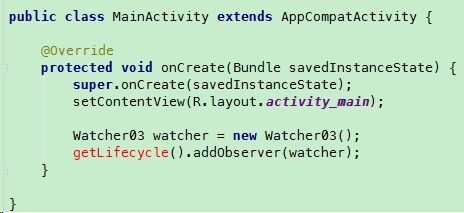

Google had released a stable version of the lifecycle library. Here is something you need to know if you are still using the alpha or beta version. 

### 1. No More LifecycleActivity
LifecycleActivity is a subclass of FragmentActivity, and therefore the lifecycle library does not support AppCompativity and Fragment back then. 

But LifecycleActivity is deprecated in the stable 1.0.0 version.  Now you should use AppCompatActivity. Because the AppCompatActivity implements the LifeOwner interface now, and it can replace the old LifecycleActivity.

### 2. AppCompatActivity is good for you?
I did what the google suggests, and replace the LifecycleActivity with AppCompatActivity. But the getLifecycle() method does not exist:


You see, the `getLifecycle()` turns to red, which means Android Studio spot a compile error. 

Then I realized there must be the version issue. The AppCompatActivity I used before is from version 25.3.1.  So I tried to update the version from 25.3.1 to 25.4.0, 26.0.0, 26.0.1, 26.0.2, but the getLifecycle() method is still missing in the AppCompatActivity. After I bumped the version number to 26.1.0, the AppCompatActivity finally has the getLifecycle() method. What a relief!

So here is the conclusion. Not any AppCompatActivity has the functionality of lifecycle library. To use the latest stable lifecycle library, you have to update the support:appcompat-v7 to version 26.1.0.

```groovy
implementation 'com.android.support:appcompat-v7:26.1.0'
```


