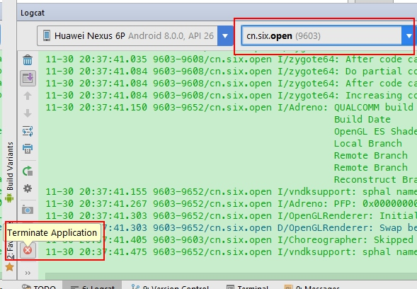

## 1. Introduction
ViewModel 1.0.0 stable version is released at the begining of November. I happened to make a page that support the screen rotation, so I dug it a littler deeper.

At first, I found it is amazing to tell the difference between a normal destory of one activity and that kind of
destory due to configuration change. . And LiveData could have a observer? Hello, this is a typical MVVM architecture. I can see myself happily coding MVVM in the world of ViewModel and LiveData.

But when I dug a little deeper, I found out a couple of issues that makes me uncomfortable.

## 2. ViewModel: Couldn't save data when necessary
The reason of using ViewModel is that it can save and restore data in a configuration change (i.e. screen rotation, system language change). I am not satisfied with that. So I was wondering, could the data in a ViewModel class survive the kill of one app?

Let's get our hands dirty and code a bit. The following code save a custom class(`User`) in the static and also in a ViewModel.

```java
public class SameVm {
    public static User user;
}

public class ZeroViewModel extends ViewModel {
    public User user;
}
```

And the Activity.onCreate() is trying to get the data

```java
   vm = ViewModelProviders.of(this).get(ZeroViewModel.class);
   System.out.println("szw vm.user = " + vm.user);
```

Then I rotated the screen, the data in `SameVm` and `ZeroViewModel` are as same as the original one.
Finally, I pressed home to bring the app to the stack, then terminated the app through Android Studio, then brought the app back. What happened?
The user in `SameVm` and `ZeroVm` are both `null` !!!

So now you should understand my point. I expected the data in a ViewModel could survive configuration change and app termination. But it does not.  It only survive the configuration change. 

This pictures shows how to ternimate an app in Android Studio. (First select the process, then click the "terminate application" button.)




