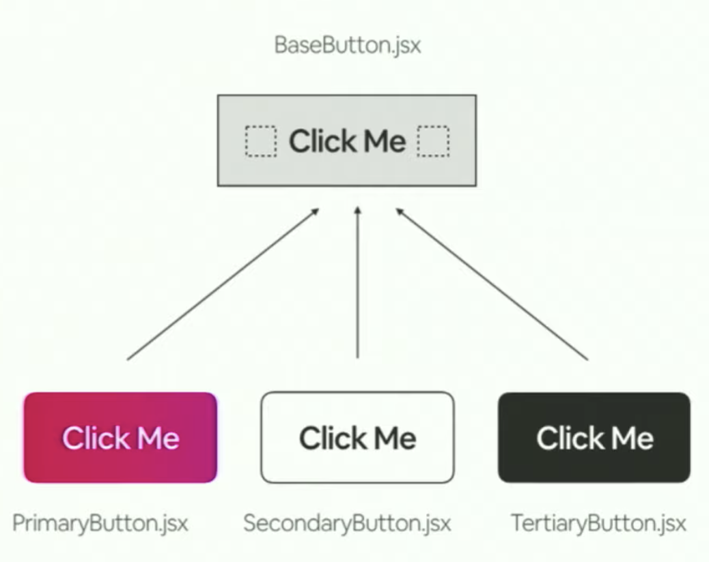
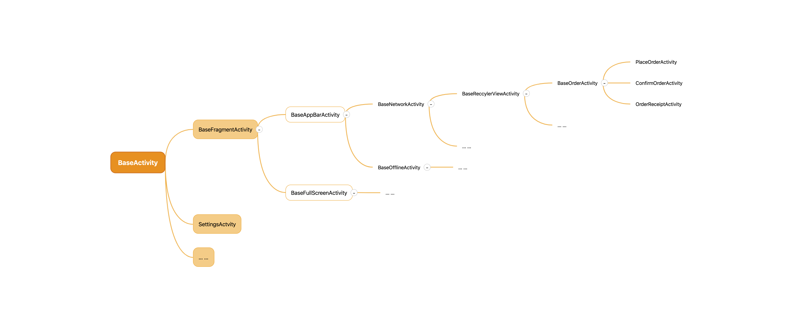

Last week, I just watched one technical video presented by two Airbnb employees. I have to say I am a little disappointment at their architecture choice. And I'm afraid many people might do the same bad choice, so this post is trying to explain what it is, and why it is bad.

## 1. The technical video to introduce Airbnb's architecture
First of all, the video I watched is a React video that Airbnb is explaining they roadmap of architecture change. However, the ideas are actually common, so it applies to Android as well. 

## Airbnb v1.0
The first approach Airbnb was using is the plain js. Just like this, `<button className="alpaca/cat">Click me </button>`.
The problem of course is the style info are piled up in the .css files, which make the css become more and more fat.


## Airbnb v2.0
So Airbnb managed to change this style to one type-specific design. Also, they import the "css-in-js" to the code as well. Take the previous `<button/>` for example, they remove the `className` attribute, and add some more meaningful attributes. Let's say, they change the button to `<button isAlpaca={true/false}>Click me</button>`.

I've done something like that before. The problem of this design is the flexibility. What if you have more types, like `isCat`, `isDog`, `isWhale`... , the possibility is endless. So this kind of design is hard to expand in the future. 

And that was exactly what Airbnb ended up with. Their `Button.jsx` files extremely increased from 1KB to 33KB. 

## Airbnb v3.0
To fix the previous issue, Airbnb re-design their code. This time they had a new idea: inheritance. 
For any different type of Button, they should have something common. Okay, then we could extract all these common thigns and form them as a parent class: `BaseButton`. Then each type of button could be a child class of `BaseButton`. 



Now the world is so peaceful. All different type of button have their own class and file. You can just call some specific child button, that's it!  But, is it?

## 2. Why this design is bad
If you are an Android developer, the previous code might bore you. If this is the case, then you can just think of this scenario:

```
            BaseButton.java
PurpleButton.java    CircleButton.java    RippleButton.java
RoundCornerButton.java                    ShrinkButton.java
...
```
How could you react?

### 1. it violate OCP
The first thing cames to my head is: this seems kind of burdensome in the future. Every time I need a new type (I'm sure you would in the future), I had to write a new class for it. And I have to maintain a list of Button files, in case I can remove some when it's not used anymore.


### 2. it is fragile
Let's say when you are asked to modify one behavior of `PurpleButton`. It might be common for buttons, so you decide to do it in the `BaseButton.java`. After you're done, you might want to re-check every button, to make sure you don't break something.

I know, unit test might help you in these refactoring cases. But unit test is not a silver bullet. For styles, or anything related to UI, unit tests might not cover them at all. 

In short, since this is a `parent-child` architecture, you now have to pay attention to your refactoring. Your change for one class might affect all the other files. It's very fragile


### 3. it is hard to expand
As I mentioned before, I had to write one new class if I had a new type. This is not the only thing you have to handle when it comes to expanding your class. 

Let's say, I had a Button system:

```
               BaseButton
           ↗        ↑           ↖
ConfirmButton  CancelButton   DefaultButton
```

Now the UX is inspired by some app and decideds to make all the ConfirmButton and CancelButton to have a round corner. 

You see, now this new feature(let's call it as `RoundCorner feature`), but it's not for all children. So I can not add it to the `BaseButton.java`. On the other hand, it's something both ConfirmButton and CancelButton have, so it can't be added to each class, otherwise we would have duplicate code.

A more common way to handle this is to add another layer - another parent for both ConfirmButton and CancelButton.

```
                    BaseButton
                     ↗       ↖
        RoundCornerButton   DefaultButton
           ↗           ↖          
ConfirmButton     CancelButton   
```

This seems okay, for now! As time flies by, you definitely will have more and more parent layer. Actually in my last company, their Activity system is already super complex.



As you see here, we have sooooo many layers for different type of abstraction. They seems okay. But it really is not a good design because:
* it is hard to debug. Different values just places in differnt class, it's hard to find where goes wrong exactly.
* it is hard to refactor. As I mentioned, you have to be careful to change anything in the parent layer, to make sure you don't break other children.
* it is hard to test. When I just want to test one simple thing in my `PlaceOrderActivity`, I have to mock every possible variable in the parent activities of `PlaceOrderActivity`. Yes, I mean every class. You can imagine the sad smile on my face when I have to mock nearly over 12 class just for a simple test.


## 3. How to make the architecture better?
Actually, a simple word: `composition over inheritance!`

Instead of making an extra `BaseNetworkActivity`, we could just extract all the network logic to a `HttpEngine` class. So in our Activites, we could simple call `HttpEngine.get(url)`, or `HttpEngine.post(url)`. 

For those UI parent, say `BaseAppBarActivity`, you could have a `AppBarUtil` class which has a `injectAppbar()` method, to intercept the `contentView` of your activity and add one more AppBar at the top for you under hood. Now you can remove another parent layer as well.

For the `BaesRecyclerViewActivity`, I know the RecylerView and its adapter could be a pain in the ass. Fortunete for me, I've written a `OneAdapter` for all the adapter. Now we could easily add a adapter, -- no need to create an adapter class for each new RecyclerView. So we could remove `BaesRecyclerViewActivity` too.

... ...

Now you should be able to follow me. By doing some utils class or abstraction, we could remove most of our unnecessary parent, while we make our BaseActivity as small as possible. This way, our BaseActivity does not like expand from 1KB to 33KB, like Airbnb did before, and also could be easy to expand, debug and test.
