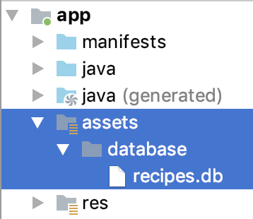

Room has been out for serveral years, I haven't used it until this year. And I do learn a lot this time, and would like to take a note of it.

Before I dive in, I would say, the version of Room I'm using is :

```
def room_version = "2.2.2"

    // ROOM
    implementation "androidx.room:room-runtime:$room_version"
    kapt "androidx.room:room-compiler:$room_version"
    implementation "androidx.room:room-ktx:$room_version" // ktx + Coroutine
```

By the way, you can check [here](https://developer.android.com/jetpack/androidx/releases/room) to see the release log of Room.

## Relation
The first thing I would state is the relation in ROOM. As we all know, if you have multiple tables and there might be 1:1, 1:Many, Many:Many relation among these tables.

I would like to explain how to build a many to many relation using Room, as this is the hardest relation for us.  Say I have a recipe database, which has two tables: "ingredient" and "recipe". The relation between ingredient and recipe, of course, are many to many. Here is how we retrieve data from Database

1). We define the entities first

```kotlin

@Entity
data class Ingredient(
    val name: String,
    val isVegi: Int,
    @PrimaryKey(autoGenerate = true) var ingredientId: Int = 0
) 

@Entity
data class Cuisine(
    val name: String,
    @PrimaryKey(autoGenerate = true) var cuisineId: Int = 0
)

```

Note that we have to have one, and only one, field annoated with @PrimaryKey in every Entity class.
p.s. You could add @ForeignKey as well. 

2). As we know, many to many relation also requires an extra table to save the relations. That's why we still need one more table.

```kotlin
@Entity
data class IngredientCuisine(
    @ForeignKey(
        entity = Ingredient::class,
        parentColumns = ["ingredientId"],
        childColumns = ["ingredientId"]
    )
    val ingredientId: Int,

    @ForeignKey(
        entity = Cuisine::class,
        parentColumns = ["cuisineId"],
        childColumns = ["cuisineId"]
    )
    val cuisineId: Int,

    @PrimaryKey(autoGenerate = true)
    var icID: Int = 0
)
```

3). Now if we want to know what ingredients are in one specific cuisine, then we need to have a new POJO class to get the data from database. But note that this new POJO class is not an Entity class. Entity is normally a table, but this new POJO class is only the result of query.

```kotlin
data class CuisineWithIngredients(
    @Embedded val cuisine: Cuisine,
    @Relation(
        parentColumn = "cuisineId",
        entity = Ingredient::class,
        entityColumn = "ingredientId",
        associateBy = Junction(IngredientCuisine::class)
    )
    val ingredients: List<Ingredient>
)
```
Note that we have @Embadded cuisines, and also a @Relation annotation to state the relation between two tables. The `IngredientCuisine` class of course is the bridge between Ingredient and Cuisine.

Note that this @Relation(associateBy) is since Room 2.2! 

4). Now we finally could go to retrieve the Cuisine data from database.

```kotlin
@Dao
interface RecipeDao {
    @Query("select * from Cuisine")
    suspend fun cuisinesWithIngredients(): List<CuisineWithIngredients>
    ...
}

@Database(
    entities = [Ingredient::class, Cuisine::class, IngredientCuisine::class],
    version = 1
)
abstract class RecipeDatabase : RoomDatabase() {
    abstract fun dao(): RecipeDao
}
```

Note that the `@Query("select * from Cuisine")` is only query from `Cuisine` table, but what you got is actually a list of `CuisineWithIngredients`.

## pre-packaged database

### 1. load a pre-packaged database
We didnt' have a pre-packaged database before ROOM 2.2. What we did is to insert a bunch of tables on the fresh install, but also need to be careful that we don't create tables every time we open the app.

Lucky for us, ROOM 2.2 support pre-packaged database now. We can now put the database files to `assert` or `file system`. And since we need to place our pre-defined database to our apk, we normally would like to put it to `assert` foldwer.



And then we can load the pre-packaged database like this:

```kotlin
database = Room.databaseBuilder(
            context.applicationContext,
            RecipeDatabase::class.java,
            "recipes.db"
        )
        .createFromAsset("database/recipe.app")
        .build()
```

Yeah, pre-packaged db sound nice, but it still have some gotchas there:

### 2. gotcha: schema gets wrong? 
I created some tables, and inserted some data to tables by using SQL code, just like : 

```sql
> sqlite3 recipe.db
> CREATE TABLE IF NOT EXISTS Ingredient (id INTEGER PRIMARY KEY AUTOINCREMENT, name text);
> INSERT INTO Ingredient(name) VALUES ("egg");
```

But when I copied and pasted the generated database to my android project and compile it, I got an error saying that the schema in the  pre-pacakged database are not exactly as same as the schema defined in my  `@Entity` class.

I did many changes. Sometimes, it's a foreign key; some other time, it's `not null` issues. Anyway, I've wasted 30 minutes to this kind of debugging. It's boring and exhausting. 

Suddendly, the perfect solution just dawned on me. I realized that i don't have to create a database by myself, which is error-prone. I should just create another Android project, and use Room's `@Entity` class to generate a database for me. This way, I just have to copy these Entity classes and DAO classes fro this new project to my work project. And since the database is generated by ROOM, so it can be understandable by ROOM. Perfect solved!


### 2. gotcha: upgrate databases?

Say you've published a version out to the market, and now you changed the database schema. Instead to make sure you've added the migration code to the java/kotlin, you also have to make sure to upgrate your pre-packaged db to the latest format. Otherwise, you may get some odd errors.


## search text
We would type `Select name from cuisine where name like '%egg%'` to search data by a substring in a SQLite console. That's right. 

But things get a litte different in the ROOM. ROOM does not support the `%%` yet. So you have to do a text search by this:

```kotlin
// DAO
@Query("select * from Cuisine where name like :keyword")
    suspend fun getCuisinesBy(keyword: String): List<Cuisine>


// ViewModel
val arg = "%$keyword%"
val cuisines = dao.getCuisinesBy(arg)    
```
Yeah, you have to wrap the `%%` yourself, as Room does not not understand the `%` format yet. I hope it might be improved in the later versions.

## unit test


### 1. make a mock database for unit test
One most important rule of unit test is "you can only fail one test because your logic is not working as you expected". That means, the connectivity of network/database, the multi-thread random issues should not be the reason to fail your test.

The solution for that is `isolation`. Same for unit test against database code. We have to have a mock database to test, so tests don't fail just because the database connectivity.

ROOM has a `memory database` that we can take advantage of. 

```kotlin
    val app = RecipeApplication.app
    db = Room.inMemoryDatabaseBuilder(app, RecipeDatabase::class.java)
        .build()
    dao = db.dao()
```
With this database in memory, we coudl save and read data very easily.


### 2. suspend? coroutine?
The `wait to finish` is another issue we have to deal with in the unit test. In the production, it's okay to wait the code to get the data from back-end or database. It's understandable. But when it comes to unit test, we need the unit test to run as fast as possible. (another import rule of unit test: `fast`!!!)

I've written [a blog about how to test ROOM](https://github.com/songzhw/songzhw.github.io/blob/master/test/2018-04-11-test-room.md) last year. That's the time before Kotlin coroutine. Room now support coroutines. So we could easily switch thread by using `suspsend`.

```kotlin
// production
   @Query("select * from Ingredient")
    suspend fun ingredientsWithCuisines(): List<IngredientWithCuisines>
```

Now how could we test the `suspend`?
: No worry, we have a `runBlocking` block to run the code in a coroutine context. 
`runBlocking: Runs a new coroutine and blocks the current thread interruptibly until its completion. `

Then the unit test is easy :

```kotlin
    @Test
    fun insertManyToManyRelation_queryingGetsResults() = runBlocking {
        dao.insertCuisine(Cuisine("pizza", 1))
        dao.insertIngredient(Ingredient("dough", 3, 1, ""))
        dao.insertIngredient(Ingredient("chicken", 2, 0, ""))
        dao.insertJoint(IngredientCuisine(1, 1))
        dao.insertJoint(IngredientCuisine(2, 1))

        val result = dao.cuisinesWithIngredients()
        assertEquals(1, result.size)
        assertEquals(2, result[0].ingredients.size)
    }
```

## ref
* [What's new in ROOM(Android Dev Summit '19)](https://www.youtube.com/watch?v=_aJsh6P00c0) is a great video that deserve your 16 minutes to watch. It presents many useful new feature, such as pre-packaged db and realtion. I strongly suggest you to take a look.

* [Kotlin Coroutine](https://kotlinlang.org/docs/reference/coroutines-overview.html)