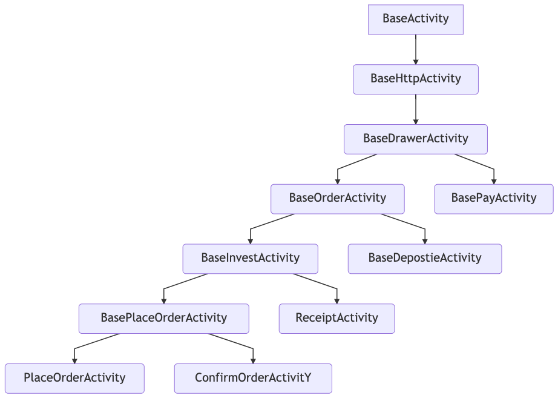

The androidx.Activity library that Google released is kind of new to many developers. This is the post to introduce how to use it, and also try to get the bottom of this library. 

## How to use androidx.Activity?

### 1. import androidx.Activity
In your build.gradle, add the dependencies:

```groovy
dependencies {
    def activity_version = "1.1.0"

    // Java language implementation
    implementation "androidx.activity:activity:$activity_version"
    // Kotlin
    implementation "androidx.activity:activity-ktx:$activity_version"
}
```

### 2. what is inside androidx.Activity

#### v1.0
* **ComponentActivity**:  Now the `ComponentActivity` is the new base class for `FragmentActivity`. This said, it is also the base class for `AppcompatActivity`. This enpowers you to have a constructor with an `@layoutResid int layoutId` argument and other useful functionalities. 
  
* **OnBackPressedDispatcher** : this is an alternative for overriding onBackPressed. You can write you onBackPressed logic to a `OnBackPressedCallback` class.


#### v1.1

* **SavedState** : same as OnBackPressedDispatcher, this would enpower to save data instead of overriding onSaveInstanceState(bundle) method.

* **by viewModels()** : this is a syntax sugar to save you troubles to write long initialization of one ViewModel instance. And also, this could use `SavedStateViewModelFactory` as the default factory for generating a ViewModel instance.


#### v1.2.0-alpha 
* **ActivityResultRegistry** : still, same as OnBackPrssedDipatcher, this provides an alternative for handle the `startActivityForResult` + `onActivityResult()`.


### 3. an example of OnBackPressedDispatcher

Here is a complete example. Simple, isn't it?

```kotlin
class DemoActivity : AppCompatActivity(R.layout.activity_on_back_demo) {
    val onBack = object : OnBackPressedCallback(true) {
        override fun handleOnBackPressed() {
            println("szw activity back")
        }
    }

    override fun onCreate(savedInstanceState: Bundle?) {
        super.onCreate(savedInstanceState)
        this.onBackPressedDispatcher.addCallback(this, onBack)
    }
}
```

This is simple example, but it is good enough to show our point. 
Before we go any furthur, let's take a step back. What would we do if we don't have OnBackPressedDispatcher?

### 4. what would do before?
Let's say we have a requirement, that the user could directly exit our app by tapping the back key twice in a short time. What could we dev do?

Of course, we need to write the logic in the `onBackPressed()`. We could do it ourselves, but importing a library is one opiton. Let's assume that we import a library, and we use its `DoubleTabToExitActivity` as a base activity of every Activity in our app.

```kotlin
class HomeActivity : DoubleTapToExitActivity(){
  ...
  fun onBackPressed(){
    // listen to the double tap, and exit the app if it is ready.
  }
}
```

Of course, this requirment would apply to every page we had. So it's natural to put it to the `BaseActivity`, so every Activity would reuse its code, just like this:

```kotlin
class BaseActivity : DoubleTapToExitActivity(){
  ...
  fun onBackPressed(){
    // listen to the double tap, and exit the app if it is ready.
  }
}

class HomeActivity : BaseActivity(){
  ...
}
```

Wonderful, it is working, and is working for all of our pages. Exactly what we need. 

However, we actually have a problem. Every page in our app could be exited by swipe to the right. To fulfill that, we import a library called `SwipeToExit`, which requires us to make our every Activity to extend its `SwipeToExitActivity`.
`class BaseActivity : SwipeToExitActiivty(), DoubleTapToExitActivity()` is wrong, as Kotlin, and Java, does not allow multiple parents for one class. 

Now you see what's the disadvantage of inheritance. Many modern language only allow single one parent for a class, so it's hard for us to get two functionality from two different base activity. We could only choose one. 

You may not see it from the prevous example, but another disadvantage of interitance is complexity. The cruel reality would make us to add many parent class for different granularity of requirement. An example I saw it myself would be:

This kind of code would hard to extend, and hard to test. Also it's very easy to make bugs once you are not pay attention, or don't know your change might affect other parts.

### 5. composition over inheritance
Yes, this is kind of one of the most important rules in the software development world (p.s "Don't repeat yourself" of course should be one of them as well ^_^).

The disadvantage of inheritance has been listed above. On the other hand, composition will have no such delimna as "only one parent". You can composite any part into your class. If you can, please use composition, instead of inheritance.

And most of all the changes in the androidx.Activity actually just repeat to explain this rule to you again and again.