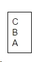
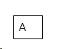
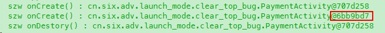

I've got a bug about the Activity stack recently, and I fixed it using the knowledge of launch mode and Intent's flag. This post will introduce how I locate the reason, and how I fixed it.  

Before reading this post, please make sure you already know something about launch mode. If not, please read this post [Explain Activity Launch Mode with Examples](http://www.songzhw.com/2016/08/09/explain-activity-launch-mode-with-examples/), which will help you understand how different launch mode work.

## 1. What's the problem I got?
We have an Activity (let's call it A) which could contains multip Fragment. When you click the button on Fragment (let's call it B), what it does is jump to A, so A could launch another Fragment, "C" it is.  Oh, forget to mention, this "jump" action actually has an "Clear_top" flag in its Intent. 

### 1.1 Original Code
Let's see the code.
**code-1**
This is Activity A, PaymentActivity. It will add a Fragment according to the fragmentId it gets.  And it will set the isEnable field to false on its onDestroy() method

```java
// [PaymentActivity]

    //you can think of it as a flag, we may need it somewhere in real project
    public static boolean isEnable = true;

    // onCreate() will just call showFragment(ACTION_PAY) 
            
    public void showFragment(int fragmentId) {
        FragmentManager fragmentManager =getFragmentManager();
        FragmentTransaction transaction = fragmentManager.beginTransaction();

        if(fragmentId == ACTION_PAY){
            PayFragment frag = new PayFragment();
            transaction.add(R.id.flayPay, frag);
        } else if(fragmentId == ACTION_RESULT){
            ResultFragment frag = new ResultFragment();
            transaction.add(R.id.flayPay, frag);
        } else {
            return;
        }

        transaction.commit();
    }

    @Override
    protected void onDestroy() {
        super.onDestroy();
        isEnable = false;
    }
```
**code-2**
This is Fragment B, PayFragment. Once you click the button whose id is "btn_simple", it actually ask Activity to load ResultFragment.
And when you click another button, it will show the value of activity.isEnable. 

```java
// [PayFragment]
    @Override
    public void onClick(View v) {
        if(v.getId() == R.id.btn_simple) {
            activity.showFragment(PaymentActivity.ACTION_RESULT);
        } else {
            tv.setText("PayFragment : isEanble = "+activity.isEnable);
        }
    }

```

**code-3**
This is Fragment C. Once you click the button, you will jump to PaymentActivity with a CLEAR_TOP flag. 

```java
// [ResultFragment]
    @Override
    public void onClick(View v) {
        Intent it = new Intent(actv, PaymentActivity.class);
        it.addFlags(Intent.FLAG_ACTIVITY_CLEAR_TOP);
        activity.startActivity(it);
    }

```

### 1.2 Problem
The code above is the code that exists in our project. 

Now, the steps to reproduce our bug are:
(1). you enters the PaymentActivity (A), so it launches the PayFragment (B).  
(2). click the button whose id is "btn_simple", so the activity launches the ResultFragment (C).
(3). click the button in ResultFragment, so you enters the PayFragment (B) again.

The requirement needs the "activity.isEnable" is still be "true", but you will find out the value of "activity.isEnable" is false. 

**Why?**


## 2. Process to locate the reason
To understand why the value of "activity.isEnable" is false, we have to understand "FLAG_ACTIVITY_CLEAR_TOP" first.

### 2.1. Intent.FLAG_ACTIVITY_CLEAR_TOP
I used to believed, if you set "Intent.FLAG_ACTIVITY_CLEAR_TOP", that means it will kill all the activity on top of your target activity, and bring your target Activity to the front/top. 

For example, we have an Activity stack, it has A,B,C three Activities. C is at the top, and A is at the bottom. Now we call "c.startActivity(this, A.class);" with the clear_top flag.



Then the result is this:



Yes, this is right. But what do you mean by **"bring your target Activity to the front/top"**? If it does so, which lifecycle methods will be called? onCreate()? onReseum()? onStart()? or onNewIntent()?

I never thought of it before, now I have a chance to get to know it. So I did some small experiences about it. 

#### 2.2. experience about clear_top
Now I place some log in the PayActivity.

```java
// [PaymentActivity]

    @Override
    protected void onCreate(Bundle savedInstanceState) {
        ...
        // ▼ 
        Log.d(TAG, "szw onCreate() : " + this);
    }
            
    public void showFragment(int fragmentId) {
        ...
    }

    @Override
    protected void onDestroy() {
        super.onDestroy();
        isEnable = false;
        // ▼
        Log.d(TAG, "szw onDestory() : " + this);
    }
```
I still followed the previous steps to reproduce the bug:
(1). you enters the PaymentActivity (A), so it launches the PayFragment (B).  
(2). click the button whose id is "btn_simple", so the activity launches the ResultFragment (C).
(3). click the button in ResultFragment, so you enters the PayFragment (B) again.

And the log surprised me:




#### 2.3. explanation about the previous log
Oh, we can see two different instance of "PaymentActivity", one is "@707d258", and the other one is "@6bb9bd7".  Since the "@707d258" is create first, so we call it "the old instance", and hence call "@6bb9bd7" as "the new instance".

We can easily see the old instance create a new instance, and destory itself.

So that's what "Clear_Top" does. If one instance of an Activity is alreay at the top of the Activity stack, and it jump to the same Activity with the Intent that contains the CLEAR_TOP flag, this means two things:
(1). it will create a new instance of its class
(2). then it will finish itself.

#### 2.4. back to our example
Now we understand why the "activity.isEnable" is false. Because we executed the "onDestory()" of the old instance of PaymentActivity. And "onDestory()" will set "activity.isEnable" to false.

## 3. Final Solution
The requirement need the "activity.isEnable" is still "true" if you already have one instance of PaymentActivity.  And the "CLEAR_TOP" flag will violate that. 

So I should find a other way to start the PaymentActivity which will not create another instance of PaymentActivity if we already have one at the top of the Activity stack. 

The answer is "**Intent.FLAG_ACTIVITY_SINGLE_TOP**". Rememeber the post [Explain Activity Launch Mode with Examples](http://www.songzhw.com/2016/08/09/explain-activity-launch-mode-with-examples/) I released before, we talked about what is "single_top" launch mode. And when you add "FLAG_ACTIVITY_SINGLE_TOP" to your intent, actually you are using the "single_top" launch mode to launch the target activity. Here is the definition of this flag:

```
[FLAG_ACTIVITY_SINGLE_TOP]

If set, the activity will not be launched if it is already running at the top of the history stack.
```
Finally, our solution is to change two class:
**(1). change the ResultFragment**

```java
    @Override
    public void onClick(View v) {
        Intent it = new Intent(actv, PaymentActivity.class);

        // ▼  // it.addFlags(Intent.FLAG_ACTIVITY_CLEAR_TOP);
        // ▼
        it.addFlags(Intent.FLAG_ACTIVITY_SINGLE_TOP);

        actv.startActivity(it);
    }
```

**(2). change the Activity **
Now the Activity will not destory itself and start a new instance. Instead, it will call its own `onNewIntent(intent)` method. So we should implement the `onNewInetn(intent)` method.

```java
    // ▼ 
    @Override
    protected void onNewIntent(Intent intent) {
        super.onNewIntent(intent);
        this.setIntent(intent);

        int arg = getIntent().getIntExtra("which_action", ACTION_PAY);
        showFragment(arg);
    }
```
**(3). result **


Now we do not execute "onDestory()". As a result, our "activity.isEnable" is still true. Mission complished!

## 4. Code
Code is in here : [github.com/songzhw](https://github.com/songzhw/AndroidAdvanced/tree/master/Advanced/app/src/main/java/cn/six/adv/launch_mode/clear_top_bug).

This is an simple version of my project. I used "activity.isEnable" to simplify the business logic, so the code will not too big to read. If you have any questions, please leave your comments below. 
