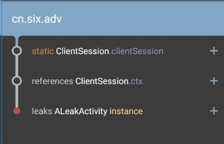

I searched the memory leak in our company's project and did find some leaks. Here is the two leaks I fixed.

### How to find memory leak?
Thanks to [Square company](https://github.com/square), we now have a memory leak detect library, called [LeakCanary](https://github.com/square/leakcanary). All you need to do is just follow the LeakCanary's ReadMe, add the dependency and add a few lines of code in your Application class. If you have leak, LeakCanary will tell you that.


### Leak 01 static Context
Our code has a Activity, and its code is as below:

```java
public class FloatingDemo03 extends Activity{
    static Context self;

        @Override
    protected void onCreate(Bundle savedInstanceState) {
        super.onCreate(savedInstanceState);
        self = this;
    }
}
```

Here is the leak report:


This leak is very easy to spot. `self` is a static field. A static field has a long lifecycle that is as long as the whole application. So even you want to finish this FloatingDemo03, Android could not GC it since this Activity object still have strong reference.


### Leak 02 : ClientSession
Our app has a strict security policy. For example, if the user does not perform any action for more than 1 minutes, our app will log out this user.  And the `ClientSession` is in charge of this functionality.

But I got a memory leak report about this class:




#### 2.1 why leak?
The code of `ClientSession` is as below:

```java
public class ClientSession extends CountDownTimer {
    public static final int TIME = 60000;

    private static ClientSession clientSession;
    private Context ctx;

    public static ClientSession getInstance(Context context) {
        if (clientSession == null) {
            clientSession = new ClientSession(context);
        }
        return clientSession;
    }

    public ClientSession(Context ctx){
        super(TIME, 1000);
        this.ctx = ctx;
    }
    @Override
    public void onTick(long millisUntilFinished) { }

    @Override
    public void onFinish() { 
        Intent it = new Intent(ctx, WarningActivity.class);
        it.addFlags(Intent.FLAG_ACTIVITY_CLEAR_TASK | Intent.FLAG_ACTIVITY_NEW_TASK);
        ctx.startActivity(it);
    }

    public void reset(){
        cancel();
        start();
    }
```


Just like the first leak, we know the reason is the Singleton, AKA, static field, holds the reference of our Activity and never release it. So a leak happens. 

But how do we fix that? It's kind of tricky. 

#### 2.2 solution 01

The first solution I thought is remove this Singleton, and use a normal class. And in every activity's onDestory(), we just cancel this timer. 

But after I really applied this solution, I found out this is not correct. Because cancelling the timer in onDestory() is not correct. If we jumps from A screen to B screen, A's timer should stop. But since the cancelling timer is in the onDestory(), so A's timer does not stop. So this solution fails.


#### 2.3 solution 02
Then I moved the cancelling action to onStop(), instead of onDestory(). But I found out I was wrong again. Because the requirement asks us to keep ticking even the user press home button. 

If we cancel the timer in onStop(), and the user press home button, then the timer stopped, which is not correct.


#### 2.4 solution 03 -- (successful!)
Finally, I now get to understand why the original author of this class wanted to make it Singleton. 
--> If you jump from A screen to B screen, the singleton will make sure the `context` member would be a new activity and the timer will be reset

--> If you press home button, the singleton will make sure the timer is still ticking.

Singleton is good for our requirement, but is bad for our memory. Now I start to think since the singleton is inevitable, maybe we can stop singleton to hold our context.

The only reason why the ClientSession class need the context is when the timer is finished, we need the context to start the WarningActivity. And to finish all the activities before, we add new_task|clear_task flag.

This two flag actually saved us. Here is how we fix the leak : `replace the context with the application.context`

```java
   public static ClientSession getInstance() { // ▼ removed "Context context"
        if (clientSession == null) {
            clientSession = new ClientSession(AndApp.context); // ▼ replace the context
        }
        return clientSession;
    }
```

Why does this fix works and does not break our ClientSession functionality?
1. Replacing the context with applicationContext will make sure our Activity is not holded by a static field. As for the application context, it's application and will last in the whole application's lifecycle, so it's okay to let a static filed hold the reference of an application context

2. As for the functionality, we still keep the singleton, which will still have a correct timer. It's just our singleton does not hold an activity context anymore.


#### 2.5  important thing to mention
The leak is fixed, however I still have one thing need to mention. 
Normally, if the context is the application context, rather than an activity context, then  `context.startActivity(context, WarningActivity.class);` will actually cause a crash. The error message would be :

``` java
android.util.AndroidRuntimeException: 
        Calling startActivity() from outside of an Activity  context requires the FLAG_ACTIVITY_NEW_TASK flag.
        Is this really what you want?
   at android.content.ContextWrapper.startActivity(ContextWrapper.java:331)

```

So now you should understand why our solution is so tricky. It's not just replace "context" with "application context", it's not that easy. We tried many solution, try to fix the leak and also try to keep the client seesion functionality.  Even that, without the `clear_task | new_task` flag, our solution will still fail.  In conlusion, with the help of LeakCanary, it might be easy to spot a memory leak, but how to fix it might be more complicated. 

Okay, this is the two leaks I fixed days ago. I will continue to bring more examples of how to fix memory leak in the future.
