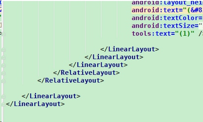

Here are some experience of me trying to improve the performance of apps recently. Hope it will help you when you try to do such optimization too. 

## 1. Layout Performance
Last month, I got a bug to fix. After understand how the existing code works, I fixed it quickly. But when I was trying to figure out the old code, I found out something else that was troubling me. 

The image below is the thing that really made me uncomfortable. Really, this layout needs so many layout to wrap the real content?

As we can see, it has seven layout at the bottom. The last six layout seems has nothing to do but wrap another layout. That said, the last six layout seems like unnecessary.

