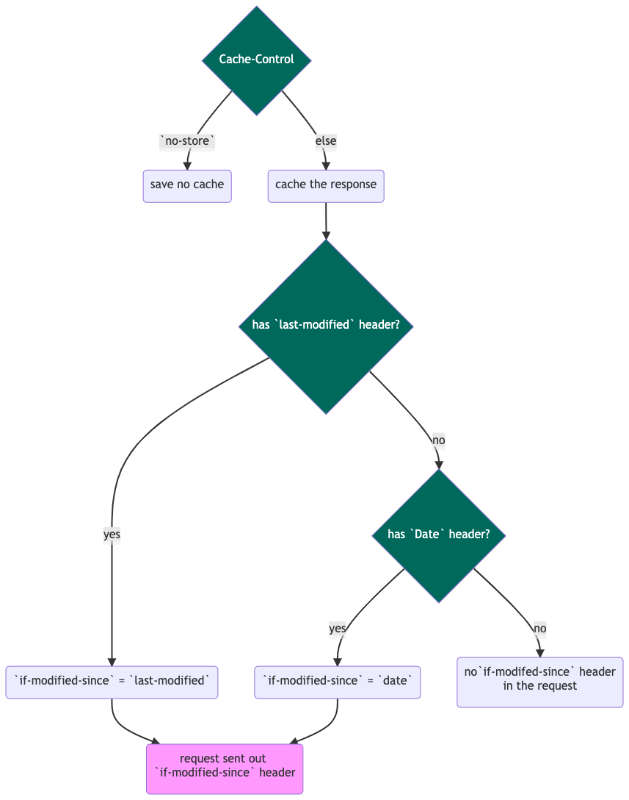

##  How to cache in OkHttp
The code actually is quite simple, all you have to do is add a `Cache` in the OkHttpClient

```kotlin
val cacheSize: Long = 15 * 1024 * 1024 // 15MB
val cacheFolder = MyApplication.getInstance().cacheDir
val targetFolder = File(cacheFolder, "my-okhttp")
val cache = Cache(targetFolder, cacheSize)

val builder = OkHttpClient.Builder()
        .connectionPool(ConnectionPool(3, 5, TimeUnit.MINUTES))
        .connectTimeout(C51ApiLoader.DEFAULT_TIMEOUT.toLong(), TimeUnit.SECONDS)
        .readTimeout(C51ApiLoader.DEFAULT_TIMEOUT.toLong(), TimeUnit.SECONDS)
        .cache(cache)  // this is the line to add cache
```

With just a simple line of `.cache(cache)`, OkHttp can handle the `cache-control`, `last-modified` and `eTag`. 
How wonderful it is, but is it real?  
Sadly, no. It has some pitfalls to watch out. 


## Pitfall 1: The value of `if-modified-since`
If your backend sent out the `last-modified` header, then OkHttp would save this value, and put it as the value of the next Request's `if-modified-since` header.

But sometimes, your backend does not sent out the `last-modified` header. They just ask you to sent out your previous request time, so the backend would judge if they would give you a 200 or 304. If that's the case, then you should persiste the previous request time. 
Luckily for us, OkHttp would do this for us as well. OkHttp would save the response's `Date` header, and use its value for the next Request's `if-modifed-since` header. 

If the backend has no `last-modified` header, and has no `Date` header as well, then the next request would not sent out the `if-modified-since` header. Hence you would lose the ability of 304. 


## Pitfall 2: Why OkHttp does not cache the response?
Once I've done the previous work, I just found out the OkHttp does not cache my response at all. Why? 

So I have to dig into OkHttp's source code, and debug it one step by one step. Finally I got to find out that OkHttp does not cache the `response.noStore` is true. Now I have a clue, I open the Network Inspector in the Android Studio and found out the response gave me a `Cache-Control: no-store, no-cache, private` header. And this cache-control tells the Okhttp to `no store` the response.

Once I told backend and they remove the `no store` from the `Cache-Control`, OkHttp now can cache the response correctly. 


## Conclusion
With all these explaination, I wouln't blame you if you are lost in the text. So here we are, a graph would make it more clear: 

