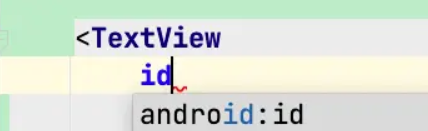
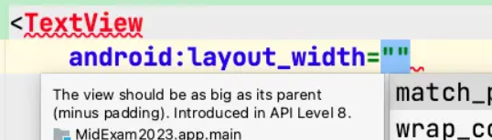
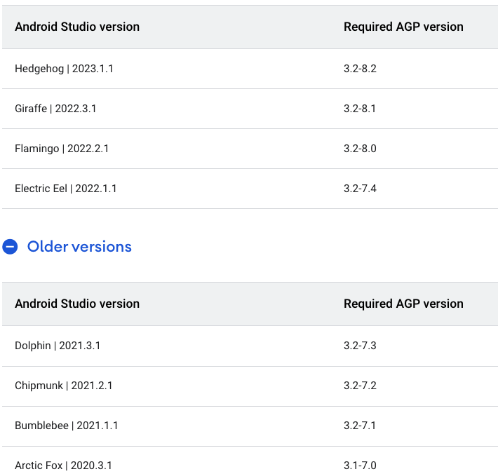
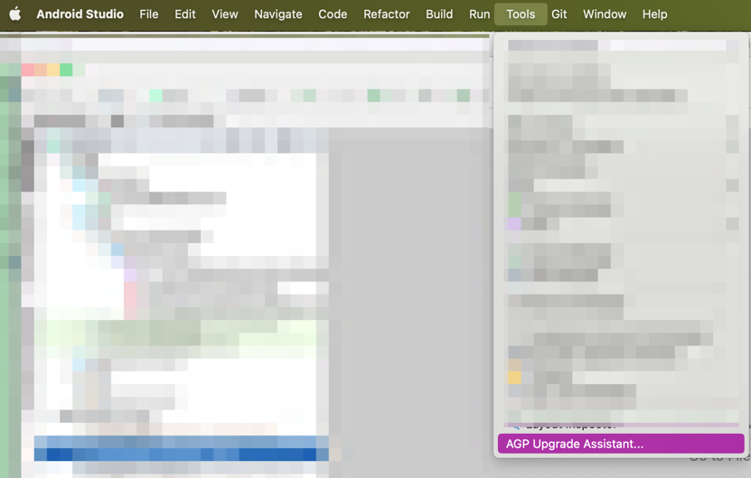
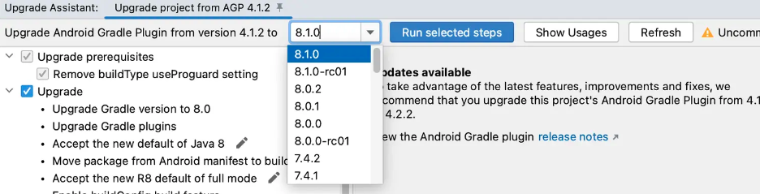
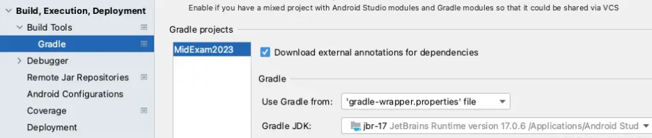

Google asked every app to upgrade the app to use targetSDK 33 by August 31st. Upgrading your codebase is not very hard, just check the [Android 13 features and change list](https://developer.android.com/about/versions/13/summary) and we can get a idea what code we should change. But I got a bunch of issue after I upgrading the targetSDK.

## issue 1: Android Studio(AS) Smart completion is gone
I'm using Android Studio BumbleBee when I upgraded the targetSDK. And after the upgrading, I just found out some smart completion is gone, such as 

or


After I downgrade the targetSDK to 31, then these missing smart completion are all coming back. Now I know it's the targetSDK get this issue. 

It seems my AS is not supporting the new SDK, Api levle 33, very well, so I have to upgrade my AS as well. Also the Android Gradle Plugin(AGP) is related to the version of AS as well, according to [here](https://developer.android.com/build/releases/gradle-plugin?buildsystem=ndk-build#android_gradle_plugin_and_android_studio_compatibility)


So when I upgrade the AS, I have to upgrade AGP as well. Anyway, the first step, I download and install the latest stable version: `Android Studio Giraffe`.

## issue 2: upgrade AGP
My AGP was 4.1.2, and it does not work very well with the AS Giraffe. So I have to upgrade AGP as well. Fortunately for us, we have a tool to upgrade AGP automatically:


so I just upgrade to the latest stable version : v8.1.0 as well


The result of this upgrading is: 
```gradle
plugins {  
  // AGP version (chagned from v4.1.2 to v8.1.0)
  id 'com.android.application' version '8.1.0' apply false  
  id 'com.android.library' version '8.1.0' apply false  
  // Kotlin version (unchanged)
  id 'org.jetbrains.kotlin.android' version '1.5.31' apply false  
}
```


## issue 3: upgrade JDK
If you got `android LintModelSeveirty requires Java 61, the current is 55` issue when you upgrade, that means your JDK is just too low. The java internal level is : 

```
49 = Java 5 ; 50 = Java 6 ; 51 = Java 7 ; 52 = Java 8
53 = Java 9 ; 54 = Java 10
55 = Java 11 ; 56 = Java 12 ; 57 = Java 13 ; 58 = Java 14; 59 = Java 15 ; 60 = Java 16
61 = Java 17 ; 62 = Java 18 ; 63 = Java 19 ; 64 = Java 20
```

So this just means you are using JDK 11, but the AS requires JDK 17.  And also set the JDK to `jbr-17` (`jbr` means: JetBrains Runtime).


## issue 4: upgrade google service


This just means my google service is just too low. 
The fix is upgrade the sdk from v.4.3.10 to v4.3.14: 

```
dependencies {
  classpath 'com.google.gms:google-services:4.3.14'
}
```

## issue 5: upgrade kotlin
Since many old code in our codebase is still using `kotlin-android-extensions` plugin, so I can't upgrade kotlin to v1.8+ since Kotlin 1.8 removed this plugin.

```
plugins {  
  // AGP version (chagned from v4.1.2 to v8.1.0)
  id 'com.android.application' version '8.1.0' apply false  
  id 'com.android.library' version '8.1.0' apply false  
  // Kotlin version (chagned from v1.5.1 to v10.7.22)
  id 'org.jetbrains.kotlin.android' version '1.7.22' apply false  
}
```

## issue 6: CircleCI -- build debug apk


## issue 7: CircleCI -- build release apk


## issue 8: CircleCI -- release apk crash

