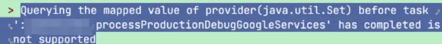

Google asked every app to upgrade the app to use targetSDK 33 by August 31st. Upgrading your codebase is not very hard, just check the [Android 13 features and change list](https://developer.android.com/about/versions/13/summary) and we can get a idea what code we should change. But I got a bunch of issue after I upgrading the targetSDK.

## issue 1: Android Studio(AS) Smart completion is gone
I'm using Android Studio BumbleBee when I upgraded the targetSDK. And after the upgrading, I just found out some smart completion is gone, such as 

or


After I downgrade the targetSDK to 31, then these missing smart completion are all coming back. Now I know it's the targetSDK get this issue. 

It seems my AS is not supporting the new SDK, Api levle 33, very well, so I have to upgrade my AS as well. Also the Android Gradle Plugin(AGP) is related to the version of AS as well, according to [here](https://developer.android.com/build/releases/gradle-plugin?buildsystem=ndk-build#android_gradle_plugin_and_android_studio_compatibility)


So when I upgrade the AS, I have to upgrade AGP as well. Anyway, the first step, I download and install the latest stable version: `Android Studio Giraffe`.

## issue 2: upgrade AGP
My AGP was 4.1.2, and it does not work very well with the AS Giraffe. So I have to upgrade AGP as well. Fortunately for us, we have a tool to upgrade AGP automatically:


so I just upgrade to the latest stable version : v8.1.0 as well


The result of this upgrading is: 
```gradle
plugins {  
  // AGP version (chagned from v4.1.2 to v8.1.0)
  id 'com.android.application' version '8.1.0' apply false  
  id 'com.android.library' version '8.1.0' apply false  
  // Kotlin version (unchanged)
  id 'org.jetbrains.kotlin.android' version '1.5.31' apply false  
}
```


## issue 3: upgrade JDK
If you got `android LintModelSeveirty requires Java 61, the current is 55` issue when you upgrade, that means your JDK is just too low. The java internal level is : 

```
49 = Java 5 ; 50 = Java 6 ; 51 = Java 7 ; 52 = Java 8
53 = Java 9 ; 54 = Java 10
55 = Java 11 ; 56 = Java 12 ; 57 = Java 13 ; 58 = Java 14; 59 = Java 15 ; 60 = Java 16
61 = Java 17 ; 62 = Java 18 ; 63 = Java 19 ; 64 = Java 20
```

So this just means you are using JDK 11, but the AS requires JDK 17.  And also set the JDK to `jbr-17` (`jbr` means: JetBrains Runtime).


## issue 4: upgrade google service


This just means my google service is just too low. 
The fix is upgrade the sdk from v.4.3.10 to v4.3.14: 

```
dependencies {
  classpath 'com.google.gms:google-services:4.3.14'
}
```

## issue 5: upgrade kotlin
Since many old code in our codebase is still using `kotlin-android-extensions` plugin, so I can't upgrade kotlin to v1.8+ since Kotlin 1.8 removed this plugin.

```
plugins {  
  // AGP version (chagned from v4.1.2 to v8.1.0)
  id 'com.android.application' version '8.1.0' apply false  
  id 'com.android.library' version '8.1.0' apply false  
  // Kotlin version (chagned from v1.5.1 to v10.7.22)
  id 'org.jetbrains.kotlin.android' version '1.7.22' apply false  
}
```

## issue 6: CircleCI -- build debug apk
After fixing the issues above, I finally can run app from Android Studio. But when I push the code, our CI/CD server, CircleCI, just failed to build any apk. The error is : 


There are many solution online, but none of them works for my case. The only thing I found useful is to upgrade the docker image of CircleCI Android. Because the latest docker image has been updated the JDK from 11 to 17, so this would solve the issue above.


So this is how I fix this build error: 


## issue 7: CircleCI -- build release apk
However, once the debug apk is built successfully by CircleCI, CircleCI, again, have a problem to build the release apk. Fortunately for us, this time, the AGP tell us why and how to fix this: 

```
> Task :app:minifyStagingReleaseWithR8  
> ERROR: Missing classes detected while running R8.  
   Please add the missing classes or apply additional keep rules  
   that are generated in /home/circleci/repo/xxx/build/xxx/mapping/stagingRelease/missing_rules.txt.  
> ERROR: R8: Missing class com.abc.camera.hardware.VersionInterval  
   (referenced from: com.abc.hardware.Version com.abc.internal.DeviceInfo.mEglVersions and 4 other contexts)
```

So all I have to do is just to add the proguard rules in the `missing_rules.txt` to my proguard rule file: 

```
# Please add these rules to your existing keep rules in order to suppress warnings.
# This is generated automatically by the Android Gradle plugin.
-dontwarn com.abc.hardware.VersionInterval
-dontwarn com.abc.internal.DeviceInfo.mEglVersions
-dontwarn com.abc.internal.client.ClientCallback
```

## issue 8: CircleCI -- release apk crash
The release apk is built successsfully now. But it will immediately crash when I open the app. 
One important details is: the debug apk runs very well, no crash at all. But the release apk will just crash on app open. 

Take a look at the logcat in the AS: 


I haven't implement my own Navigator,  also the debug apk runs fine. So this should be something like proguard. And it is. Just add these two line to the proguard file, then it's solved.

```
# java.lang.IllegalArgumentException: No @Navigator.Name annotation found for m
-keepattributes RuntimeVisibleAnnotations  
-keep class * extends androidx.navigation.Navigator

```

## issue 8: CircleCI -- release apk crash
This time, our app did not crash on app open, but it crash once it got any http response. The error is: 


It's apparently related to Retrofit. And Retrofit already [give us the answer the this issue](https://github.com/square/retrofit/blob/master/retrofit/src/main/resources/META-INF/proguard/retrofit2.pro).  We just need add more proguard rules: 

```
# With R8 full mode, it sees no subtypes of Retrofit interfaces since they are created with a Proxy
# and replaces all potential values with null. Explicitly keeping the interfaces prevents this.
-if interface * { @retrofit2.http.* <methods>; }
-keep,allowobfuscation interface <1>

# Keep inherited services.
-if interface * { @retrofit2.http.* <methods>; }
-keep,allowobfuscation interface * extends <1>

# With R8 full mode generic signatures are stripped for classes that are not
# kept. Suspend functions are wrapped in continuations where the type argument
# is used.
-keep,allowobfuscation,allowshrinking class kotlin.coroutines.Continuation

# R8 full mode strips generic signatures from return types if not kept.
-if interface * { @retrofit2.http.* public *** *(...); }
-keep,allowoptimization,allowshrinking,allowobfuscation class <3>

```

It's just a incompatible issue with Retrofit and R8 compiler. Adding these rule will fix this issue. 

Now, finally, our app can built and run without any issue. 