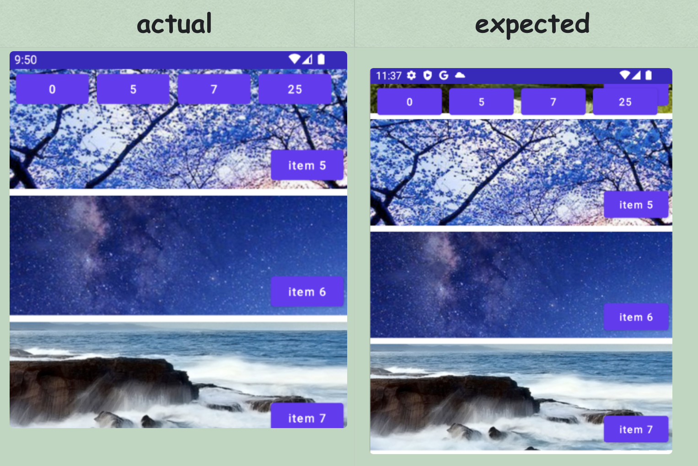
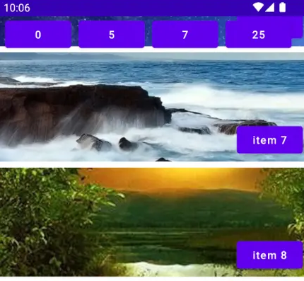
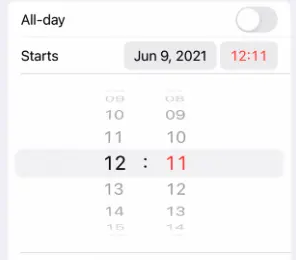

# Issues of `rv.smoothScrollToPosition(pos)`
1). Let's say your RecyclerView(rv) shows the content of item 0 to item 3. Now if you want to smooth scroll(SS) to item 5,  then `rv.smoothScrollToPosition(5)` will only make the item 5 fully visible at the bottom of rv.

2). Let's say your RecyclerView(rv) shows the content of item 7 to item 10. Now if you want to smooth scroll(SS) to item 5,  then `rv.smoothScrollToPosition(5)` will only make the item 5 fully visible at the top of rv.

3). Let's say your RecyclerView(rv) shows the content of item 0 to item 3. Now if you want to smooth scroll(SS) to item 2,  then `rv.smoothScrollToPosition(2)` will do nothing. Literally nothing, no scroll at all. 

Most of time, PO want to the target item to show at the top of the rv, or at the center of rv. Not something inconsistant position (sometimes top, sometimes bottom). 

# Use case 1: smooth scroll and make the target item at the top
There is one possible solution:
```kotlin
val first = rv.layoutMananger.firstVisibleItemPosition()
val last = rv.layoutManager.lastVisibleItemPosition()
if(targetPosition < first) {
  rv.smoothScrollToPosition(targetPosition)
} 
else if(targetPosition < last) { // between [first, last]
  rv.smoothScrollBy(0, targetItem.top)
}
else {
  // this case might be complex. You have to listen to the scroll and scroll to target when the target item is found.  
  rv.smoothScrollTo(targetPosition)
  rv.addOnScrollListener{ 
    if(state == SCROLL_STATE_IDLE) {
      rv.scrollBy(0, targetitem.top)
    }
    rv.removeScrollListener(this)
  }
}
```

The solution is able to make the SS be more smart, but it's kind of complex. 
A more simpler solution would be use LiearSmoothScroll(LSS): 

```kotlin
    private fun RecyclerView.smoothScrollAndSnapStartTo(pos: Int) {
        val scroller = object : LinearSmoothScroller(context) {
            override fun getVerticalSnapPreference() = LinearSmoothScroller.SNAP_TO_START
        }
        scroller.targetPosition = pos
        layoutManager?.startSmoothScroll(scroller)
    }

```

# Use case 2: snap_to_start and add some offset

Now I have a row of buttons at the top of RV, and the `smoothScrollAndSnapStartTo(pos)` is not working very well.

Because the row of buttons is blocking some of the target position, so UX don't think it's good enough to watch. So I have to make the SS to snap_to_start, and also add some offset to the SS.

## how SS works?
when you want to SS to the target position, the RV will start scrolling, until the target position shows. 
Then the scrolling enters the phase 2, which is the `Deceleration` phase. In this deceleration phase, LSS will try to calculate how long it will scroll and how much time it takes. The source code of LSS will tell us more.  It's `onTargetFound()` method is got called when the target positions start showing in the screen.

```java
// LSS - source code
@override
protected void onTargetFound(View targetView, RecyclerView.State state, Action action) {
    final int dx = calculateDxToMakeVisible(targetView, getHorizontalSnapPreference());
    final int dy = calculateDyToMakeVisible(targetView, getVerticalSnapPreference());
    final int distance = (int) Math.sqrt(dx * dx + dy * dy);
    final int time = calculateTimeForDeceleration(distance);
    if (time > 0) {
        action.update(-dx, -dy, time, mDecelerateInterpolator);
    }
}
```

And what is the `calculateDxToMakeVisible` and `calculateDyToMakeVisible`. These two methods are calculating how much distance the rv should scroll in the x direction and y direction. Their source code is something like this: 

```java
// LSS - source code

    public int calculateDxToMakeVisible(View view, int snapPreference) {
        ...
        return calculateDtToFit(viewLeft, viewRight, rvLeft, rvRight, snapPreference);
    }
    
    public int calculateDyToMakeVisible(View view, int snapPreference) {
        ...
        return calculateDtToFit(viewTop, viewBottom, rvTop, rvBottom, snapPreference);
    }    

```

Yes, they are both using the method `calculateDtToFit()`. And when we want to adjust the scroll distance, this `calculateDtToFit()` method is where it can help us.

## solution

```kotlin
   private fun RecyclerView.smoothScrollWithOffsetTo(pos: Int) {
        val topButtonsHeight = topButtonsLayout.height //=> 126

        val scroller = object : LinearSmoothScroller(context) {

            override fun getVerticalSnapPreference() = LinearSmoothScroller.SNAP_TO_START
            
            override fun calculateDtToFit(viewStart: Int, viewEnd: Int, boxStart: Int, boxEnd: Int, snapPreference: Int): Int {
                val computed = super.calculateDtToFit(viewStart, viewEnd, boxStart, boxEnd, snapPreference)
                if (snapPreference == SNAP_TO_START) {
                    return computed + topButtonsHeight
                }
                return computed
            }
        }
        scroller.targetPosition = pos
        layoutManager?.startSmoothScroll(scroller)
    }

```

Here is the result after I call `rv.smoothScrollWithOffsetTo(7)`. Now you can see the item 7 is not blocked by the top buttons row.


# Use case 3: make the target item in the center of RV
You may want to SS to a target item and make it in the center of RV. For example, you made a WheelSelectionView based on RV, and the selected item should be in the center and highlighted.


We've explained that you can override the `calculateDtToFit() ` method if you want to customized the final position. So that's what we can do: 

```kotlin
    private fun RecyclerView.smoothScrollInCenterTo(pos: Int) {
        val scroller = object : LinearSmoothScroller(context) {
            override fun calculateDtToFit(viewStart: Int, viewEnd: Int, boxStart: Int, boxEnd: Int, snapPreference: Int): Int {
                return (boxStart + (boxEnd - boxStart) / 2) - (viewStart + (viewEnd - viewStart) / 2)
            }
        }
        scroller.targetPosition = pos
        layoutManager?.startSmoothScroll(scroller)
    }

```

# Use case 4: adjust the SS speed
LSS does have two method that seem to be related to the scrolling time. 
```kotlin
override fun calculateTimeForScrolling(dx: Int): Int 

override fun calculateTimeForDeceleration(dx: Int): Int 

```

But you can't customized the scroll speed by overriding any of these two methods. Because one is complex, and another one is only for the phase 2(deceleration phase).

The only way you can successfully adjust the SS speed is to override LSS's `calcuateSppedPerPixel()`.  The return value of this method is bigger, then it takes more time to scroll over one pixel. So If you want to have a higher speed, then the return value should be smaller.

The source code of LSS is : 
```java
protected float calculateSpeedPerPixel(DisplayMetrics displayMetrics) {
    return 25f / displayMetrics.densityDpi;
} 

```

And we can speed up the SS by doing so:
```kotlin
    private fun RecyclerView.fastSmoothScrollTo(pos: Int) {
        val scroller = object : LinearSmoothScroller(this.context) {
            override fun calculateSpeedPerPixel(displayMetrics: DisplayMetrics): Float {
                // return 25f / displayMetrics.densityDpi;
                return 6f / displayMetrics.densityDpi 
            }
        }
        scroller.targetPosition = pos
        this.layoutManager?.startSmoothScroll(scroller)
    }

```


# use case 5: make a constant SS time

If the target item is far away from the current item, then it would take much more time to SS to there. To get a better user experience, you can make the SS time constant, not matter you want to SS from item 0 to item 5, or SS from item 0 to item 50. 

As we said, the only way to adjust the speed is the `calculateSpeedPerPixel()`. So we have to adjust the speed dynamically based on how much we should scroll. 


```kotlin
    private fun RecyclerView.smoothScrollEquallyTo(pos: Int, speedFactor: Int = 5) {
        val scroller = object : LinearSmoothScroller(context) {
            override fun calculateSpeedPerPixel(displayMetrics: DisplayMetrics): Float {
                //  return 25f / displayMetrics.densityDpi;
                val layoutMgr = this.layoutManager
                if(layoutMgr !is LinearLayoutManager) return super.calculateSpeedPerPixel(displayMetrics)
                val first = layoutMgr.findFirstVisibleItemPosition()
                val diff = abs(pos - first) 
                val speed = 25f / diff * speedFactor
                val ret = speed / displayMetrics.densityDpi
                return ret
            }
        }

        scroller.targetPosition = pos
        layoutManager?.startSmoothScroll(scroller)
    }

```

The `speedFactor` argument can be any value you pointed. It exist so the speed can be flexible and changeable as you like. 

# Conclusion
This article is mostly about how to do SS to RV, and an explanation of LinearSmoothScroll. We overrided many methods of LSS to get different user experiences.