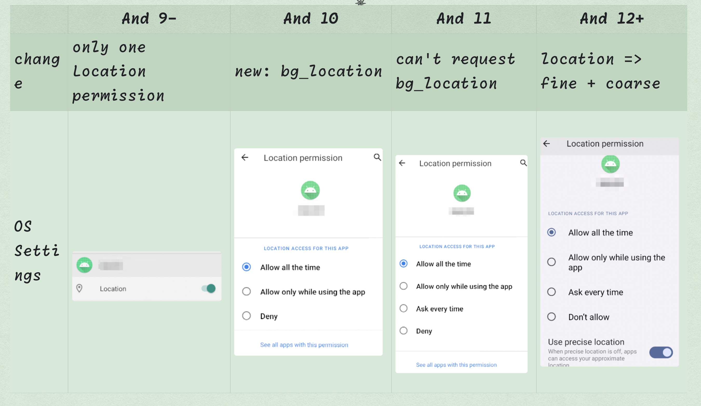
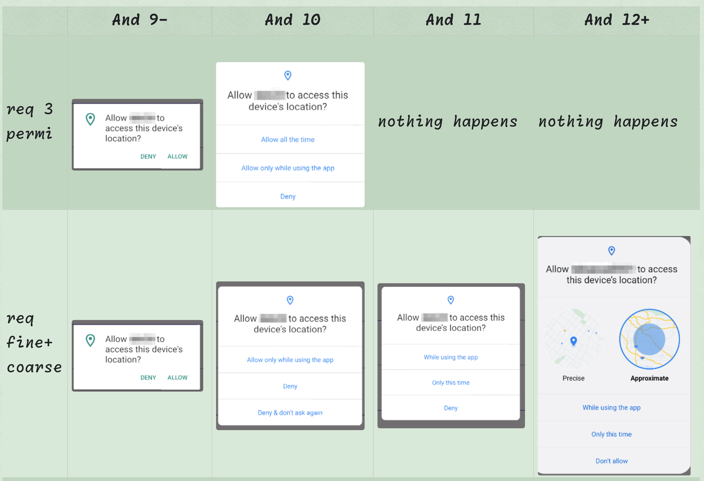
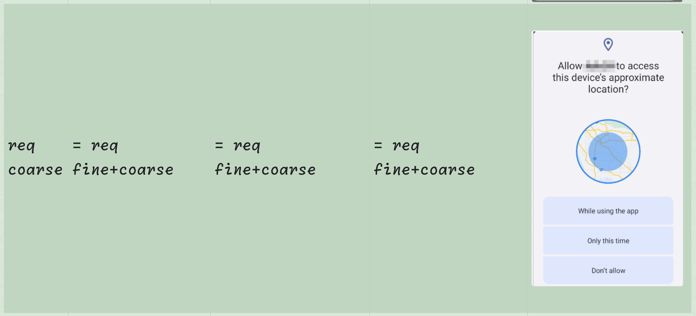
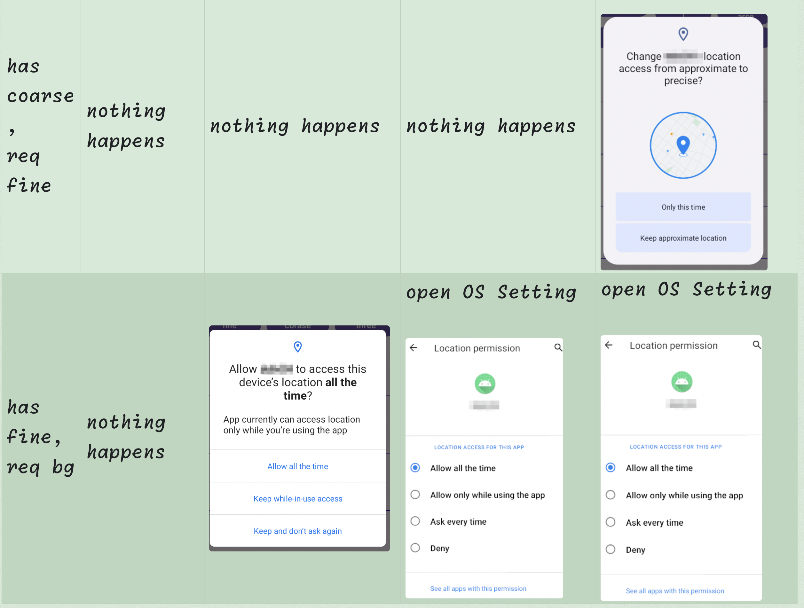

# I. permission request
The Androidx-Activity library has provided us a new approach to request permission. This new approach does not need to use any Activity's callback function. Just use `ActivityResultLauncher` would be enough for us. 


```kotlin
    private lateinit var launcher : ActivityResultLauncher<Array<String>>

    launcher = registerForActivityResult(RequestMultiplePermissions()) {map: Map<String, Boolean> ->
        // .....
    }
```

By doing so, we could easily request any permissions, such as : 
```kotlin
    launcher.launch(arrayOf(
        Manifest.permission.ACCESS_FINE_LOCATION,
        Manifest.permission.ACCESS_COARSE_LOCATION,
    ))
```

# II. Location Permission Change

* Android 9-:  only one `location` permission exists

* Android 10:  a new `background-location` permission was coined. Now we have two: `regular-location` permission, and `background-location` permission.

* Android 11: we can not request `background-location` permission with the  `regular-location` permission at the same time. Otherwise, our requestLauncher's callback will never get called.

* Android 12+:  `regular-location` permission has become two permissions, `fine` and `coarse`. So to sum up, now we have three permissions: 
  *  `background-location` permission
  *  `fine-location` permission
  *  `coarse-location` permission
  




# III. Request Location Permission
The key point is : are we able to query the find-location permission on Android 11- since this permission is since 12+?
Same question is for the `background-location` permission as well. 

This is the code: 

```kotlin
fun Context.isPermissionGranted(permission: String): Boolean =
    ContextCompat.checkSelfPermission(this, permission) == PackageManager.PERMISSION_GRANTED

val isFineLocationGranted = isPermissionGranted(Manifest.permission.ACCESS_FINE_LOCATION)
val isCoarseLocationGranted = isPermissionGranted(Manifest.permission.ACCESS_COARSE_LOCATION)
val isBackgroundLocationGranted = isPermissionGranted(Manifest.permission.ACCESS_BACKGROUND_LOCATION)
println("fine = $isFineLocationGranted, coarse = $isCoarseLocationGranted, bg = $isBackgroundLocationGranted")   
```

By testing this code on different Android OS, we finally know: 
* Android 9-: The `background-location` permission is always return `false` when we request it. 
* Android 11-: The `fine` permission is always equals `coarse` permission
* Android 12+: The `fine` and `coarse` can be different.

Note that Android9- actually has the background location permission if the regular-location is granted, But the query will always return false. So the below query code would be more reasonable: 

```Kotlin
fun Context.isBackgroundLocationGranted() : Boolean{
    // Android 9-
    if(Build.VERSION.SDK_INT < Build.VERSION_CODES.Q) {
        return this.isPermissionGranted(Manifest.permission.ACCESS_FINE_LOCATION)
    } else {
        return this.isPermissionGranted(Manifest.permission.ACCESS_BACKGROUND_LOCATION)
    }
}
```


# IV. Request Location Permission


## When we haven't request before




The so-called `request 3 permission` means `we request fine+coarse+bg permissions` at the same time.


## When we have part of permission, and go request more



## waht if you really want to request all 3 permission on Android 11+ with one click?
Actually this is doable too, just a little more complex.

The solution is we request bg after we got the regular location permissins. Here is the code: 

```kotlin
private lateinit var launcher2 : ActivityResultLauncher<Array<String>>

launcher2 = registerForActivityResult(RequestMultiplePermissions()) {map: Map<String, Boolean> ->
    val isForegroundLocations = map.keys == setOf(Manifest.permission.ACCESS_FINE_LOCATION, Manifest.permission.ACCESS_COARSE_LOCATION,)
    val isForegroundLocationsGranted = map.values.contains(true) 
    if(isForegroundLocations && isForegroundLocationsGranted) {
        launcher2.launch(arrayOf(Manifest.permission.ACCESS_BACKGROUND_LOCATION))
    }
}

// 点击就申请权限
vb.btn.text = "One-stop Service"
vb.btn.setOnClickListener {
    launcher2.launch(arrayOf(
        Manifest.permission.ACCESS_FINE_LOCATION,
        Manifest.permission.ACCESS_COARSE_LOCATION,
    ))
}
```

# V. Summary of location permissions
Now we know all the different behaviour in different OS version, we can now get a code to handle this complex issue for us.
```kotlin
fun getLocationPermissions(): Array<String> {
    // Android 11+ (R+), background_location can't be request  
    if (Build.VERSION.SDK_INT >= Build.VERSION_CODES.R) {
        return arrayOf(ACCESS_FINE_LOCATION, ACCESS_COARSE_LOCATION)
    }
    // Android 10(Q), background_location permission can be request
    else if (Build.VERSION.SDK_INT == Build.VERSION_CODES.Q) {
        return arrayOf(ACCESS_FINE_LOCATION, ACCESS_COARSE_LOCATION, ACCESS_BACKGROUND_LOCATION)
    }
    // Android 9-, no background_location permission
    else {
        return arrayOf(ACCESS_FINE_LOCATION)
    }
}
```

and we then can request: 
```kotlin
    val isBackgroundLocationGranted = isPermissionGranted(Manifest.permission.ACCESS_BACKGROUND_LOCATION)
    val isCoarseLocationGranted = isPermissionGranted(Manifest.permission.ACCESS_COARSE_LOCATION)
    val isFineLocationGranted = isPermissionGranted(Manifest.permission.ACCESS_FINE_LOCATION)


    if(isFineLocationGranted && !isBackgroundLocationGranted) {
        context.openOsSetting()
    } else {
        launcher.launch(getLocationPermissions())
    }


fun Context.openOsSetting() {
    val intent = Intent(Settings.ACTION_APPLICATION_DETAILS_SETTINGS)
    intent.data = Uri.fromParts("package", packageName, null)
    startActivity(intent)
}

fun Context.isPermissionGranted(permission: String): Boolean =
    ContextCompat.checkSelfPermission(this, permission) == PackageManager.PERMISSION_GRANTED

```

