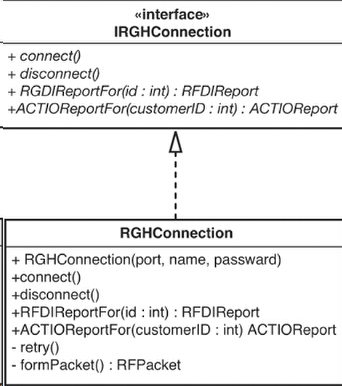

## Chapter 6. I don't have much time and I have to change it
Suppose you are very busy and now your boss need you to add a new feature. What should you do with the legacy code?

### 6.1 Sprout Method
Here is your legacy code that our entries need to post date and be added to the transaction bundle.

```java
public class TranscationGate {
    public void postEntries(List<Entry> entries) {
        for(Entry entry : entries){
            entry.postData();
        }
        mTransactionBundle.getListManager().add(entries);
    }
}
```
Now we need to verify that the transaction bundle only add the new entries.  We could change the code to this:
```java
// Not a good example
public class TranscationGate {
    public void postEntries(List<Entry> entries) {
        List<Entry> tmp = new LinkedList<>(); //▼
        for(Entry entry : entries){
            if(!mTransactionBundle.getListManager().hasEntry(entry)) { //▼
                entry.postData();
                tmp.add(entry); //▼
            }
        }
        mTransactionBundle.getListManager().add(tmp); //▼
    }
}
```
This seems like a simple change, but it was pretty invasive. There isn't any separation between the new code we've added and the old code. 

What we need to do is separate the new code and old code, so the test new features is easier. A better version of code is like this:
```java
public class TranscationGate {

    //TODO add a @Test method to test the new method/feature
    List<Entry> uniqueEntries(List<Entry> entries){
        List<Entry> tmp = new LinkedList<>();
        for(Entry entry : entries){
            if(!mTransactionBundle.getListManager().hasEntry(entry)) {
                tmp.add(entry);
            }
        }
        return tmp;
    }

    public void postEntries(List<Entry> entries) {
        List<Entry> tmp = uniqueEntries(entries) //▼
        for(Entry entry : entries){
            entry.postData();
        }
        mTransactionBundle.getListManager().add(tmp);//▼
    }
}
```

```
songzhw:
    Actually I am not 100% agreeing with this section. The book think `How do we know we got it right?`. I think that should not be worried. Because that's JUnit's job. 
    We should add test code to cover the old code. Then we are not afraid of changing the code, because we know after we made the change our test case are in the background to guard our code. 
```

### 6.2 Wrap Method
Adding behavior to existing method is quite easy, but maybe not the right thing to do. Let's see an example.

Old code
```java
public class Employee {
    public void pay(){
        for(TimeCard time : timeCards){
            .... // time.getHours() * payRates
        }
        payDispatcher.pay(amout);
    }
}
```

Let's suppose that a new requirement comes along. Every time that we pay an employee, we have to update a file with the employee's name so that that it can be sent off to some reporting software. 

A good way to do that is to add a wrap method, whose name is still "pay()", but the implementation is changing. 
```java
public class Employee {
    private void dispatchPay(){ //▼ name: pay() --> dispatchPay()
        for(TimeCard time : timeCards){
            .... // time.getHours() * payRates
        }
        payDispatcher.pay(amout);
    }
   
    public void pay(){ //▼ a wrapper
        logPayment();
        dispatchPay();
    }
}
```
Clients who used to call pay() don't have to know or care about the change. They just make their call, and everything works out okay.


Another form of *Wrap Method* is having two parallel methods. You can call pay(), and you can call payWithLog() too. It's your decision to call which method.
```java
public class Employee {
    public void payWithLog(){
        logPayment();
        pay();
    }

    public void pay(){  ...  }
   
    private void logPayment() { ... }
}
```

### 6.3 Wrap Class

Just like *Wrap Method*, *Wrap Class* uses wrapping to add a new behavior and to avoid affect legacy code.

Let's take a look at the code from the *Employee* class again.
```java
public class LogginEmployee extends Employee{
    private final Employee employee;

    public LogginEmployee(Employee e){
        this.employee = e;
    }
   
    public void pay(){
        logPayment();
        employee.pay();
    }
}
```
Note: It seems like we can remove `extends Employee`, then why do we add it?
: Because that's for the [Decorator Design Pattern](https://en.wikipedia.org/wiki/Decorator_pattern). This way, you can wrap one Employee, and use it just like Employee. 

## Chapter 8. How Do I Add a Feature?
When you want to add a new feature, duplication is a hazard. If we can get code under test, we are in a better position to add new features. We have a solid foundation.

### 8.1 Test-Driven Devlopment (TDD)
The most powerful feature-addition technique I know of is test-driven development(TDD). In a nutshell, it works like this: We imagine a method that will help us solve a problem, and then we write a failing test case for it. 

TDD uses a little algorithm that goes like this:
```
1. Write a failing test case
2. Get it to compile
3. Make it pass
4. Remove duplication
```

One of the most valuable things about TDD is that it lets us concentrate on one thing at a time.  We are either writing code or refactoring; we are never doing both at once.  

After we have written some new code, we can refactor to remove any duplication between it and the old code. 

### 8.2 Liksov Substitution Principle(LSP)
The LSP implies that clients of a class should be able to use objects of a subclass  without having to know that they are objects of a subclass. 

LSP actually is asking you that subclass can implement the abstract method, but the subclass should not override the non-abstract method. 


## Chap 9. I Can't Get This Class into a Test Harness
It is often hard to instantiate a class in a test harness. In this chapter, we go through a series of examples that highlight these problems in different language. 

read through these examples
apply (techniques) in particular situations

### 9.1 The Case of the Irritating Parameter
When I need to make a change in a legacy system, I usually start out optimistic. I try to be a realist as much as I can, but the optimism is always there.
"This sounds like it will be easy, We just have to ..., and we'll be done."
"Maybe it won't be too hard to construct it. We need to ... and of course, we'll need to get it in a testing harness."

Let's take a look at an example and see whether my optimism is appropriate or just a defense mechanism.

...
```java
CreditValidator validator = new CreditVlidator(rghConnection, creditManager);
```
It turns out that establishing *RGHConnection* to the server in a test is not a good idea. It takes a long time, and the server isn't always up.  

The thing that is really getting in our way when we want to create the validator is the *RGHConnection*. It is an irritating parameter. 

If we can create some sort of a **fake** *RGHConnection* object and make *CreditValidator* believe that it's talking to a real one, we can avoid all sorts of connection trouble

*RGHConnection* has a set of methods that deal with the mechanics of forming a connection: connect, disconnect, and retry, as well as more business-sepecific method such as RFDIReportFor and ACTIReportFor. 
In this case, the best way to make a fake object is to use **Extract Interface** on the *RGHConnection* class. 

After we do **Extract Interface**, we end up with a structure like this picture:



We can start to write tests by creating a little fake class. And don't worry, the fake class isn't productin code. It won't ever run in our full working application - just in the test harness.  (Test Code doesn't have to live up to the same standard as production code. )
(songzhw: Mockito may be another way to help us.)

The test works fine. 

### 9.2 Hidden Dependency

It's hard to test the below code
```java
public void foo(){
    Connection connection = new Connection(...);
    connection.setUp();
    connection.talk();
    ...
}
```

This code allocate a new connection object using *new* in the foo() method. That is poor style, and it gets worse. This foo() method does a lot of detailed work with the connection object. 

We use a connection to try to build a http connect. And it will be hard to test that functionality in an automated way unless we set up a server and connect to it repeatedly, wariting for a message to arrive. That could be great as an overall system test, but if all we want to do now is add some new tested functionality to the class, that could be overkill.  How can we create a simple object and add some new functionality?

The fundamental problem here is that the dependency on connection is hidden in the foo() method. If there was some way to replay connection object with a fake, we could sense through the fake and get some feedback as we change the class.

[Solution]
**Parameterize Function**
```java
public void foo(Connect connect){
    connection.setUp();
    connection.talk();
    ...
}
```


