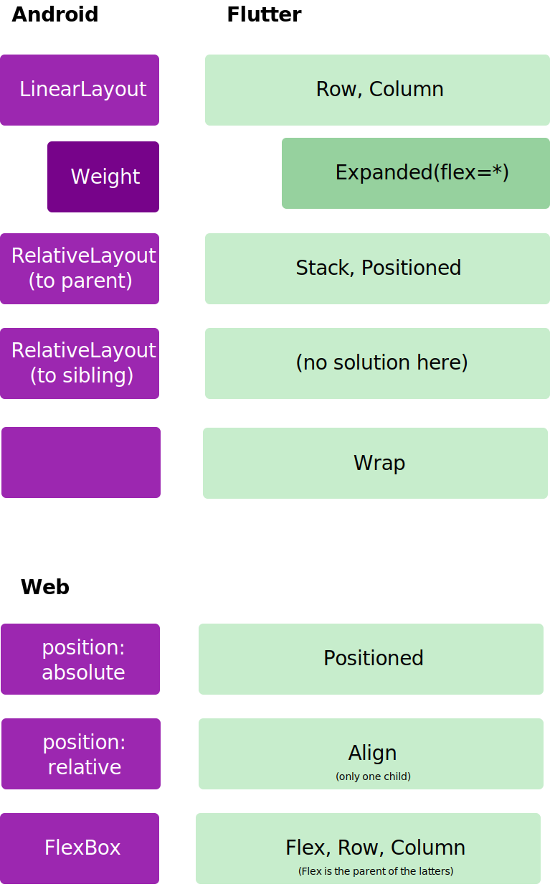

Also, `Container` is like the `God Layout`, as it contains:
* padding, margin
* stroke, fill  (like `DecoratedBox`)
* width, height (like `SizedBox`)
* min/maxWidth/Height (like `ConstriantBox`)
* transfer (like `Transform`)