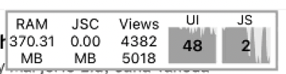

## Introduction

This is actually one of a series posts which mostly focus on several critical issue of "react-like" framework. This post is mostly focus on the Jetpack Compose UI. All the posts are:
* [Jetpack Compose version](https://github.com/songzhw/songzhw.github.io/blob/master/and_archi/2021-08-31-compose-issues.md)
* [React Native version](https://github.com/songzhw/songzhw.github.io/blob/master/react/2021-09-11-rn-issues.md)
* [Flutter version](https://github.com/songzhw/songzhw.github.io/blob/master/flutter/2021-10-01-flutter-issues.md)


## I. Re-render issue

### 1.1 Issues on React Native
One of the biggest performance issue in the React Native is the re-render issue. Let's say we have a parent and child:

```javascript
function Parent() {
  // it has two props/states: A , B
  return (
    <Text text={A}/>
    <Child prop={B}>
  )
}
```

Every time the prop A changes, it will refresh the Parent component/View, which means it will generate a new instance of `Child` and `Text`. 

But it's really unnecessary, as `Child` only depends on prop B. The parent ask child to re-render based on a irrelevant prop(A), that's kind of awful. 

### 1.2 What about Flutter?


## II. Long list performance

## II. Long list performance

### 2.1 Issues on React Native
React Native's latest view for List is the `FlatList`. It's powerful as it's easy to use, extend (such as the refresh header, the bottomView, load more pages, ...). However, it has a serious performance blackhole. 

#### 1). item layout
To get a better performance, you need to calculate every item's height and offset from the top. I never saw such a case that dev have to calculate the size of ListView item in any platform. Not ListView/RecyclerView, not UITableView, not the ListView in Flutter, ... 

I personally think React Native is wasting every dev's time to ask dev to calculate the position for each item. 

#### 2). initialNumberToRender
To get a better performance, you can point how many items you want to render when you open the page. 

Same comments here, no other platform has asked dev to do so. It's the React Native's responsibility to show just enough items where they are just enough to display in one screen. 

#### 3). Long list
React Native is doing terribly in this area. If you have 100 items in the list, RN will load all of them in the memory. I, acutally, has such a memory issue in my company's app. The list we had is using pagination, and the JS render frame rate is just dropping to 0ps, and the memory is just keeping growing when we load more and more pages. It's really a pain for the dev to handle it for you list. 

This is the performance of when I open the screen:


This is what I got when I load several more pages:



### 2.2 What about Flutter?

Lucky for us, Flutter has no such issue. `ListView.builder()` will only generate the children that are actually visible. This means that the listView is perfect for the larget nubmer of children, even infinite nubmer of children.


## III. Call tranditional view
