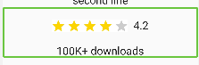

## Flutter Accessibility

Since Flutter is a cross-platform framework, so to be compatible with both Android and iOS, Flutter have many unique property to each platfrom, such as iOS's hint, android's liveRegion. However, in general, Flutter accessibility(a11y) is more easier than two native platform.

### 1. Text, TextButton
For the Text or TextButton, you don't need to do anything, Talkback/VoiceOver will read the text out for you automatically. 

However, if you want to do anything special, you could use ``.
For example, a Text which says "4.4", but you want to read "average rating four point four star", then you could do this:

```dart
          Text(
            "4.4",
            semanticsLabel: "average rating four point four star",
          ),
```

### 2. Image
For Image, Talkback/Voiceover will read "unlabelled. Image". So you could give a `lable` value.

The two approaches below are both okay. You can choose one for your code.
```dart
// [approach 1]
Semantics(
    label: "4.2 star in 100 thousands downloads",
    child: Image.asset("star.png", width: 160, height: 80)
)  

// [approach 2]
     Image.asset("star.png", width: 160, height: 80, semanticsLabel:"4.4 stars")

```

And the `Semantics` is the widget that contains a lot of a11y properties. If you want your view to support a11y, you can wrap that view into a `Semantics`. 

`Semantics` has many properties, like `label, hint, value, increasedValue, decreasedValue, isButton, isHeader, ...`.  If you are familiar with iOS a11y, then you would just find out these properties are just the copy of iOS a11y. 


### 3. exclusion
Just like two native platform, Flutter also have an a11y tree that is full of a11y node. If you don't want your view to be read, aka, to be included in this a11y tree, you can do it, still, by any of means below.

```dart
// [approach 1]
Image.asset("star.png", width: 160, height: 80, excludeFromSemantics: false)

// [approach 2]
Semantics(
    hidden: true,
    child: Image.asset("star.png", width: 160, height: 80)
)  

// [approach 3]
ExcludeSemantics(
    child: Image.asset("star.png", width: 160, height: 80)
) 
```
The `ExcludeSemantics` class is a widget that drops all the semantics of its descendants. AKA, that all its subviews are excluded from the a11y tree.

### 4. Region
Sometimes, you find out there are too many views in one page, and it takes the Talkback/Voiceover users to swipe too many times to get the whole info. To make the user experience better, you could combine some views together and regroup them as one a11y note. 



To make it read it as a group, and reduce some a11y noise for the talkback/voiceover users, we could use a `MergeSemantics` to group child views. Also, we would exclude the image, and re-generate the text for Texts.

```dart
MergeSemantics(
  child: Column(
    children: [
      Row(
        mainAxisAlignment: MainAxisAlignment.center,
        children: [
          Image.asset(
            "res/images/four_star.png",
            width: 160,
            height: 80,
            excludeFromSemantics: true,
          ),
          Text(
            "  4.2",
            semanticsLabel: "average rating four point four star in",
          ),
        ],
      ),
      Text(
        "100K+ downloads",
        semanticsLabel: "100 thousands downloads",
      ),
    ],
  ),
),```

// magic tap, escape, ...