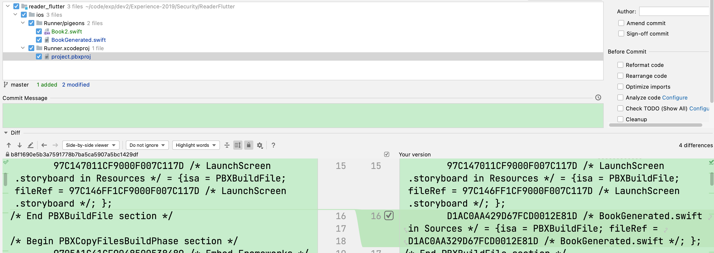

The `pigeon` is a third-party library to generate the `MethodChannel` code for us, which enables us to write platform-specific code. 

About how to use the `pigeon`, we have two main official document to reference: 
* Flutter's [Writing custom platform-specific code](https://docs.flutter.dev/development/platform-integration/platform-channels?tab=type-mappings-obj-c-tab)
* Pigeon's[ReadMe and Exampel](https://pub.dev/packages/pigeon/example).

However, unfortunately, the two official document are quite different from each other, and there are several conflict in these two documents. That's why I wrote this article to point out the pitfalls and how to solve these problems. 

The first few pitfalls are all about the following command you are about to run: 

```
# flutter pub run pigeon \ 
--input lib/pigeons/demo/BookIn.dart \ 
--dart_out lib/pigeons/demo/BookOut.dart \ 
--swift_out ios/Runner/pigeons/BookGenerated.swift \
--kotlin_out ./android/app/src/main/kotlin/ca/six/books/pigeons/BookGenerated.kt \  
--experimental_kotlin_package "ca.six.books.pigeons"
```

## pitfall 1 - Android
When you run the `flutter pub run pigeon ...` command, you normally will have errors, that's because this command does not create the fold for us if the destination folder is not there. 

How to fix it?
: just create the package in the Android Studio before you run the `flutter pub run pigeon ...` command

## pitfall 2 - iOS
Same as the pitfall #1, you have to create destination folder for the iOS as well. In iOS, the folder is called `group` (Android's is `package`). 

## pitfall 3 - iOS
After you create package and group for Android and iOS, then you run the `flutter pub run pigeon ...` command. Everything seems right to you. No warning. No error. However, if you want to run the iOS, then you will get a compile error that says `can not find type 'Book' in scope`. 

p.s. The Android has no such issue.
And the reason is Android will treat every java and kotlin file in the `src` folder as a source file. 
But iOS is quite different. iOS only know which files to compile through the `project.pbxporj` file. This `project.pbxporj` will keep index of every file that need to be built. Our generated file by the command has no reference in this `project.pbxporj` file, and that's why the iOS build failed.

How to fix it?
: before you run the command, try to open the ios folder with xcode, and generate group and new a `BookGenerated.swift` file in xcode. This way, the `project.pbxporj` will add this file to the scope and you won't have this issue anymore.


p.s. Don't worry about this BookGenerated.swift. Once you run the command, this file will be overrided with the correct generated content. 


## pitfall 4 - Android
The official document says: 
```kotlin
BookApi.setUp(getBinaryMessenger(), BookApiImpl()) 
```

But this is wrong, because this `getBinaryMessenger` method is no longer there anymore. 

How to fix it?
: we should use this:
```kotlin
import android.os.Bundle
import ca.six.books.pigeons.Book
import ca.six.books.pigeons.BookApi

class MainActivity: FlutterActivity() {
    override fun configureFlutterEngine(flutterEngine: FlutterEngine) {
       super.configureFlutterEngine(flutterEngine)
        val messenger = flutterEngine.dartExecutor.binaryMessenger
        BookApi.setUp(messenger, BookApiImpl()) 
    }
}


class BookApiImpl : BookApi {
    override fun search(keyword: String): List<Book?> {
        val book = Book("szw2", "android-$keyword")
        return listOf(book)
    }
}

```

## pitfall 5 - iOS
Same as Android, the way to get the messenger is quite different from the official doc. The correct way is: 

```swift
// wrong
let api = BookApiImpl()
BookApiSetup.setUp(getFlutterEngine().binaryMessenger, api)

// correct
let controller : FlutterViewController = window?.rootViewController as! FlutterViewController
let api = BookApiImpl()
BookApiSetup.setUp(binaryMessenger: controller.binaryMessenger, api: api)
    
```