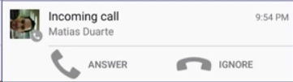
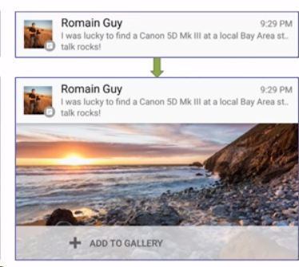
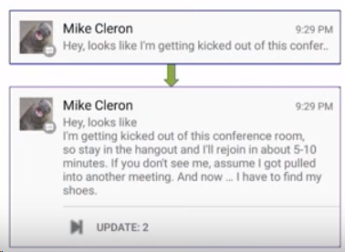

#Respect user Attention : *Notification Best Practices*

Content
> Notification Best Practices
>> Don't annoy the user
>> Respect the user
>> Empower them
>> Delight them
>> Connect them to the people they care about


## Don't annoy the user
One of the things we do in Lollipop and on is we have a mode called "Do Not Disturb".

You don't know if you're going to be interrupting me and something I care about. But I can give the system signals. I can say, listen, I don't want to be bothered by unimportant things for the next hour.

The right way to do this:
```java
new NotificationCompat.Builder(this)
    ...
    .setCategory(NotificationCompat.CATEGORY_MESSAGE)
    .build();
```

I will try to use NotificiationCompa everywhere, because this will at least compile and run all the way back to four(Android  1.6).

You have to pick one [category](https://developer.android.com/reference/android/support/v4/app/NotificationCompat.html) for you notification. Here is some categories:

Category  |  Description
:-------------------------:|:-------------------------:
CATEGORY_ALARM | alarm or timer
CATEGORY_REMINDER | user-scheduled reminder
CATEGORY_EVENT | calendar event
CATEGORY_CALL | in coming call(voice or video)
CATEGORY_MESSAGE | incoming direct message(SMS, instant message, etc.)
CATEGORY_EMAIL | asynchronous message, such as email
CATEGORY_SOCIAL | social network
CATEGORY_RECOMMENDATION | a specific, timely recommendation for a single thing

## Respect the user
### 1: **set priority**
```java
new NotificationCompat.Builder(this)
    ...
    .setPriority(NotificationCompat.PRIORITY_LOW)
    .build();
```


Priority  |  Description
:-------------------------:|:-------------------------:
PRIORITY_MAX | time-critial tasks <br/> (incoming call, turn-by-turn directions)
PRIORITY_HIGH | important communications<br/> (chats, texts, important emails)
PRIORITY_LOW | not time sensitive<br/>(social broadcast)
PRIORITY_MIN | contextual or background information<br/>(recommendation, weather)

### 2: **setOnlyAlertOnce**
Another way to get the user the information they need is to use this thing called "setOnlyAlertOnce()"

```java
new NotificationCompat.Builder(this)
    ...
    .setOnlyAlertOnce(true)
    .setprogress(100, 50, false)
    .build();
```
It's not an instant message notification. It's not the one that I hear the beep, and I pull my phone out, and look at it right away.  It might be something like, what's the weather, or what's the latest stock quote, or how far are you away from some place.    Those are the kinds of things where you're not going to alert these. You don't have any timely information to give them, but you have information they might be able to take advantage of if they happen to see it.

And this is the way if you did want to alert them that you were posting it, but you didn't want to keep bothering them while you're updating it. So **setOnlyAlertOnce()** says, if you've already made noise, don't do it again.

### 3: **cancle out of date notification**
Afte a long time, you may have multiple notifications. The most recent of which was useful, but the other ones are totally not. You should just cancel them out.

```java
ctx.getSystemService(Context.ALARM_SERVICE)
    .SET(AlarmManager.ELAPSED_REALTIME,
         SystemClock.elaspedRealtime() + ONE_HOUR,
         makeCancelAllPendingIntent(ctx));
```
If you think that you've posted information that the user isn't going to care about an hour from now, don't show it to them. Get out of their face. Their attention is worth more than you extra effort for coding. So you can do them that favor, and they will appreciate it.

### 4. Peeking notification
This is another situation where the you were reading Or maybe you were playing a game, and you got a phone call. You kind switched to the calling page. It's strong.

So one thing we did in Lollipop is we introduced the idea of a peak. Peak notificaiton. So the nice thing about this is that the user doesn't get pulled out of their task.


Only the high priority notification can bubble up into the space. This is the way to make sure your notificaiton is really important. So, don't use the peek, unless you really think it's worth it. Because you will get uninstalled. 

```
Peek
    >= PRIORITY_HIGH && (sound || virbration)
```
## Empower them
### 1. Notification Settings
(1). 
... (manifest : Category: NOTIFICATION_PREFEREENCES)

(2). 
If you have a settings activity for your notifications, which you should, and the user express some desire about how notifications should be handled, please save that. Don't drop it on the next upgrade. Don't drop it when the user moving to another devices. You should definitely send it to you sever.

I think the key idea there is that any time the user tells you or gives you some information about how they like or dislike your app, that's gold.  You're never going to get that again.

### 2. add up actions to notification
The other way to enpower the users is notifications should be actionable.



Here ishow you add them:

```java
new NotificationCompat.Builder(this)
    ...
    .addAction(R.drawable.answer, R.string.answer, answerPendingIntent)
    .addAction(R.drawable.ignore, R.string.ignore, ignorerPendingIntent)
    .build();
```
### 3. giving the imformation the user need
(1). Big Picture

(The image will be *CenterCrop*, and <= 450dp wide. )

This is great for showcasing visual content. However, remember that large bitmap waste RAM. 

```java
new NotificationCompat.Builder(this)
    ...
    .setStyle(new Notification.BigPictureStyle()
                  .bigPicture(photoBitmap))
    .build();
```

(2). Big Text
And there is a text example



```java
new NotificationCompat.Builder(this)
    ...
    .setStyle(new Notification.BigTextStyle()
                  .bigText(longText))
    .build();
```
### 4. Ongoing Notifications
Ongoing notifcations are those notification that you can not dismiss. Please be careful, and please give the user a way to dismiss. 

## Delight them
Some people love to change ringtones. They love to have this app be that sound, and this app be that sound. And that way they can know which apps are making sound.

It turns out that there's this ringtone preference.
```xml
<RingtonePreference
    android:persistenet="true"
    android:key="sms_sound"
    android:dependency="sms_enable"
    android:ringtoneType="notification"
    android:title="@string/sms_sound"
    />
```
So if you just drop this little snippet into your perferences panel, you'll get his nice little dialogue. You don't have to do anything else. 

```java
SharedPreferences perfs = PreferenceManger.getDaultSharedPerferences(ctx);
String uri = pref.getString(SOUND, null);
if(uri != null){
    builder.setSound( Uri.parse(uri) );
}
```
So if you want to delight your users, in addition to everything else you're doing, this is another thing you can add on.  

## Connect them to the people they care about

Do not disturb : Priority only

If the person is important to me, you can add code like this:
```java
new NotificationCompat.Builder(this)
    ...
    .addPerson(Uri.formParts("tel", "1 (617) 555-1212", null).toString())
    .build();
```
Note: you do not need to ask for the contacts permission.


