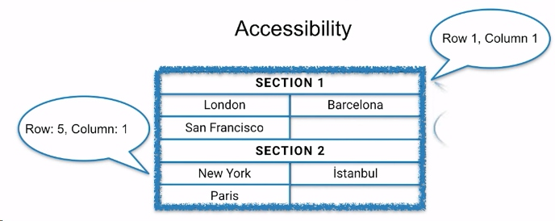
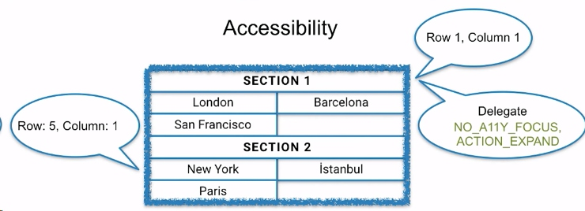
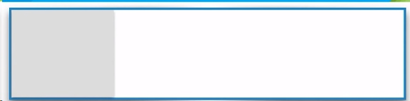

#RecyclerView : Animations, Layout, and More

## I. Quick going throug components

### 1. LayoutManager
1.1 Positioning Items, 
1.2 Scolling, 
1.3 Accessibility : LayoutManager provide basic accessibility, information to cycle through. Like One row of one column:



But if you have more information about those views, like the section one cannot be accessible to focus, you then have access to delegate to RecyclerView to add this additional information:



### 2. Adapter
[Basic]
* create view and ViewHolder
* Bind an item to a ViewHolder
* Notify RecyclerView about changes
* Notify data out of sync

[Advanced]
* Item interaction handling(click etc)
* Multiple view types
* Recycler recovery(onFailedToRecyclerView)
* Granular data change events (like this item is changed, not that the whole list changed)

Don't tell the adapter that all of your items have been changed. RecyclerView won't be able to reuse any of those views.   Instead, how do I fix this?   Please use granular adapter updates
```java
adapter.notifyitemChanged(position)
```

### 3. ItemDecoration
* Custom drawing on RecyclerView Canvas
* Can add offset to view bounds
* Can have multiple ItemDecorations

Let's see the API a little bit in detail. 

#### 3.1 getItemOffsets()
So this is my view, and that's the boundaries. 


```java
public void getItemOffsets (Rect outRect, 
                View view, 
                RecyclerView parent, 
                RecyclerView.State state)
```
The RecyclerView asks the ItemDecoration do you have any offsets for this item, which means do you want to draw around this item?

#### 3.2 onDraw()
```java
public void onDraw(Canvas c, RecyclerView parent)
```
When the drawing starts, the RecyclerView will first ask you to draw whatever you want to draw before the layout manager or the children draws.

You can daw backgrounds here:
before: 


After:




#### 3.3 onDrawOver()
Then the RecyclerView draw will happen, the children will draw. 


And after that, we will can onDrawOver where you can draw over the children whatever you want. 


```java
public void onDrawOver(Canvas c, RecyclerView parent, RecyclerView.State state)
```

#### 3.4 Take Care
* Do not try to access the adapter.  Because you might call it in the middle of a layout.
* Keep necessary information in ViewHolder. The ViewHolder should keep whatever information the ItemDecoratin needs.
* General onDraw rules applys (don't allocate etc. Because you are gonna be called many times here.)
* When you need to get the viewholde, you can use this method:  `recyclerView.getChildViewHolder(view)`

### 4. RecycledViewPool
 * Sanctuary for reserve ViewHolders
 * Can be shared between RecyclerViews or custom ViewGroups
 * Per Activity Context

The ppol is where we keep all the remaining views.

## II. How Animations work
11:00


