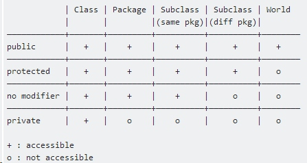

## Background

Today I want to create a subclass of "AppCompatDelegateImplV14". But I found out the definition of this class is :
```java
class AppCompatDelegateImplV14 extends AppCompatDelegateImplV11 { ...}
```

And I failed to try to do this:
```java
public class MyAppComplatDelegateImpl extends AppCompatDelegateImplV14 {...}
```

I then realized that's because the access modifier of `AppCompatDelegateImpl` is default. 
The `AppCompatDelegateImpl` class is in the "android.support.v7.app" package, and my `MyAppComplatDelegateImpl` is in my "ca.six.demo" package.  Since there are two different package, so it's illegal to extend the default class. 

## Java Access Modifier
There is a famous table about the java access modifiers:


But I have to say, this table is not completed. The biggest question about this table is what is "accessible".  

Since public and private is easy to understand, so I will talk more about the protected and default modifiers. Here is the completed version.


Protected                  |  Default
:-------------------------:|:-------------------------:
Subclass </br>(Sampe Package)  |    ▼ </br> ✿
Not Subclass</br>(Same Package) |   ▼
Subclass </br>(Different Package) | ✿
Not Subclass</br>(Different Package) |  

▼  can call the filed/method
✿  can override the field/method from parent class


