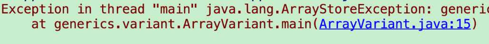
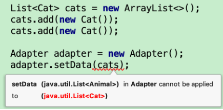
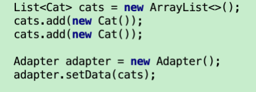
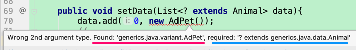
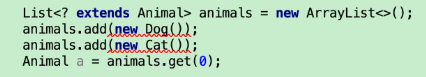
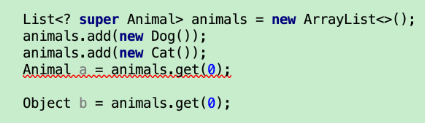

Let's say we have an app for displaying cute pets. Naturally, we would have lists of pets. But before Java 1.5, the reality is not good for our Developer. Let's see the tough reality among Java 1.0 to Java 1.4.


##I. Why we need generics?

Before we start, let me give you some context. We have three class, and their hierarchy is like this:

```
        Being
          |
        Animal
      /       \
    Cat       Dog
```

Now let's begin.


\### 1. to reduce duplicate code

We could have `CatList` and `DogList` classes, or we could have `List<Cat>` and `List<Dog>` objects. They seems similar, except the latter share a same class, which, for us, removes duplicate code. It helps us manage our code, extend our code, and change our code easier.


### 2.  array is not a perfect option for us

You may say, we could save the pets into an array, like `Cat[]`, `Dog[]`, and `Animal[]`. Yeah, you can, but this is just not the best option for us. Why? Let's have a look at the below code:


\```java

Dog dog = new Dog();


Cat[] cats = new Cat[1];

Animal[] animals = cats;

animals[0] = dog;

\```


These code seem fine, but they are not. Yes, you will see no warning or errors when you write it (-- which makes this even more evil), but you will get a crash if you want to run it. 




First of all, `animals` is an array of animals, so it's okay to add a dog object, and it's okay to add a bunch of cats. -- That's why Java compiler does not say it's wrong


But when we run this code, Java just noticed that "Wait a minute, when you use `animals = cats`, it actually becomes an array of Cat, so you can't add Dog into it anymore!" -- This seems fair too. 


Just it's confusing if you compare these two behavior (at the run time, and the one at the compile time).  Yes, this kind of confuse is exactly why `Array` in Java is not good for "type security".   


Now I must say one extremely important things: `Arry's type insecurity is exactly what the Java Generics wants to avoid`. List want to avoid this kind of `ArrayStoreException` at the runtime. Understand this, then you will understand many odd behavior of generics, which we'll cover later. But before we move on, please remember this again:`Arry's type insecurity is exactly what the Java Generics wants to avoid`!!! 

## II. Examples


###1. `List<Animal>`

Still the Pet App. Let's say I have a home page to show all kinds of pets. So I need a `List<Animal>`. Here is the code


\```java

List<Animal> animals = new ArrayList<>();

animals.add(new Cat());

Animal cat = animals.get(0);

\```


This is correct and usual. You may have no interest in it. Fair enough, let's go a little further.


###2. Common RecyclerView.Adapter

Inside the Pet App, we have a screen called `Cat List Screen`, to display the cute cats; we also have another screen, `Dog List Screen` to display the cute dogs; The UI of both screen are identical: only show a RecyclerView; the ViewHolder of Recycler is same too. Just the data is different. One is `List<Cat>, and another is `List<Dog>`. 


Naturally, I only need one Adapter, one CommonAdapter class, for both screens. In this CommonAdapter, I have a `setData(pets)` method, which I can pass in a `List<Cat>`, and I can also pass in a `List<Dog>`. According to the previous Animal[] array example, I just make the definition as `public void setData(List<Animal> animals)`, things should be good.


Unless, is it?

Let's make the `setData()` method this way, and pass in a `List<Cat>` data, what could happen?





Notice Java just complain to us, "I expect a List<Animal>, but you gave me a List<Cat>". 

Wait a minute, a list of cat IS a list of animals, that should be fine. But sorry, Java doesn't think it in the way we human being thinks. 


Remeber the last array example, these two line makes the code crash at the runtime


\```java

Cat[] cats = new Cat[1];

Animal[] animals = cats;

\```


When Java try to add a new feature, called `Generics`, in Java 1.5, Java want to stop making these kind of mistake. So Java generics has a more strict policy about types, yes, more strict than array. 


the code `Animal[] animals = new Cat[1]` is what might be dangerous in Java(I will call it "parent-child assigment", or "PC assignment" for short later)


PC assignment is okay for Java arraies, but it's forbidden by Java Generics. That means, `List<Animals> a = new ArrayList<Cat>()` would get an error AT THE COMPILE TIME. 


p.s. Actually, generics is only existing at the compile time. When it's run at the run time, `List<Animal>` would become `List` instead. This is called `type-erasure`. If this is too much for you, you can just skip it. I still hope to show you the knowledge by examples, not by definitions. 


### 3. How to fix it?

Just like our CommonAdapter class, sometimes we do have such requirement, that we would like to pass in `List<ChildA>`, and some other time we would like to pass in `List<ChildB>`. If this is what you want, then you should use wildcard in generics.


For the CommonAdapter case, we should use `List<? extends Animal>`. This means we could accept `List<AnyChildOfAnimal>`. 


\```java

// the previous code that would cause issue

public void setData(List<Animal> animals){ }


// now it's be corrected as: 

public void setData(List<? extends Animal> animals){ }

\```


Now we could pass `List<Cat>` to the setData() method:




## III. `List<? extends Animal>`

The previous code enable us to show CatListScren, and DogListScreen as well. Now the project owner tells us that we finally get someone to sponsor us. In return, we have to show the sponsor's Ad. The sponsor would like to display his cute pet as the first item of the RecyclerView in the CatListScreen, and the DogListScreen. 


### 1. Ad

Fair enough. Now let's start working. 

1. we create another child of Animal:

```
class AdPet extends Animal{... }
```


2. we modify the Adatper.setData() method.

\```java

   public void setData(List<? extends Animal> animals){

​        animals.add(0, new AdPet()); //ERROR!

​        // ....

​    }

\```

But we get an error: 




### 2. Why?

Here you must be confused again. Why can't I add a animal child to a `List<Animal>`.


First of all, this is not a `List<Animal>`,  this is a `List<? extends Animal>`. Yes, they are different!


Second, please allow me to show the previous array code again (because it is really really important to help us understand generics)


\```java

Dog dog = new Dog();


Cat[] cats = new Cat[1];

Animal[] animals = cats;

animals[0] = dog;

\```


As we said, the previous code is not type-secure, and that's what Java Generics wants to avoid.


Now back to Java Generics, when you have declared a `List<? extends Animal> animals`, Java actually don't know what this list could add. A cat? A dog?  What if you just copy the array code to add a dog after you PC assign a cat list? 


\```java

List<? extends Animal> animalList = new ArrayList<Cat>(); // okay!

animalList.add(dog); // error!!!

\```


Since you can PC-assign in the `List<? extends Animals>`, so the type of `animalList` could be anything at the runtime. It could be a `List<Cat>`, or a `List<Dog>`. Therefore, Java is actually protect your code from yourself by forbiding you adding any values to this `List<? extends Animals>`.


### 3. You can read, though




From this small demo, we see we can read value from this list, but we can not add any value to it. 


### 4. Conclusion

so for a `List<? extends Animals>` object, you:

  \* can PC assign

  \* can not add(value) into this list

  \* can read from this list by using `get(index)` or `for loop`


## IV. `List<? super Animal>`

### 1. introduction by a example

`List<? super Animal>` is similar with `List<? extends Animal>`; they are like Ying and Yang. A good example to show you how to use `List<? super Animal>` would be :



That means, `List<? super Animal>`could add elements, but it can not get an element out as a Animal. Yes, it's just the opposite of `List<? extends Animal>`


### 2. Conclusion

```
List<? super Animal>
```

* it could PC assign, like `List<? super Animal> animals = new List<Being>()`
  * Notice that, the right value is holding a `Being` class, the parent class of the `Animal` class

* it can write (add items to it)
* it can not read as an Animal -- all it can do is to read an object, and the type can only be an `Object`


## V. Conclusion


### 1. What about List<Animal>?

After reading all these confusing examples and concepts, you may have a question about `List<Animal>`. Good question, that means you are thinking as reading this article.


We've, actually, cover this in the `II.1` section. But I would like to say it again, with a new example.

