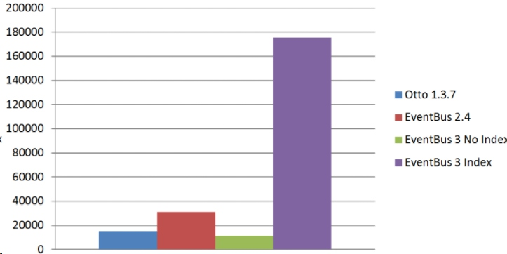
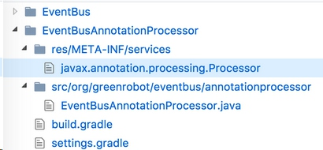

### A question about EventBus 3
EventBus3 is released for a while. After taking a lookt at its source code, I has some doubts about its performance.

EventBus3 is using runtime annotation. 
```java
@Retention(RetentionPolicy.RUNTIME)
@Target({ElementType.METHOD})
public @interface Subscribe {
    ThreadMode threadMode() default ThreadMode.POSTING;
    boolean sticky() default false;
    int priority() default 0;
}
```

Then the code need to use reflection to parse the information the @Subscribe annotation carries.
```java
        for (Method method : methods) {
            int modifiers = method.getModifiers();
            if ((modifiers & Modifier.PUBLIC) != 0 && (modifiers & MODIFIERS_IGNORE) == 0) {
                Class<?>[] parameterTypes = method.getParameterTypes();
                if (parameterTypes.length == 1) {
                    Subscribe subscribeAnnotation = method.getAnnotation(Subscribe.class);
```

As we know, runtime annotation, or reflection, is bad for the performance. So it’s natual for me to conclude that EventBus3 must have a worse performance than EventBus2. 

But the performance result actually slap my face right away.



The above graph shows the resulting speed in registrations per second (higher is better). As we can see, the EventBus3 without Index is indeed slower than EventBus2. The reason is that analysis I did above.

But what is “EventBus 3 with Index”? and Why did it much faster than EventBus2?

### How does Eventbus2.4 work?
Before to understand why Eventbus3.0 is better, we need to understand how EventBus 2.4 works?

```java
eventBus.register(this);

public void onEvent(AnyEventType event) {
    /* Do something */
}
```

When we regesiter one Subscriber using `eventBus.register(this)`, actually, we iterate all the method in that subscriber object.  Here is what happend this registration:
1. call `eventBus.register(subscriber)`
2. EventBus iterates this subscriber object, finds out all the method starts with “onEvent”
3. EventBus then saves all these methods we just found out, say in a HashMap<Event, Method>
4. When we got an event, we iterate the HashMap, find out where this method is. If we do find one method, then we invoke it.

We now understand how it works. If you want to improve it, how should you do?

First of all, we need to locate which part costs most time? 
: The answer is registration.  We need to iterate the subscriber object using reflection to get all the subscriber method. This is time consuming.  Maybe we can do something about it.

### Try to improve ther performance
Since the registration is the most time-consuming thing. Can we do something about it？

Oh, I have a idea. How about this? 
I add another helper class. Every time we add a subscriber method, we register it in that helper class by ourselves. That way, EventBus does not need to scan the subscriber object anymore.

Here is the code. `SubscriberInfo` is a class that contains the subscriber class and method information. 

```java
[Helper]
public class EventBusHelper {
    public HashMap<Event, SubscriberInfo> map;
}
```

```java
[Activity]
eventBus.register(this);
helper.map.put(Event_A, methodA);

public void methodA(){
    // do something
}

```

Good, now the time is much shorter, just like EventBus3 with Index in the above graph.


### New problem
Although the above way is good for our performance, but it’s **NOT** good for our programmer. Everytime we add a new subscriber method, we have to add it to the Helper class. If we forget one time, we may get wrong result.  And we do forget some times. 

So is there a way which is good for performance, and also good for our programmer?
: Yes, there is. That’s what EventBus3 does. 

### Why performance of EventBus 3 is better?

Here is the documentation about the EventBus 3:

```
The "subscriber index" is a new feature of EventBus 3. It is an optional optimization to speed up initial subscriber registration. The subscriber index can be created during build time using EventBus's annotation processor. While it is not required to use an index, it's recommend on Android for best performance.
```

Obviously, subscriber index is our answer. But how did it work?
: 
1. It still use the Helper class to help us shorten the registration time. But now the Helper class is named to  “SubscribeInfoIndex"
2. But we, as programmers, do not create this SubscriberInfoIndex class. This class and its content is generated by the compile time annotation. 

I wrote a post about [how to make your own ButterKnife using compile time annotation](https://github.com/songzhw/songzhw.github.io/blob/master/open_src/2016-05-27-make-your-own-butterknife-2.md). So I assume we already know how to implement the second part.

By the way, here is the evidence about EventBus is using compile time annotation

### Conclusion
After reviewing the source code, and thinking how to do it by ourselves, we now completely understand the reason why the performance is better.


