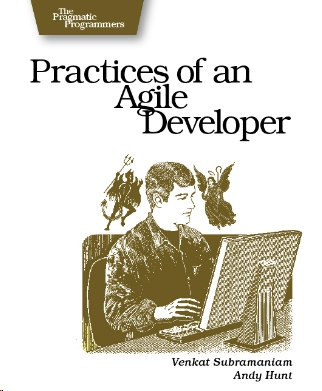
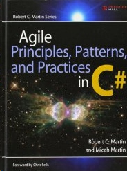
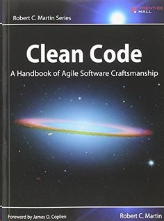
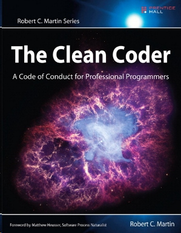
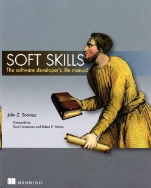

Today I want to introduce some books that may help you with your career. 

## how to be an agile developer
I strongly recommend this book. Actually, since I first heard of agile, this is the most great book I've ever found. This books tells you a lot knowledge about agile development, such as code review, constant feedback, iteration, feeding agility etc. Since most of projects are agile projects, You should definitely read it. 

## Uncle Bob's books
Uncle Bob is a famous developer, and he write many famous books. I named three of them as followed. These three books tells you about how to write clean code, how to write design pattern, how to become a professional programmer. Actually, these three books is worthy to read more than once. When you are junior developer, you read them to understand what goal should you set for yourself. When you start to become a senior developer, you can read them again. This time, you may get sympathetic response, and may get a tip that you never did but find it useful. 

 
 

## Soft Skills
This books tell you a lot of things beyond the development life, such as marketing yourself, productivity, finance, spirit, fitness etc. 

Amazon even has the audible version of this book. You can listen to the audio and learn staff when you are walking or doing something other stuff.

