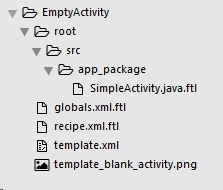
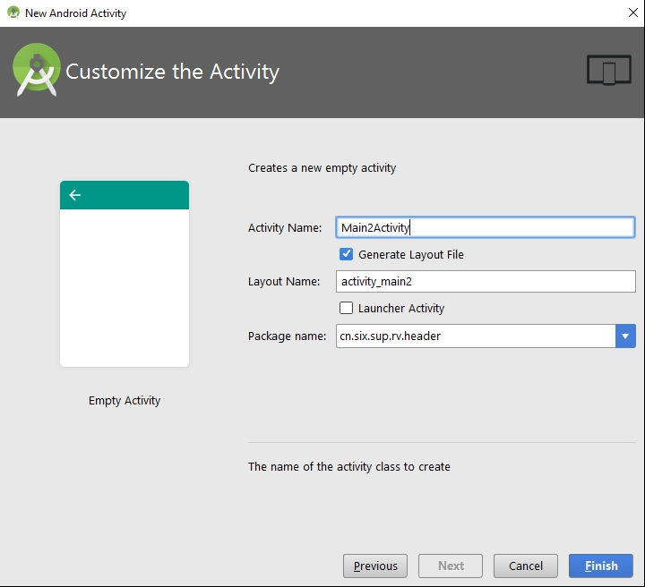
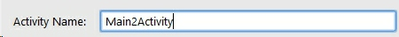
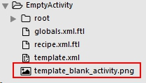
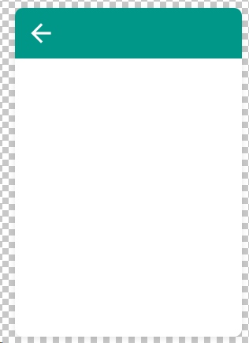

Today I want to introduce another tool to help you improve your  productivity: Activity Template in the Android Studio.

## 1. Introduction


This picture is familiar, right? But have you ever wondered what these templates come from when you new a project or an Activity?

Actually, they are come from the directory : "`%Android Studio Installed Directory%`\plugins\android\lib\templates\activities\EmptyActivity".    (`%Android Studio Installed Directory%` is the directory where you install the AndroidStudio.)

Let us open this directory, and take a look:


Yes, now you can find where the "Empty Activity", "Fullscreen Activity", "Basic Activity" come from ; they are all here.

We actually can take advantage of it to make our own Activity template for us, after getting familiar with the Activity Template.

Here is some developer's output:


(the picture is from: [Hongyang's blog](http://blog.csdn.net/lmj623565791/article/details/51592043) )

Pretty awesome, right?  

## 2. Learning from existing template

Before we make our own template, we should get know how to make a template. And the best way to do that is to learn from the existing template, especially the easiest one. 

In all the templates that already exist in the plugin directory, `EmptyActivity` is the simplest example. Let us have a loot at it.

Open the "EmptyActivity" directory, we found the structure of this directory is this:



### 2.1. template.xml
template.xml is like the layout xml in our Android project. It tells Android Studio how to draw a UI. 

For example, Empty Activity Template looks like this:


You have three EditText for you to input the name, and two CheckBox to select.  And the template will have these five element to draw them. 

A steamlined code of template.xml is like this:
```xml
<?xml version="1.0"?>
<template description="Creates a new empty activity">

    <parameter id="activityClass" name="Activity Name"
        type="string" default="MainActivity" />

    <parameter id="generateLayout" name="Generate Layout File"
        type="boolean" default="true" />

    <parameter id="layoutName" name="Layout Name"
        type="string" constraints="layout|unique|nonempty"
        visibility="generateLayout"/>

    <parameter id="isLauncher" name="Launcher Activity"
        type="boolean" default="false" />
    
    <parameter id="packageName" name="Package name"
        type="string" constraints="package"
        />

    <thumbs>
        <thumb>template_blank_activity.png</thumb>
    </thumbs>

    <globals file="globals.xml.ftl" />
    <execute file="recipe.xml.ftl" />

</template>

```

#### 2.1.1 parameter
It is easy to find out that every `<parameter>` element is one input UI View in the previous picture. 

Take an examploe of the first `<parameter>`,  ActivityName, the code is like below:

```java
    <parameter
        id="activityClass"
        name="Activity Name"
        type="string"
        constraints="class|unique|nonempty"
        suggest="${layoutToActivity(layoutName)}"
        default="MainActivity"
        help="The name of the activity class to create" />
```

And the UI is like this:



* Thd `id` attribute : It's like `android:id="@+id/etActivityName"`. You can use the "id" to get this UI View's text.
* The `name` attribute is the text in the left, "Activity Name:"
* The `type` attribute: String or boolean. If the value is String, then it will show as a EditText. If the value is boolean, then it will show as a CheckBox. (just like `<parameter id="isLauncher">`)
* The `constraints` attribute: "class|unique|nonempty" value is not hard to understand.

#### 2.1.2  thumb
```xml
    <thumbs>
        <thumb>template_blank_activity.png</thumb>
    </thumbs>
```

"template_blank_activity.png" is in the root directory of "EmptyActivity" directory. 



It looks like this:



Yes, this is the picture in the left of the UI.

#### 2.1.3 globals and execute  
```xml
    <globals file="globals.xml.ftl" />
    <execute file="recipe.xml.ftl" />
```
Template refers "globals" and "execute". I will talk about them later. 


