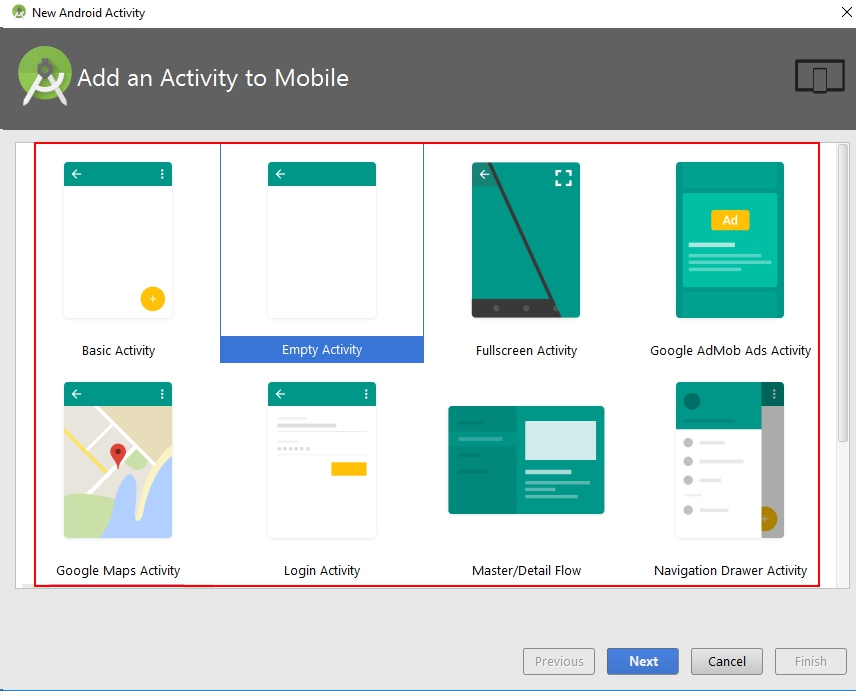
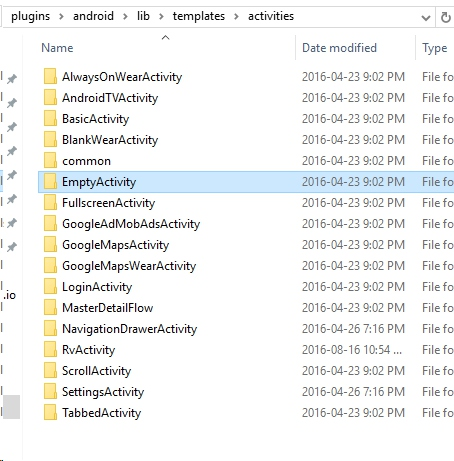

Today I want to introduce another tool to help you improve your  productivity: Activity Template in the Android Studio.

## 1. Introduction

This picture is familiar, right? But have you ever wondered what these templates come from when you new a project or an Activity?

Actually, they are come from the directory : "`%Android Studio Installed Directory%`\plugins\android\lib\templates\activities\EmptyActivity".    (`%Android Studio Installed Directory%` is the directory where you install the AndroidStudio.)

Let us open this directory, and take a look:

Yes, now you can find where the "Empty Activity", "Fullscreen Activity", "Basic Activity" come from ; they are all here.

We actually can take advantage of it to make our own Activity template for us, after getting familiar with the Activity Template.

Here is some developer's output:

(the picture is from: [Hongyang's blog](http://blog.csdn.net/lmj623565791/article/details/51592043) )

Pretty awesome, right?  

