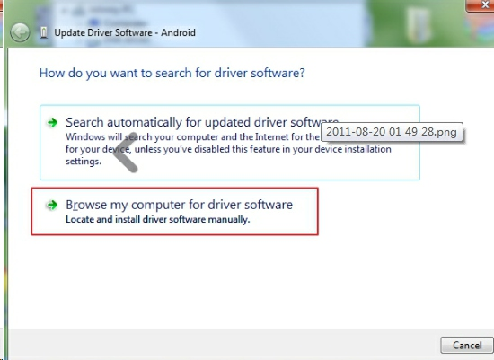

If you are a Mac/Linux user, you may have no such problem. But if you are a Windows user, you may find sometimes your computer cannot recognize a cellphone in AndroidStudio.  And this post will help you solve this problem

#### Step 01. 
Right click "This PC"(windows 10) or "My Computer"(Windows 7), select "properties"

#### Step 02. 
Select "Device Manager". Then you will see a phone with a yellow exclamatory mark in your phone. Just like this:

#### Step 03.
Make sure you already installed "Google USB Driver" in Android SDK.

#### Step 04. 
Right click this phone icon. Selecte "update Driver Software ..."

#### Step 05. 

#### Step 06. 

#### Step 07. 

#### Step 08. 

#### Step 09.  
select the directory :  `{android_sdk}\extras\google\usb_driver`, and install this driver

#### Step 10. Success

Now your Eclipse or Android Studio can recognize this phone.

Eclipse : 

Android Studio:

  

