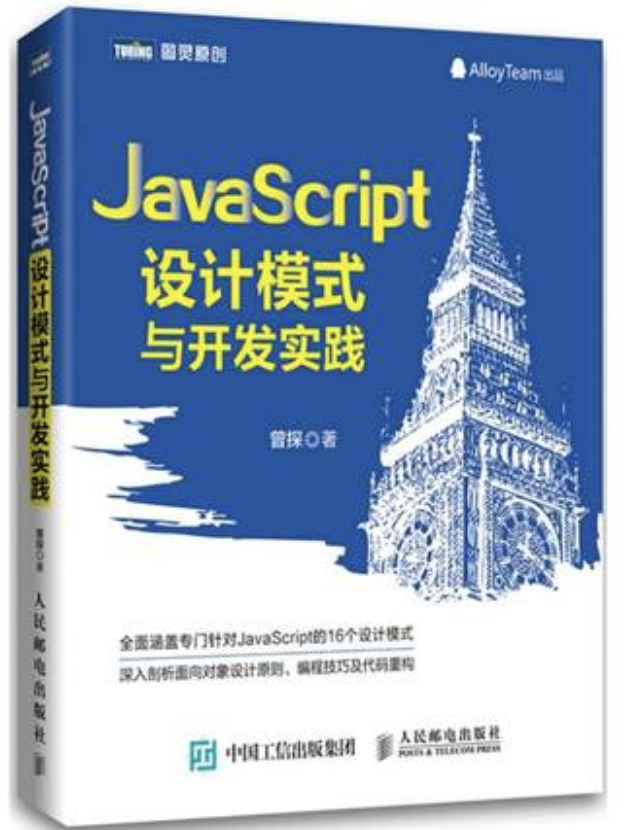
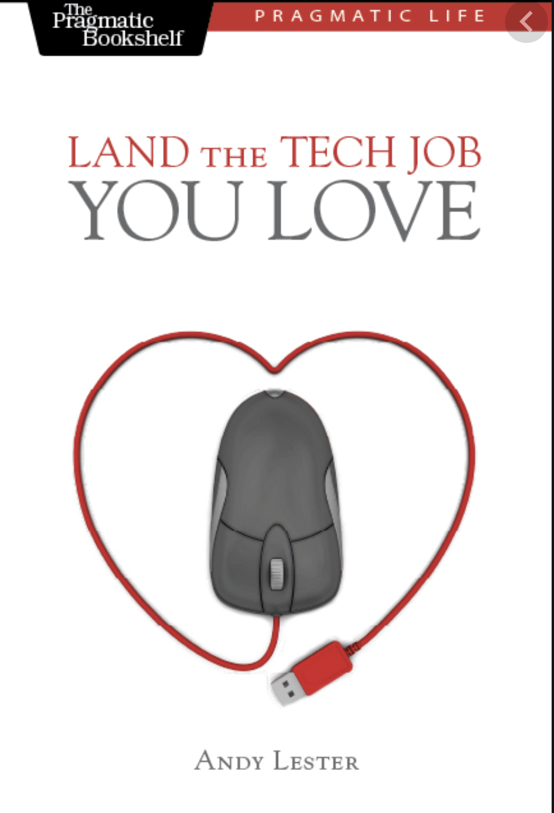
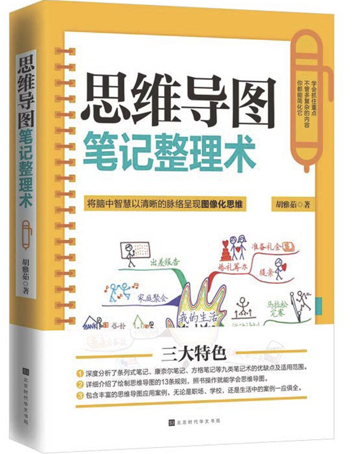
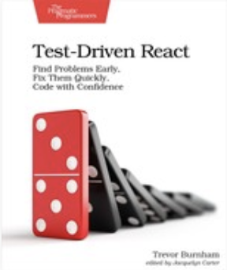
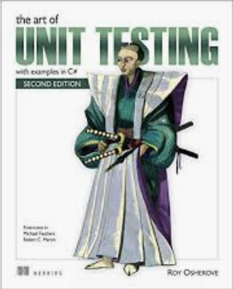

# The Good book I've read in 2019
2019 is already far away from us. I'm glad I did learn a lot in 2019. I've switched from an Android Developer/Architecture to a full-stack(ish?) developer. I've learned Node.js in 2018, and this year I spent 10 months in React/React Native app in my company. 

One thing that helps me a lot is books. I've read many books in 2019. Some of them are good, and some of them are not that interesting. 

## Bad Books

### 1. <JavaScript设计模式与开发实践>

Author: 曾探
Rate: ☆

This is a book about javascript design pattern in Chinese. I have to say most of the content are boiling. I expected to see more real-world issues we may had in the developement in JavaScript. But no, most of the content are simple and out-of-date examples. 

### 2.  Land the Tech Job You Love

Author: Andy Lester

Release Date: June 2009

Rate: ☆

This book contains resume, applying for a job, interview, after interview... It seems okay. That's my thought. But it turned out that the book is full of cliché. I really did not find anything useful or interesting. Sorry, this book is not good for me.

### Normal Books

These books are not bad, and they contains a few useful ideas or interesting ideas. So you can take a look  if you have time.

### 1.  <思维导图笔记整理术>

Author : 胡雅茹

Rate: ☆☆

This book is about taking notes using MindMap. MindMap could help you explore your brain, and get more and more ideas and details. 

This book also introduced many other approaches to take notes, like 5R of notes ... They are all interesting and helpful.

But one shortcoming of this book is that the way it suggested us is to use paper and pen. This is against my habits. I prefer to do thing on computer, so I can check it everwhere without carrying any heavy notebooks. Plus, it's much easy to remove and add stuff in computer than notebooks.

### 2. Test-Driven React

Author: Trevor Burnham

Release Date: June 2019

Rate: ☆☆☆

TDD is always a good idea, but also an idea that is hard to keep track of. You might find it tedious and give it up sometime in the future. Actually this is what this book did. 

This book introduced TDD at the first time, and guide us to do a Gallery example. But later the author just drop it, and do the coding first, then finish the unit test. So I guess this book is not showing us why TDD is so good. 

However, the examples in this book is a good way to teach you React and unit test int React. So I do recommend you to take a look. It's somehow a good book, I guess.

### 3. The Art of Unit Testing, 2nd Edition

Author: Roy Osherove 

Release Date: November 2013

Rate: ☆☆☆

First of all, this is the only book that I've read talking about writing good unit tests. All the books, videos, blog posts are only talking about how to write unit test. So I am so curious about this book.

The author mentioned 

### 4.

<!-- 
好书:
<getting started with SQL>

<head first html and css>
<阿里巴巴Android开发规范>
<effective typescript>
< Learn React with TypeScript 3>
<effective js>
<RxJs>
<React Native Cookbook>
<React状态管理与同构实战>
<Manager's Path>

一般:
<思维导图笔记整理术>
<the art of unit testing>
<test-driven react>
<Mastering TypeScript 3>

差评:
<js算法与数据结构>
<land the tech job you love>

在读:
<Programming iOS13>

其它书: 
<红色经济战> 
<临高启明>
做菜的几本书
是大臣 
-->