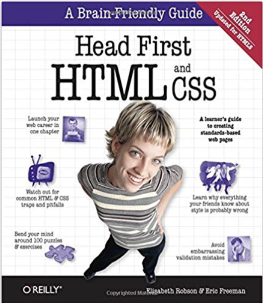
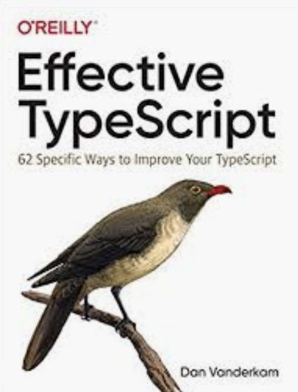
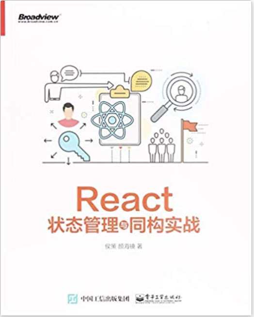

# The Good book I've read in 2019
2019 is already far away from us. I'm glad I did learn a lot in 2019. I've switched from an Android Developer/Architecture to a full-stack(ish?) developer. I've learned Node.js in 2018, and this year I spent 10 months in React/React Native app in my company. 

One thing that helps me a lot is books. I've read many books in 2019. Some of them are good, and some of them are not that interesting. 

## Bad Books

### 1. <JavaScript设计模式与开发实践>

Author: 曾探
Rate: ☆

This is a book about javascript design pattern in Chinese. I have to say most of the content are boiling. I expected to see more real-world issues we may had in the developement in JavaScript. But no, most of the content are simple and out-of-date examples. 

### 2.  Land the Tech Job You Love

Author: Andy Lester

Release Date: June 2009

Rate: ☆

This book contains resume, applying for a job, interview, after interview... It seems okay. That's my thought. But it turned out that the book is full of cliché. I really did not find anything useful or interesting. Sorry, this book is not good for me.

### Normal Books

These books are not bad, and they contains a few useful ideas or interesting ideas. So you can take a look  if you have time.

### 1.  <思维导图笔记整理术>

Author : 胡雅茹

Rate: ☆☆

This book is about taking notes using MindMap. MindMap could help you explore your brain, and get more and more ideas and details. 

This book also introduced many other approaches to take notes, like 5R of notes ... They are all interesting and helpful.

But one shortcoming of this book is that the way it suggested us is to use paper and pen. This is against my habits. I prefer to do thing on computer, so I can check it everwhere without carrying any heavy notebooks. Plus, it's much easy to remove and add stuff in computer than notebooks.

### 2. Test-Driven React

Author: Trevor Burnham

Release Date: June 2019

Rate: ☆☆☆

TDD is always a good idea, but also an idea that is hard to keep track of. You might find it tedious and give it up sometime in the future. Actually this is what this book did. 

This book introduced TDD at the first time, and guide us to do a Gallery example. But later the author just drop it, and do the coding first, then finish the unit test. So I guess this book is not showing us why TDD is so good. 

However, the examples in this book is a good way to teach you React and unit test int React. So I do recommend you to take a look. It's somehow a good book, I guess.

### 3. The Art of Unit Testing, 2nd Edition

Author: Roy Osherove 

Release Date: November 2013

Rate: ☆☆☆

First of all, this is the only book that I've read talking about writing good unit tests. All the books, videos, blog posts are only talking about how to write unit test. So I am so curious about this book.

The author mentioned three approaches to write unit test: verify the return value, verify the internal state, verify that we've called some 3rd-party libraries.  And we should "Always choose to use interaction testing only as the last option. This is very important. It's perferable to see if you can use the first two types (value or state) of end-result tests of units of works." The reason is that "From a pure maintainability perspective, in my tests using mocks creates more trouble than not using them. "

I'm particularly interested in this idea, and looking forward to seeing more examples. Unfortunately I didn't see too much details and examples. That's why I am a little disappointed about this book. 

Also, some concept are confusing and old-school, such as the difference of stub and mock. I personally think there is no need to understand this kind of difference. The more important thing is to understand why we need to isolate the dependency and how to do so. 

This book also tell us how to isolate dpendencies, how to handle legacy code, .... Overall, this is a good book, but I don't see too much examples of how to avoid the interaction testing in real-life.

However, I have to say I may make a mistake about underestimate this book. And I planned to review this book again one or two years later. I hope I can get more details when I read it again. -- Or, perhaps, it would have the third edition, which is better.

### ## Wonderful Books

### 1.  

Author: Elisabeth Robson, Eric Freeman

Rate: ★★★★★

The "Head-First" series books are alway with high quality. This book is not an exception as well.

It introduces many new concept by understandable examples. And authors evolved these examples step by step. You would know more and more by learning these examples. 

If you are new to HTML, especially CSS, this book is the best book to get started.

### 2. Effective TypeScript

Author: Dan Vanderkam

Rate: ★★★★★

TypeScript is more and more popular within the JavaScript dev world. And I personally like the strong-typed feature in TypeScript, which would help us find out errors before you publish it to market or QA. 

But TypeScript is complexer than JavaScript. You might get errors once in a while. You just don't know why you have this complaint sometimes. One potential approach to fix them is to use `any` in TypeScript. But `any`menas no check at all. This would result in errors, just like JavaScript

If you are getting troubles with TypeScript, and don't want to use `any`,  then this book come to rescue you. This book is not just explain some confusing concepts, but also tell you which approaches is the better way to write code in TypeScript.

Strongly recommend this book!

### 3. React状态管理与同构实战

A good book to explain the React state management in Chinese. If you are new to React, this book is a good one to introduce you to the React world. Above all, it also introcduce the Flux and Redux. 

It also dive into the source code of Redux, to help you understand more about Redux store/middleware and React-Redux. With these knowledge, you could be able to understand some Redux libraries, such as Redux-Saga.

This book shows more than React and Redux. It also tells you how to reuse code, why `setState` is async, how to optimize React apps....

 

In one world, this book is a good book to get started with React, and also a wonderful book to know more about React apps.

### 4.

### 5.

### 6.

## Other Dev Books

### 1. getting started with SQL

### 2.  Learn React with TypeScript 3

###3. React Native Cookbook

