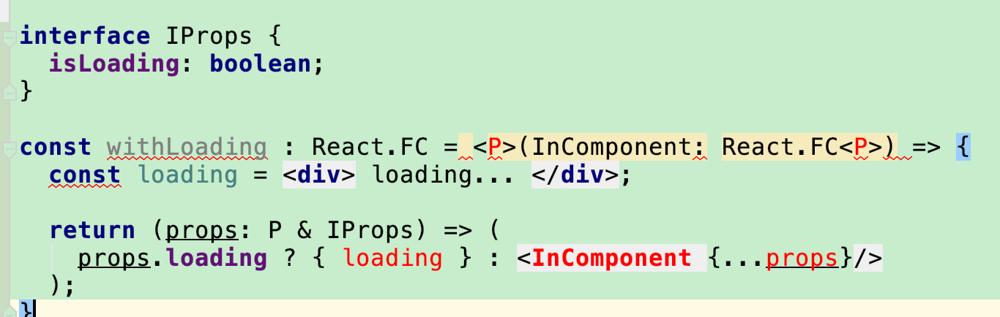

# Pitfalls of TypeScrit you may get in React project
For those who are familiar with modern language, JavaScript is a language that may let you feel familiar, but also would be the one to slap you right on your face somewhere. The lack of types, of course, would be a downside of JavaScript. That is also why TypeScript can rescue you.

However, TypeScript is not a silver bullet. Importing TypeScript would make sure your code is more readable, but also may have more issues you don't have in JavaScript. This post is trying to help you know some pitfalls in TypeScript, in order to make your TypeScript journey more comfortable.

## I. Define props

The following code works fine. You will not have an error by it. 

```typescript
const Item = () => {
  return (<div/>)
}
```

But reality is more complex than that: we normally would like to pass in some props.

In Javascript, we could use prop-type to define the type of props, as shown in the following code snippet:

```javascript
Item.propTypes = {
  name: PropTypes.string,
  book: PropType.object,
  values: Propypes.array,
  onTextChange: PropTypes.func
}
```

This code is helpful, but not that helpful. You don't know `value` is an array of what type, you don't know what's the types of parameter and returned value of `onTextChange`, of course, you still don't know what is this `book` means. 

A much more readable type definition would be something like the following snippet(pseudocode):


```typescript
type Props {
  name: string,
  book: TxtBook,
  values: string[],
  onTextChanged: (string)=>void
}
```

TypeScript is born for that, and it just help us make the prop type clear. Here is what TypeScript code that fulfill the same requirement:

```typescript
class TxtBook {
  public id: number = 0;
  public content: string = "";
}

interface IProps {
  name: string,
  book: TxtBook,
  values: string[],
  onTextChanged: (url: string) => void
}

const Item: React.FC<IProps> = (props: IProps) => {
  return (<div/>);
}
```

Now, let's take a close look at this preceding code. 

1. React.FC is short for React.FunctionComponent, which takes in a generics P as the type of its props. (Oh, yes, React.SFC is deprecated now, so please don't use React.SFC anymore. The reason is the name, Stateless Function Component, is not fit anymore. We now can have state in function component by using the `useState` hook)


2. The one thing that you may get wrong is the definition of a function. You may accidently write it down as `onTextChanged: (string) => void`. But you need to define the name of parameter when you trying to define a function/labmda type in TypeScript. So remember to add this parameter name, or you will get a compilation error.


## II. Problems when making a HoC


### 2.1 withLoading() - javascript version
HoC is a great way to reuse logic, aka, reduce boilerplate code. Take the loading for example, if some component is loading, then we show a progress bar; if not, then we just show the component directly.

```javascript
const withLoading = (InComponent) => {
  const loading = <div> loading... </div>
    
  return (props) => (
    props.isLoading ? {loading} : <InComponent {...props}/>
  )
}
```


### 2.2 typescript version 0.1
When it comes to TypeScript, we need to clarify the types: the types of props, the types of parameter of this HoC, and the type of the returned value of HoC. It seems easy. So I roll up my sleeves and write down the code:

```typescript
interface IProps {
  isLoading: boolean;
}

const withLoading : React.FC = (InComponent: React.FC) => {
  const loading = <div> loading... </div>;

  return (props: ?) => (
    props.loading ? { loading } : <InComponent {...props}/>
  );
}

```

1). The first error is the type of `InComponent`. It shouldn't be restricted on a function component, it could also be a calss Component, 
So the more rightful answer should be `InComponent: React.ComponentType`.  
This React.ComponentType is a combination of React.FC and React class component. Here is the definition of it: 

`type ComponentType<P = {}> = ComponentClass<P> | FunctionComponent<P>;`

2). InComponent normally would have its own props. And this props may be different if you pass another different component in to our `withLoading` HoC. That is said, the props of InComponent is not certain for now, it varies, which seems like a perfect scenario for generics. 


### 2.3 labmda definition in TypeScript
I have to mention the lambda definition before we go on. If you want to write a lambda, then here is an example


```typescript
const get = <T>(url: string): Promise<T> => {
  return fetch(url)
    .then(resp => resp.json());
};
```

This definition may seems odd to you. Its parameter has name; also, the returned value is prefixed by ":", not by "=>". But this is how TypeScript works. Please don't to make a definition like `const get = (string)=>Promise<T> {...} `, this is wrong, just wrong in TypeScript.


### 2.4 typescript version 0.2
By inspired by the idea of generics, I wrote down the second version. This time, my code stopped working. 



The intention is clear. I want to create a intersectio type: `P & IProps`. So I would have InComponent's props and also the IProps.

But the TypeScript compiler brutally crashed my idea: "I don't konw what `<P>` is!"

Yes, this is another pitfall you may have: `Generics in *.tsx files is not the same way it is supposed to be in *.ts files.`


TypeScrpt also use angle brackets for generics, combining it with JSX's syntax would introduce certain parsing difficulties. That is said, if you write down `<P>`, TS compiler thought this `<P>` is a JSX element. You have to make TS compiler believe this `<P>` is just a generics, not a JSX element.

The solution is to use `<P extends object>` instead of `<P>`. So the right code should be :

```typescript
interface IProps {
  isLoading: boolean;
}

const withLoading : React.FC = <P extends object>(InComponent: React.FC<P>) => {
  const loading = <div> loading... </div>;

  return (props: P & IProps) => (
    props.loading ? { loading } : <InComponent {...props}/>
  );
}
```


## III. props.children

`props.children` is a 

```typescript

```