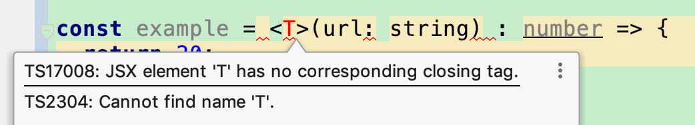

# Advanced TypeScript Tips in React-Native

TypeScript imports types to the JavaScript world, like a sweet sunshine into a dark room. However, types being compulsory also means you have to know the exact type even when you don't know it. So this is the pain of TypeScript. Most of these situations come from the 3rd-part library, and some of them are hard to solve. But lucky for us, TypeScript has some advanced types to help us.

## I. React
We could use `PropTypes` to define type in JavaScript. But you can not define types of state in JavaScript, while TypeScript can.

Since react 16.8, React imports functional components. So I would like to introduce types into class components and functional components.

### 1. class component

```TypeScript
interface IProps {
  name: string;
}

interface IState {
  offset: number;
}

class SomeScreen extends React.Component<IProps, IState> {
  state = { offset: 0 };

  constructor(props: IProps) {
    super(props);
    console.log(props.name);
  }

}
```

### 2. functional component

```TypeScript
interface IProps {
  name: string;
}

const SomeScreen = (props: IProps) => {
  const [offset, setOffset] = useState<number>(0);
  console.log(props.name);
};
```

Of course, if you have multiple state to change, you may want to use `useReducer`. And to define the type you receive, you may want to add a little more detail, like `useReducer<MyReducer>`


### 3. flexible children view
Here is a scenario. Your children view are flexible; it is generated from some data. Then your children's type could be `JSX.Element`

```TypeScript
  render() {
    const children : JSX.Element[] = this.props.data.map((item, index) => {
      return <Image source={{ uri: item.url }} style={styles.item} key={`item${index}`}/>;
    });

    return (
      <View style={[this.props.style, styles.container]}>
        {children}
      </View>
    );
  }
```

p.s. This kind of flexible children view would be nice to have a key. Otherwise you may got a yellow warning.

  
### 4. defaultProps
```TypeScript
interface IProps {
  id: number;
  text?: string;
}

const MyView = (props: IProps) => {
  return (
    <>
      <p style={{ margin: "20px", fontSize: "50px" }}>{props.id} -- {props.text}</p>
    </>
  );
};

MyView.defaultProps = {
  text: "default"
};
```

This could make a defaultProps, but you can also make a code like this:
`MyView.defaultProps = { balabala: 'default'}`, which means there are no type check for (default) props.

About this type check issue, we could [do something else](https://medium.com/@martin_hotell/react-typescript-and-defaultprops-dilemma-ca7f81c661c7), but it would be then long or tedious. So I personally like the previous code.


### 5. ref 

#### 1). React #1

```TypeScript
// React (Approach 1)
const MyView = () => {
  let viewRef : HTMLDivElement | null;
  
  return (
    <div ref={v => viewRef = v} />
  );
};
```

#### 2). React #2

```TypeScript
// React (Approach 2)
const MyView = () => {
  const viewRef = createRef<HTMLDivElement | null>();
  return (
    <div ref={viewRef}/>
  );
};
```

#### 3). React Native

```TypeScript
const MyView = ()=>{
  let ref: View|null = null ;
  let imageRef = createRef<Image>();

  return (
    <View ref={ref}>
      <Image ref={imageRef} source={require("../a.png")} />
    </View>
  )
}
```

### 6. HoC
Let's say I need to add a loading component for any component, so, a HoC would be a good choice.

When it comes to TypeScript, then we must need to clarify the types in the HoC. Here is what I got from practice.

```TypeScript
interface IProps {
  loading: boolean;
}

const withLoader = <P extends object>(InputComponent: React.ComponentType<P>): React.FC<P & IProps> => {
  props.loading ? (... ) : (...)
  ...
;
```

Note that `ComponentType` actually includes function components and class component, as its source code is `type ComponentTYpe<P = {}> = ComponentClass<P> | FunctionComponent<P>;`


### 7. common props
If you need to add a `style` prop,  a `dispatch` prop, or a `navigation` prop, you may need to know where these props came from. This common scenario bothers many of us. Here is a code snippet that might help you.

```TypeScript
interface IVieProps {
  // ... your own props
}

type IProps = IVieProps &
  ViewProps & 
  NavigationScreenProps & 
  ReturnType<typeof mapStateToProps> & 
  ReturnType<typeof mapDispatchToProps>

class MyScreen extends React.Component<IProps, IState> {
  // ....
}
```

## II. React-Navigation
As we know , we need to use `props.navigation.navigate(...)`, so how is this react-navigation compatible with TypeScript? I list a few items that you may come accross in your development.

### 1. Props
We use `this.props.navigation.navigate("DetailScreen")` to navigate from one screen to another screen. But here is the problem : TypeScript does not know where this `props.navigation` comes form. You will get an error like the picture below:


So the approach to fix it is add a `NavigationScreenProps ` type: 

```TypeScript
type IProps = NavigationScreenProps

export class SplashScreen extends Component<IProps> {
  componentDidMount() {
    setTimeout(() => this.props.navigation.navigate("app"), 10);
  }
}

```

### 2. Override shared navigationOptions
In your app, you probably would like to have a common Header (or Toolbar, ActionBar, as the Android developer calls it). However, you might want to have  the flexibility to change some info, let's say, like title. After all, each screen has different title. So what should we do to override some Header details across screens. 

Just like the component Props, it varies from class components to function components.

#### 1). Class Component

```TypeScript
class DetailScreen extends React.Component<IProps> {
  static navigationOptions = {
    title: "Detail"
  }
  ...
}
```

#### 2). Function Component


```TypeScript
const DetailScreen = (props: IProps) => {
  ...
}

DetailScreen.navigationOptions = {
  title: "Detail"
}
```


## III. Redux

Redux is a popular library that can help us build a clean project. Hence, learning how to combine Redux with TypeScript is something we need to handle as wll. Lucky for us, it is quite simple for different steps.

### 1. actions

```TypeScript
export interface IAddAction{
  type: "Add"
}

export interface IRemoveAction{
  type: "Remove",
  paylaod: {
    id: number
  }
}

export type MyAction = IAddAction | IRemoveAction
```


### 2. state

```TypeScript
export interface MyState {
  readonly products: IProduct | null;
}
```


### 3. reducer

```TypeScript
export const MyReducer : Reducer<MyState, MyAction> = (
  state = new MyState(),
  action: MyAction
) => {
  switch(action.type){
    ...
  }
  return state;
}
```

### 4. store


#### 1). create store

```TypeScript
export interface IAppState {
  products: MyState,
  books: AnotherState
}

const rootReducer = combineReducer<IAppState>({
  products: MyReducer,
  books: ANotherReducer
})

export const store = createStore(rootReducer, undefined, applyMiddleware(...));
```

#### 2). ReturnType

Note that, there is another approach to write `IAppState`, which also works:

```TypeScript
export type IAppState = ReturnType<typeof RootReducer>
```


### 5. async action
I'm using Redux-Saga, which handles the async action for me. So I did not write a Thunx action, but it should be easy, especially if you are using `async/await` syntax sugar.

```TypeScript
export const fetches = async (): Promise<IProduct[]> => {
  await wait(1000);
  return products;
}
```

### 6. `AnyAction`
`AnyAction` is an action type that represents all actions. Let's see how it is defined:

```TypeScript
export interface AnyAction extends Action {
  // Allows any extra properties to be defined in an action.
  [extraProps: string]: any
}
```

You may need it in the Redux-Saga, like :

```TypeScript
export function* handleAddBookmark(action: AnyAction) {
  ...
}
```

### 7. Redux-Persist
If you are using Redux-Persist, then the `IAppState` would have issues because the extra type added by the Redux-Persist. 

Before we adding the Redux-Persist, the state would be like `{book: {id: 22, name: "Harry" } }`. 
Now the stae is something like this: `{book: {id: 22, name: "Harray", _persist: {....} } }`.

We have to do this:

```TypeScript
interface IAppState {
  // book: IBookState  // this would cause an error, since we got a more extra field : '_persist: {...}'
  book: IBookState & PersistPartial;
}
```

### 8. React-Redux
It's obvious that some props are coming from `mapStateToProps` and `mapDispatchToProps`. But the below snippet is hard to write.

```TypeScript
function mapStateToProps(state: IAppState){
  return {
    id: state.book.id,
    name: state.book.name,
    msn: string
  }
}

function mapDispatchToProps(dispatch: Dispatch) {
  return {
    getProducts: () => dispatch({type: "", payload: ""})
  };
}

export interface IProps {
  id: number;
  name: stirng;
  msn: string;
  others: string[]
}
```

A more clever way to deal with this requirement is using `ReturnType`. Here is a better solution :

```TypeScript
type IProps = ReturnType<typeof mapStateToProps> 
					& ReturnType<typeof mapDispatchToProps>
					& ViewProps
```


### 9. Middleware
I saw many books all said this is how to define a middleware: `const middleware = store => next => action => {...}`. But please don't get fooled. The first argument `store` is actually not a Redux Store type. It's a `MiddlewareApi` type. 

THis is the definition of this type:
`type MiddlewareAPI = {dispatch: Dispatch, getState: ()=> State}`. Yeah, it does seems similar with redux store, but it is not.

Now go back to our issue: how to custom a middleware in TypeScript. The difficulty obvious lies on the types: we don't know the types. Here is a code snippet that can help us.

```TypeScript
const myMiddleware = (store: MiddlewareAPI) => (next: Dispatch<AnyAction>) => (action: AnyAction) => {...}
```

Note that we are using generics, otherwise you will get a complaint from TypeScript compiler. 


### 10. Dispatch
We, of course, need to dispatch actions in our screens. Here is some code snippet that might help you.

```TypeScript
export interface DispatchProps {
  dispatch: Dispatch
}

// or define a Dispatch in the 'mapDispatchToProps'
const mapDispatchToProps = (dispatch: Dispatch<AnyAction>) => {
  return {
    setTheme: (theme: string) => {
      const action = createSetThemeAction(theme);
      dispatch(action);
    }

  };
};
```


## IV. Test
When it comes to mock some function or field, TypeScript does have some limits about dynamic extension. And dynamic extension sometimes would be very important. 

The code below is an obvious example. `jest.mock()` just inject some mock methods to the `Worker` file, but TypeScript would never get to know this kinds of injection, and then an error would be generated.

```TypeScript
import { work } from "../Worker"

jest.mock("../Worker")

test("some...", ()=>{
  work.mockReturnThis(); // ERROR!!!, as TypeScript does not know this method exist
  ...
})
```

A temporary work around would be :

```TypeScript
  // @ts-ignore
  work.mockReturnThis()
```


`work.mockReturnThis()` : why js, not ts?

## V. Others

### 1. Lazy Init
When we need to define a constant, and also this constant will be initilized later, what could we do?   (p.s. If you are a Kotlin user, then here we want to make a `lateinit var` effect. )

Here an `as` operator might help you, just like the below code:

```TypeScript
interface People {
  id: number,
  name: string
}

...
// const p = {}  // ERROR! `{}` and `People` are not compatilbe
const p = {} as People
p.id = 100
```

By doing this, we told TypeScript to leave it alone. "This is a People type, and you don't need to check it again". After all, after the compilation, the generated JavaScript code has no problem to handle such code at all.

Also, `as` or `any` are super powerful in TypeScript, they will force the code to do what you want to do. But they are potential very damage to your code, `any` everywhere actually just turn your code into JavaScript, which is hard to know the types of function, arguments, and other all things. 


### 2. Generics
If you define something using generics, you may find out TypeScript yells at you that something is wrong, just like this one:



If you've read the TypeScript handbook, you might find it odd, as the code in the previous picture is absolutely right. Yes, you are right, and the code is right as well.

But, if this code lies in a `tsx` file (, rather than a `ts` file), then TypeScript would have a hard time to understand this generics `<T>`. Aka, since it is a `tsx` file, so TypeScript would assume this `<T>` is a JSX element, but it makes no sense to place a JSX element in the lambda declaration. That's why we got an error at the first place.

The solution to fix it is to add `<T extends object>` to tell TypeScript, "hey, man, this is a generics, not a JSX element. Please don't mess it up".  

Here is the correct way: 

```TypeScript
// ***.tsx
const example = <T extends object>(url: T) : number => {
  return 20;
};

```


