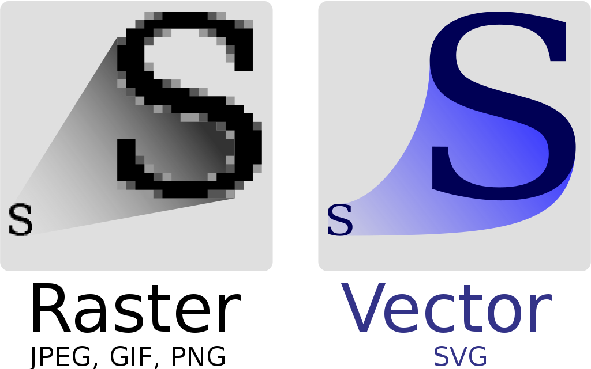

# I. Introduction

React Native, by its nature, is not a complete cross-platform framework. It is only a UI framewrok, which means you may have to sink your logic to native side if you need to something complex, such as location, camera, permission requst, and so on. 

Even from UI's perspective, React Native ("RN" for short) is not powerful as well. RN itself is using facebook's yoga library to draw differnt UI element (TextView/UILabel, Button/UIButton, ...). This says, RN can not draw any shape as we wish. If you would like to draw a circle, or, more complexer, a path the same way as where you call `canvas.drawPath(path, paint)` on Android, you would feel deeply disappointed. 

I not pointing fingers right here. Facebook clearly has know this situation, and they did some hard work to improve this. One such library they made is [react-native-art](https://github.com/react-native-art/art), which could enable us to draw some shapes on RN. However, there are not much document about this library. And based on the star and fork number, clearly devs are not taking it seriously. 

|   | star | fork |
|-|-:|-|
| rn-webview | 3.2K | 1.6K |
| rn-svg | 4.9K | 666 |
| rn-art | 198 | 43 |

Someone may ask, is it really necessary that we need to draw something on the screen?<br/>
: It depends. If your app is complex, then you might have the need to draw something for yourself. Examples are listed below, such as circle-shape Avatar, linear button and so on.

When you need to draw something, but RN's JSX apparently don't offer you a way to do that. What should you do? <br/>
: Okay, then React-Native-SVG come to the rescue. 

# II. SVG & React-Native-SVG

## 2.1 SVG
What we used often is `JEPG, PNG` images. These images has one limit: it shows jagged edge when it is scaled. 
On the other ahdn, SVG is another different type. No matter how much you scale a SVG picture, it still show the image smoothly.

Here is the picture to tell the difference :


SVG files are actually text files, whereas bitmap files are binary files. Here is a SVG that displays "check"(✔) icon:

```xml
<svg width="24" height="24" viewBox="0 0 24 24">
  <path d="M9 16.2 L4.8 12 l-1.4 1.4 L9 19 21 7 L-1.4 -1.4 z"/>
</svg>
```

We can see it tell the browser or any SVG's user to how to draw a path, from which point to which point. This is what SVG did. 

## 2.2 React-Native-SVG
rn-svg is another library that Facebook made to draw shapes. Actually iOS don't support SVG officially, and you have to import 3rd-party library, such as SVGKit, to draw SVG. But rn-svg still do a lot to support most of SVG attributes. 

## 2.3 Draw a circle
Let's take circle for an example. 

```xml
<Svg height="100" width="100">
  <Circle cx="50" cy="50" r="50" fill="pink" />
</Svg>
```
It could draw a cicle whose fill is pink color. 

Svg is not just that. It can draw Rectangle, Triangle, Polygon, Line, even Text and Image. 

Furthuremore, with the super power of Sketch or Adobe Illustrator, we can get complex path, and use them to generate wonderful animations.

## 2.4 Draw react native element in SVG
In general, the SVG shapes, and only them, must be named inside `<Svg>` element. You can't just directly put a `<FlatList>` inside `<Svg>`. However, if you do need to do so, we still have an approach to help you. This is the `<ForeignObject>` element.

`<ForeignObject>` is a SVG shape, and also it could contain React Native items. Here is an example of how to use it:

```xml
import {Image} from "react-native"
import Svg, {Circle, ForeignObject} from "react-native-svg"

<Svg>
	<Circle cx="50" cy="50" r="50" fill="pink" />
	<ForeignObject>
		<Image src={..} source={...}/>
	</ForeignObject>
</Svg>
```


# III. SVG in Practice
I've briefly introduced the simple use of SVG. From now on, we are going to go to the wild world of SVG, and see how we could use it in product.

## 3.1 Circle Avatar
We could easily draw a circle avatar with Xfermode in Android, or with blendMode in iOS. For those dev who don't know what Xfermode/BlendMode is, they are just to show some part of it after putting two layer together. However, its pretty hard to do so in React Native. 

Fortunately for us, rn-svg could do so. The key part is `<ClipPath>`.


### 3.1.1 ClipPath
An example would help us to understand it better. Assume that I have such a picture about Batman.


Now I draw a circle above it:


After that, we have two layer, one layer is the circle, and another one is the batman image. Now we use `<ClipPath>` to only show the part that overlaps both layers:

```xml
import Svg, { Circle, ClipPath, Defs, Image } from "react-native-svg";

  const { size } = props;
  const radius = size / 2;

    <Svg width={size} height={size} style={props.style}>
      <Defs>
        <ClipPath id="clip">
          <Circle cx={radius} cy={radius} r={radius}/>
        </ClipPath>
      </Defs>
      <Image href={props.href} preserveAspectRatio={scale}
             width={size} height={size}
             clipPath="url(#clip)"
      />
    </Svg>
```

1). `<ClipPath>` need to be defined inside `<Defs>`. <br/>
  The elements inside `<Defs>` would not shown on the screen, unless you apply them to some element outside `<Defs>`, the `<Image>` in the privous code for example.

2). Any rn-svg element could use clipPath by adding a `clipPath` attributes, which value is a string type, and is a `url(#id)` format.

After we apply the clipPath, the result is exactly what we need:


### 3.1.2
It's not just a circle avatar that you can make with rn-svg. You could make a image with round corner as well. Or this image:


## 3.2 Gradient Button
A button with linear gradient is common in mobile apps. There is a famous library, [react-native-linear-gradient](https://github.com/react-native-linear-gradient/react-native-linear-gradient#readme) to do such a job. Now if you are using rn-svg, then this rn-linear-gradient is not necessary. Rn-svg could draw gradient for you.

### 3.2.1 draw linear graident in Sketch
Sketch is a software to draw vector image. Many UI design use it for mobile app design. Before we dive into the rn-svg, I would like to show you how to draw linear gradient in Sketch, which will greatly help us udnerstand the linear gradient int SVG.


Here is how we add linear-gradient to text color. Notice that we using three points, each of which has a unique color. The first point is blue, the second is purple, the third one is red. We can arrange the position of three points, then the linear-gradient might be horizontal, vertical, or any other direction.


The start and end point has their coordinate, which is important to us, it will form the direction of gradient.


To draw the linear gradient above, SVG would have such code:

```xml
<LinearGradient x1=0 y1=0 x2=1 y2=1>
  <Stop stopColor=“blue”   offset=“0”  />
  <Stop stopColor=“purple” offset=“0.3”/>
  <Stop stopColor=“red”    offset=“1”  />
</LinearGradient>
```

### 3.2.2 draw a button
With all the basic knowledge I've shown above, we now could make a button with linear graidnet fill color.


```xml
<Svg>

  <Defs>
    <LinearGradient id="g3" x1={0} y1={0} x2={1} y2={1}>
      <Stop offset="0" stopColor="#c31432" stopOpacity={0.5}/>
      <Stop offset="1" stopColor="#240b36" stopOpacity={1}/>
    </LinearGradient>
  </Defs>

  <G x={100} y={360}>
    <Rect x={0} y={0} width={220} height={100}
          fill="url(#g3)" rx={20} ry={20}/>
    <Text x={110} y={50} fill="#fff" fontSize={50}
          alignmentBaseline="bottom" textAnchor="middle">Login</Text>
  </G>
</Svg>
```

Here are something worthy mentioning:

1). LinearGradient also need to be inside Defs, just like ClipPath.

2). Here we have two stops, which means two points in the Sketch. Each stop has its own color and transparancy.

3). Now we use fill attribute to link to the linear gradient. The format of it is also a url format, same as ClipPath.


## 3.3 Theme
We may have different theme, such as light theme, dark theme, or even pink theme. For different themes, we should make icons change color as well. 


The picture above is just an example of a same page in different theme.

For Svg, it is as simple as change a value of `fill` attribute.

```xml
import Svg, { Symbol, Defs, Path, ClipPath, Use } from "react-native-svg";

export const Svg101_Icon_ChangeColor = () => {
  return (
    <Svg>
    
      <Symbol id="lang" viewBox="0 0 24 24">
        <Path d="M12.87 15.07l-2.54-2… Z”/>  <!-- this is a "文A" icon" -->
      </Symbol>
      
      <Use href="#lang" x={40} y={40} width={180} height={180} fill="black"/>
      <Use href="#lang" x={220} y={40} width={180} height={180} fill="red"/>
      <Use href="#lang" x={440} y={40} width={180} height={180} fill="blue"/>
      
    </Svg>
  );
};
```

Here, we use a `symbol`, which means it's a reusable class, and three `use`s, which means it try to reuse some resuable resource. 
With different `fill` value, now we got different icon:


## 3.4 pattern
When you try to fill a huge rectange, not with color, but with an image. Let's say if the image is far smaller than the rectange, and we would like to repeat the image over and over again inside the rectange, then we could declare the image as a `Pattern`, and fill t he rectange with this pattern. 


Let's see an example. We now have a "brick.jpg", which is an image of a small piece of brick wall. Now we need a huge wall. How could we implement it?

```xml
<Svg>
  <Defs>
    <Pattern id="brick">
      <Image href={requires("brick.jpg")}/>
    </Pattern>
  </Defs>

  <Rect x={0} y={0} width={100} height={80} fill="url(#brick)"/>
</Svg>  
```

The brick.jpg is only a size of (width: 20, height:20), so the Pattern's image would repeat over and over inside this rectange.

p.s. yes, `<Pattern>` is also an element that should be defined inside `<Defs>`. 