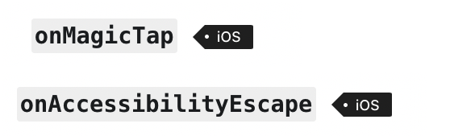

## React Native Accessibility

Unlike Flutter, which want to build a unifrom a11y experience for the dev and the users, React Native is more like a container. That said, RN has many properties that only works for one platform. Hence, it's better not to have the uniform a11y experience designed at first, you ought to have some difference. That actually is reasonable and fair, after all, the iOS's magic tap, escap are only on iOS, and Android has no such a11y features. 

### 1. Text, TextButton
For the Text, you don't need to do anything, Talkback/VoiceOver will read the text out for you automatically. 

But if you are using `TouchableOpacity/TouchableHighlight/..`, then you will find out that the a11y does not support it very well.
For example, for the code below, the Talkback will only read "send an email at here". No "Button, double tap to activate" be said by the screen reader, which has failed to tell the talkback users that this is clickable. 

```javascript
<TouchableOpacity>
  <Text>send an email</Text>
  <Text>@here</Text>
</TouchableOpacity>
```

The correct way to support a11y is to tell the screen reader:
1). this is a reader
2). this is a group, a clickable group
3). "button, double tap to activate" is not good enough. We would like the screen reader to say "button, double tap to send an email"

```javascript
<TouchableOpacity
  accessible={true}
  accessibilityRole={"button"}
  accessibilityLabel={"sent an e-mail"}
>
```

### 2. Image
For Image, Talkback/Voiceover will just ignore images. 
If your image has some meaning, you should say so in the `accessibilityLable` property:

```javascript
import Lock2 from "../../../res/lock.svg";

<Lock2 width={80} height={80} accessibilityLabel={"fancy lock"}/>
```


### 3. exclusion
Just like two native platform, Flutter also have an a11y tree that is full of a11y node. If you don't want your view to be read, aka, to be included in this a11y tree, you can do it, still, by any of means below.

```javascript
<Text style={styles.text}
      accessibilityElementsHidden={true}
      importantForAccessibility={"no"}
  >not accessible</Text>
```

Note that the `accessibilityElementsHidden` is for iOS, and the `importantForAccessibility` is for Android. 

The reason why there are two properties for one thing, is that iOS only have `true` or `false` value. 
But for Android, it has the `yes / no / auto / noHideDescendants` values, you could pick one from these four values.
So it's kind of hard to combine these two type together. 


### 4. Region
Sometimes, you find out there are too many views in one page, and it takes the Talkback/Voiceover users to swipe too many times to get the whole info. To make the user experience better, you could combine some views together and regroup them as one a11y note. 


To make it read it as a group, and reduce some a11y noise for the talkback/voiceover users, we could use a `accessible={true}` to group child views. Also, we would exclude the image, and re-generate the text for Texts.

```javascript
<View accessible={true}
      accessibilityLabel={"average 4.4 star in 100 thousands downloads"}>
  <View style={styles.row}>
    <Image source={require("../../../res/four_star.png")}
           style={styles.starImage}
           resizeMode="stretch" />
    <Text style={styles.text}>4.4</Text>
  </View>
  <Text style={styles.text}>100K+ downloads</Text>
</View>
```


### 5. action description
React Native does not support this. (If you are interested in how Flutter supports it, you can check [here](https://github.com/songzhw/songzhw.github.io/blob/master/flutter/2021-10-11-flutter-a11y.md))

### 6. reachability
If your page has a very long long list, and also a button at the very bottom of the page, then you might never get to this button, or it takes you a long time to get to the button. How could you improve this?
: You just need to provider a `header` role for this kind of view: 

```javascript
<SomeView  
  accessibilityRole={"header"}
  />
```

This way, if you are tired of the super long list, you can navigate to the next header/heading, which is the cart button. 


### 7. Live Region
This is only for Android. 

```javascript
<TouchableWithoutFeedback onPress={addOne}>
  <View style={styles.embedded}>
    <Text>Click me</Text>
  </View>
</TouchableWithoutFeedback>
<Text accessibilityLiveRegion="polite">
  Clicked {count} times
</Text>
```

When any label in the child changes, Talkback will read the latest label for you automatically. A common scenario for this is the cart with the count of items in the cart.


### 8. a11y order
```dart
// this is the second view to read
Semantics(
  sortKey: OrdinalSortKey(1),
),

// read this first
Semantics(
  sortKey: OrdinalSortKey(0),
```

### 9. magic tap, escape, ...
These are the iOS's VoiceOver's features. React Native supports them on iOS. Of course, Android platform has no such features. 



### 10. props & typescript
If you just custom a view in Typescript, and you should provide a11y functionalities. The way you do it is that you define a prop that extends ViewProps:
```typescript
interface IProps extends ViewProps {
}
```

Because the ViewProps's implements the `AccessiblityProps`, so you now can use the a11y props. 

```typescript
export interface ViewProps
    extends ViewPropsAndroid,
        ViewPropsIOS,
        GestureResponderHandlers,
        Touchable,
        AccessibilityProps {
```