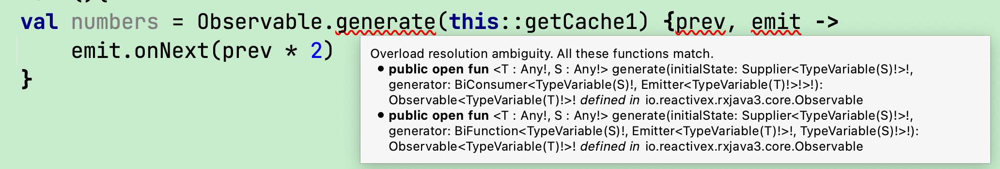

2023年大年初一, 开始做一个RxJava的总结版本. 这是第一章, 主要讲如何创建Observable的. 

## java与kotlin
整个系列有一个地方要注意的就是, 网上很多资料是java版本, 但是现在kotlin才是主流. 有相当多代码, 要把Java转成kotlin可没这么想当然的容易. 比如说

```java
    Observable<Integer> numbers = Observable.generate(
            this::getCache,
            (prev, emit) -> { emit.onNext(prev * 2); }
    );
```

但是我们简单地复制成kotlin, 就马上报错: 


原因嘛其实简单, 就是因为kotlin新加了不少语法, 所以在infer类型时会有更多考虑因素, 所以更有可能因信息不够而Infer失败. 所以这里你需要指明更多的信息给kotlin. 所以上面的正确kotlin写法是: 

```kotlin
val numbers = Observable.generate(
    Supplier { this.getCache1() },
    BiConsumer { initValue: Int, emitter: Emitter<Int> -> emitter.onNext(initValue * 2) }
)
```

## Observable, Flowable
在RxJs, RxSwift, RxDart这些兄弟框架里, 都是只有Observable表示一个流. 流即是持续产生数据的一个存在. 
但是在RxJava 2.0之后, 流被分成了: Observable + Flowable.
其主要思路是在于: 一个流持续产生数据, 但要是它短时间内产生过多数据, 导致流的接收者收不了了, 怎么办? 

举个例子, 流就是个水龙头, 流的接收者就是个街道上的下水口. 若是流一直在产生数据, 并且是快速地产生大量数据, 即水龙头一下子出来大量水, 这时下水口不能及时处理完所有水, 这种情况就叫backpressure, 中文也翻译成"背压".
Flowable就是一种特殊的Observable, 即能处理Backpressure的Observable. 
backpressure发生时, 有各种处理策略, 如drop, cache, .... 具体的东东到后面再讲. 

另外说一下就是, Subject也因为这种划分, 变成了两阵营: 普通的Subject, 以及能处理backpresure的Processor.
所以RxJS中的BehaviorSubject, 你到了RxJava世界后就发现有 BehaviorSubject与BehaviorProcessor两种之分. 

## 术语

```kotlin
val ob = Observable.interval(1, TimeUnit.SECONDS)
    .map {index -> "value$index"}
ob.subscribe {...}
```
RxJava就是一个Observable的设计框架, 兼加了很多强力的操作符, 如上面的map. 

* `流`: 就是持续发出一组数据的存在
* 
* `Observable`: 其实就是指上面的`流`, 所以它也叫 Stream, upStream(上游), publisher
* 
* `Subscriber`: 其实就是上面的subscribe{}中的lambda, 也叫downstream, receiver, observer, listener.

