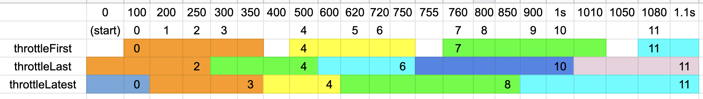

这一章主要是讲过滤操作符, 包括 filter, first, last, take, skip, distinct, elementAt等. 
但是暂不包括debounce, throttle, sample, window这些涉及到backpressure的操作符. (这些请见后面的文章)

## first, last
`filter`是最常见的操作符这里就不多做介绍了. 这一小节主要是介绍取前N个, 取最后N个的first与last一系列操作符. 

### first一系
我们经常能看到`first(defaultItem)`以及`firstElement()`两个first系的操作符. 它们的区别是:
* `first(defaultItem)`, 若是流中没数据就使用defaultItem. 其返回的是是个Single<T>, 即只有succ(value)与error两种结果. 
* `firstElement()`是返回一个Maybe. 即要么发送0个数据, 直接complete; 要么发送一个数据 succ(T); 要么就是error出错. 

```kotlin
  Observable.just(3, 1, 6, 5, 8)
      .firstElement() //=> 3  //返回Maybe<T> 

  Observable.just(3, 1, 6, 5, 8)
      .first(-1) //=> 3 //返回Single<T>, 没数据就用参数(defaultItem)-1 

  // 前3个数据
  Observable.just(3, 1, 6, 5, 8)
      .take(3) //=> 3,1,6       
```

### last一系
对应着first取开头的数据, 我们还有一组last操作符, 来取最末的几个数据:

```kotlin
  Observable.just(3, 1, 6, 5, 8)
      .last(-1) //=> 8 //返回Single<T>, 没数据就用参数(defaultItem)
  Observable.just(3, 1, 6, 5, 8)
      .takeLast(3) //=> 6, 5, 8     
  Observable.just(3, 1)
      .takeLast(3) //=> 3, 1 (不足3个也不会报错哦)                           
```

备注, 只有last(defaultItem), 没有lastElement()操作符哦!

## take一族

主要是分为take多个元素, 或是take某一时间段内的所有元素. 这些都较简单, 就不详细解释了, 看下面的代码就已经很明白了

```kotlin
// take(n), takeLast(n)
    Observable.just(3, 1, 6, 5, 8).take(3)//=> 3, 1, 6
    Observable.just(3, 1, 6, 5, 8).takeLast(3)//=> 6, 5, 8

// take(time, timeUnit), talkeLast(time, timeUnit)
    Observable.interval(80, TimeUnit.MILLISECONDS)
        .take(200, TimeUnit.MILLISECONDS)
        .subscribe { datum -> println("szw got $datum") } //=> 0,1 (80ms, 160ms)

    Observable.interval(80, TimeUnit.MILLISECONDS)
        .take(10)
        .takeLast(200, TimeUnit.MILLISECONDS)
        .subscribe { datum -> println("szw got $datum") } //=> 7, 8, 9 (640ms, 720ms, 800ms)              

// take没这签名, 但takeLast有, 即: takeLast(count, time, timeUnit)
// 这时就是若窗口中出M个, 而第一参为count, 那最终就是取 `min(M, count)`个最后的元素
    Observable.interval(80, TimeUnit.MILLISECONDS)
        .take(10)
        .takeLast(2, 200, TimeUnit.MILLISECONDS) //若没第一参, 那就是产出7,8,9一共三个元素
        .subscribe { datum -> println("szw got $datum") } //=> 8, 9


```

注意1: takeLast(count, time, unit)是有的. 但没有take(count, time, unit)这个方法哦!


## 其它的一些过滤
也都是比较简单的操作符, 就只看例子就明白了

### distinct一系
`distinct`是在整个流中去除
`distinctUntilChanged`则只是去除连续的重复数据而已.

```kotlin
    Observable.just(1, 2, 3, 3, 2, 4, 1)
        .distinct()//=> 1, 2, 3, 4

    Observable.just(1, 2, 3, 3, 2, 4, 1)
        .distinctUntilChanged()//=> 1,2,3,2,4,1 (只剔除连续的重复数据)          
                
```

### 其它的一些过滤符

```kotlin
 // ignoreElements不关心数据, 只关心完成或出错
    Observable.just(1, 2, 3, 3, 2, 4, 1)
        .ignoreElements() //返回一个Completable


    Observable.just(1, 4, 7)
        .elementAt(2) //返回个Maybe. 参数Index是从0开始计算的.
        .subscribe { println("szw(34) $it") } //=> 7

    Observable.just(1, 4, 7)
        .elementAt(3, -1) //返回个Single. index是从0开始计算的. 第二参是defaultItem
        .subscribe { v -> println("szw(35) $v") } //=> -1                
```


--------

# 背压 (BackPressure)
上游在短时间内发出大量数据, 多到下游接收不了了. 这个现象就叫背压.  那处理背压的策略主要有两种:
1). 缓存起来: 若太多了下游接收不了了, 这时策略之一就是缓存起来. 这样等什么时候数据不多时, 我再从缓存中取出来, 保证我下游总能正常地处理  -- 当然, 若一直不停地发, 缓存空间不够了, 那还会造成问题的. 

2). 丢弃: 相当于下游搞了一个阀门, 只接收有限的数据. 多余的数据就给丢弃.  这种有所丢失的策略就叫有损背压. 这也是我们这一部分的重点 

## 有损背压
有损背压有throttle, debounce, sample方式. 每种方式的不同仅在于"什么时候开阀门"而已. 下面我们一一来讲解.

## debounce

### debounce(time, timeUnit)
若我们有一个按钮, 点击后去请求后台或取数据库数据(总之就是耗时的操作). 我们自然不然用户短时间内多次点击它. 这时我们可以用: 
`debounce(1, TimeUnit.SECOND)`.
这样的话, 你怎么点击按钮都不会触发那耗时操作的. 
只有, 只有当你停止点击按钮后, 一秒后就会触发这个耗时操作.

所以, `doubnece(1s)`其实就是说: `你总发来数据, 我都不处理的; 但是你一旦停了发数据达1s之久, 那我就处理了`. 


### debounce(ob2)
这时的参数是另一个Observable (ob2). 

#### 例子1: 当我点击了另一个按钮, 才触发操作
```kotlin
// 点击btn23多次也没用, 就是走不到subscribe这里去
// 直到你点击了btn24, 马上就走到了subscribe里了
// 所以debounce(debounceIndicator)就是说参数indicator发出数据了, 这时就不drop了开始接收.
var num23 = 1
btn23.text = "debounce indicator2"
btn24.text = "tirgger prev button's debounce!"
btn23.clicks()
    .doOnNext { println("szw clicks") }
    .map { ++num23 }
    .debounce { intNumber ->
        btn24.clicks()
    }
    .subscribe { println("szw consume clicking $it") }
```        

#### 例子2
所以对于 `ob1.debounce(2s)`, 我们可以用这个重载函数达到一样的效果, 即

```kotlin
ob1.debounce{_ -> Observable.timer(2, TimeUnit.SECONDS)}; // 效果等同于 debounce(2, TimeUnit.SECONDS);

```

## sample
上面的debounce是傲娇地说"你不'骚扰'我了, 我才接收数据. 默认我都是全拒收的"
而sample的策略则是更公平.

### sample(time, timeUnit)
如`sample(2, TimeUnit.SECONDS)`就是说每2s取一次当前的数据. 中间的间隙里收到数据全给丢弃了, 不要了. 

### sample(ob2)
这个效果和debounce(ob2)一样, 即ob2发出了数据, 才去取最近的last data. 

```kotlin
// 就是sample(ob2), 只有当ob2发出数据了才去取最近的last data
btn32.text = "sample(ob2)"
btn33.text = "上一按钮的ob2"

btn32.setOnClickListener {
    Observable.interval(1, TimeUnit.SECONDS)
        .doOnNext { println("szw next($it)") }
        .take(30)
        .sample(btn33.clicks())
        .prints(disposables, "3A") //btn33一按, 就取一次数据
}
```

#### sample的使用案例
如我们在看书, 每10秒要记录一下用户读到哪了. 这样下次用户再打开我们app, 我们总能回到他上次大致读到了的位置
这时就可以用: `sample(10s)`


## throttle
throttle的概念在RxJS中比较简单. 但在RxJava一下子变复杂了, 因为RxJava区分出了多种操作符.

### throttleLast
我们先来看下这个操作符的源码哦: 
```java
public final Observable<T> throttleLast(long intervalDuration, @NonNull TimeUnit unit) {
    return sample(intervalDuration, unit);
}
```

现在明白了, 其实这个操作符就是上面学过的`sample(time, timeUnit)`, 即每隔一段时间取个数据. 

### throttleLatest
throttleLatest基本上是和throttleLast一样的. 只有一个不同点, 那就是: throttlelatest一定会发出第一个数据. **这之后,** 才会开始每隔一段时间取一次
即: `throttleLatest = 发出第一个数据 + 之后走throttleLast`

### throttleFirst
这是最难理解的操作符了. 它也是类似于"每隔N秒取一下数据"的思路. 但细节上有点不一样. 
像`throttleLast`, 它的"每隔N秒取一次数据", 它的前N秒与后N秒(我们可以描述为两个窗口哦)是紧紧相邻的. 中间没有空隙的. 后一个窗口是紧接着上一个窗口的结束. 如每隔2秒取次数据, 那会在第2,4,6,8, ...秒取数据

但是`throttleFirst`的前后两个窗口是基本不相信的.  这里后一个窗口不再紧接上一个窗口的结束. 而是: `后一个窗口开始于下面一个数据发出了`. 

### 团例
晕了, 没事, 来个例子就完全了解了. 



细节讲解: 
1). 第一个数据不是一开始就发出来的, 而是延误了100ms才发出第一个数据`0`

2). 在100ms, 200ms, 250ms, 350ms, 500ms, ... 中发出了数据 (即上面表格中第二行有数字的就表示这个时间点发出了数据.) 
第一行是时间, 单位是ms; 第二行是发出了什么数据; 

3). 第三四五行就是三个操作符的示例了, 它们分别是`throttleFirst(250ms)`, `throttleLast(250ms)`, `throttleLatest(250ms)`.  这三行中的数字, 就是最后的输出. 
注意, 我用彩色标出了一个个地的框. 每一个颜色的框就是个不同的时间窗口. 

#### 分析结果


1). `throttleFirst`: 前后两个窗口是不相邻的. 前一个窗口结束了(如[100, 350ms]这个橙色窗口), 这之后的第一个数据(4)发出来了, 那新的时间窗口才开始(黄色)
最后输出: `0, 4, 7, 11`

2). `throttleLast`: 前后两个窗口是紧紧相邻的
最后输出: `2, 4, 6, 10, 11`

3). `throttleLatest`: 一定会先发出第一个数据. 第一个数据算一个窗口.  之后再按throttleLast来运行. 
最后输出: `0, 3, 4, 8, 11`

#### throtttle的使用案例
我们也可以使用sample(1s), 或throttleLast(1s)去处理短时间内多次点击同一按钮的问题. 这样的策略即是说每1秒才接收一次点击. 你多点击了也没用. 


