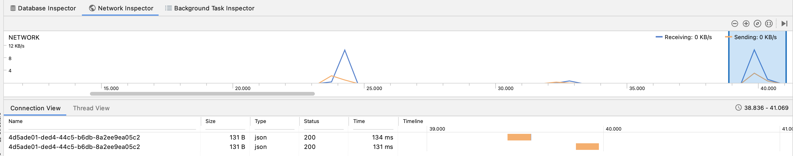
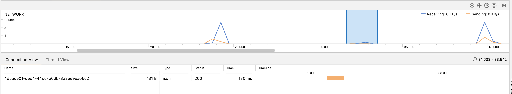

这一章一开始先要涉及到RxJava中的理论部分(单播与多播). 但纯讲理论太虚, 所以我会穿插一些实例, 来让讲解贴近生活, 就不会显得太枯燥.  接下来就会讲到多播以及多播中的Subject. 

# 一. 冷流, 热流
即RxJava中的Observable其实分为cold Observable 与 hot Observable. 它们的区别其实相当明显

## 区别1
* cold ob就是Netflix里的节目, 每个用户打开一个电影来看, 那就是从头到尾的看.

* hot ob就是收音机里或车里听的广播, 每个用户打开广播的时间不同, 听到的内容不一样. 有的从头开始听的, 有的打开来已经播了一半就只能从中间开始听.

## 区别2
cold ob只有当有了subscriber时才会开始发出数据;  而hot ob不管有没有subscriber, 都会自顾自地发出数据

## 区别3
cold ob是单播, 一对一关系 ;  hot ob是多播, 一个上游可以有多个下游.

(这里"有多个下游"容易产生误解, 所以关于"多播, 单播"的概念会在下面更加详细地讲到)

## 哪些是冷流, 哪些是热流
你可以简单地认为: 
* Subject及其子类全是hot ob
* 其它的流全是cold ob

备注: 其实cold ob经过一些变化, 也能变为hot ob. 但这不是天生的, 是后天转化而来. 

至于如何从cold ob转为hot ob, 后面也会讲到. 

# 二. 单播(unicast)
除了日常见到"冷流, 热流"的概念, 我们还可能见到"单播, 多播"的概念. 这两组概念其实有相关性的, 所以要放到一起来讲. 

## 单播的概念
说回unicast, RxJava中有两种播放形式
* 多播(multicast) : 一个上游可以有多个下游时, 这就是多播. 即面向多个下游播放数据. 
  * 典型代表就是 `Subject`的子类们
* 单播(unicast) : 一个上游就只有一个下游, 这就是单播. 
  * 所有除了`Subject`的流, 基本上都是单播 (都是cold Observable) 

上面讲了, 除了`Subject`的流, 基本上都是冷流. **那`Observable.interval(1s)`也是冷流, 也是单播, 是吗?** 

: 是的, 没错, 是冷流, 是单播

这样说来, 那就不对了, 我明明可以对`* Observable.interval(1s)`进行多个下游注册, 如这样: 
```kotlin
    val src_ = Observable.interval(500, TimeUnit.MILLISECONDS).take(5)
    /*下游1*/ src_.subscribe { count -> println("szw(A) : $count") } //=> 0,1,2,3,4
    /*下游2*/ src_.filter { it % 2 == 1L }.subscribe { count -> println("szw(B) : $count") } //=> 1, 3
```

上面的代码, 即不会编译出错, 也能运行正常并得到结果. 这样一个`src_`, **明明是单播, 怎么它就能有两个下游呢?**

: 好问题. 这其实就是大多数人对RxJava中"单播与多播"最大的疑惑了. 
我先说结论哦, 上面的不是一个上游对应两个下游; 而是2个上游对应了两个下游.

你可以这样理解, `每当你subscribe一次, 冷流的subscriber都会copy一次上游. 这样两次subscribe, 其实两个上游. 本质上仍是一对一的单播`. 


### 证据呢? 
这个其实要证明也容易, 就是给上游加个日志嘛.

```kotlin
    val src_ = Observable.interval(500, TimeUnit.MILLISECONDS).take(5)
        .doOnSubscribe { println("szw start upstream")}
    /*下游1*/ src_.subscribe { count -> println("szw(A) : $count") } //=> 0,1,2,3,4
    /*下游2*/ src_.filter { it % 2 == 1L }.subscribe { count -> println("szw(B) : $count") } //=> 1, 3
```


你看到日志就是: 
```
szw start upstream;  szw(A) : 0,1,2,3,4
szw start upstream;  szw(B) : 1, 3
```

这里的`"szw start upstream"`日志出现了两次, 说明这是两个不同的上游. 


## 单播的例子
我们来看一下更为实际的例子. 即用RxJava发出网络请求, 然后就能理解单播的问题如何在实际工作中应用. 

比如说我们有一个网络请求的Retrofit接口:  
```kotlin
interface UserService {
    @GET("4d5ade01-ded4-44c5-b6db-8a2ee9ea05c2")
    fun getUsers(): Observable<E1>
}
```

然后我们来注册两个下游, 并调用这个请求: 

```kotlin
source = retrofit.create(UserService::class.java)
    .getUsers()
    .schedules()

btnRequestUser.setOnClickListener {
    source
        .subscribe { resp -> /*刷新RecyclerView列表*/ }
        .clearBy(disposables)
    source
        .subscribe { resp -> /*更新"共有N条数据"的TextView*/ }
        .clearBy(disposables)        
}
```

这样当我们点击按钮时, 我们通过Android Studio的Network Inspector来看一下, 结果惊奇地发现, 我明明只调用`getUsers`一次, 但却发了两次网络请求: 


这个例子就完美地展示了, 为何明明可以subscribe多次, 却仍是单播了. 
: 因为你每次subscribe, 都是对应了一个新上游. 严格来说, 每个上游仍是一一对应了一个下游而已. 所以这就是单播. 

当然, 你可能还会好奇, 这好像不应该这样. 这样发2个网络请求完全没必要啊, 徒增加后台压力而已.

那要怎么样才能解决上面这样冗余的网络请求呢? 
答案其实很简单, 就是把单播变为多播, 这样一个上游能有多个下游, 就只会发出一次网络请求了. 至于什么是'多播', 如何把单播变为多播, 下面的章节就是介绍了. 

# 三. 多播
多播就是一个上游可以有多个下游. 同样, 我们经常提及到的"hot Observable", 也是指多播. 至于冷与热的Observable, 我们后面再讲. 

而讲解多播, 因为网上资料比较少, 我不得不借鉴RxJS中的多播概念来讲解. 其实RxJS, RxJava中的多播概念是一模一样的, 但RxJS的因为有multicast这个操作符而变得更容易理解多播的多个操作符. 只不过RxJava中没有`multicast`这个操作符, 所以很多讲解就麻烦了. 这也是为何我要借鉴RxJS来讲解整个多播概念的原因

## 3.1 Subject的初步介绍
因为我们要讲多播得借助Subject, 所以这里先介绍一下Subject的最基本功能, 就是下面两个: 

1). `Subject`在Rx世界中, 就是一个hot Observable, 也可以理解就是多播. 

2). Subject即是Observable, 又是Observer. 

所以下面的代码都是可以的:

```Kotlin
subject.subscribe {...} //subject做为Observable

upstream.subscribe(subject) //subject做为Observer
```

理解了这2点就行了, 更多的细节后面讲

## 3.2 [RxJS] multicast(new Subject())
```js
const hot$ = cold$.multicast( new Subject() ); 
    //muticast()返回的是一个ConnectableObservable类型
```
这样就把一个cold ob转成了hot ob了. 

其中的`下游 = 上游.multicast(new Subject())`其实就是简单地Subject自己做个中间人: 
* `上游.subscribe(subject)`
* `subject.subscribe(下游)`

前面说过Subject自己是个hot流, 这样一下就把上游(一个冷流)给成功地转成了热流了. 这就是`multicast`最基本的用法 

### ConnectableObservable类型
注意, multicast所返回的Observable, 并不是普通的Observable, 而是`ConnectableObservable`类型(它是一个`Observable`的子类). 

这个类型的流, 得先调用`connect()`, 上游才会发出数据. `connect()`就像是一个水龙头, 它不开, 就不会有数据流出来. 

```js
    const cold$ = Observable.interval(500, TimeUnit.MILLISECONDS).take(3);
    const hot$ = cold$.multicast(new Subject());
    /*下游1*/ src_.subscribe { count -> println("szw(A) : $count") } //=> (无数据)
    /*下游2*/ setTimeout( ()=> src_.subscribe { count -> println("szw(A) : $count") }, 1200) //=> (无数据)
```

注意, 上面的两个下游都不会有任何输出. 原因很简单就是没有调用`connect()`, 所以相当于水龙头没开, 就不会有数据出来.

---
要想有数据, 那就得调用connect方法


```js
    const cold$ = Observable.interval(500, TimeUnit.MILLISECONDS).take(3);
    const hot$ = cold$.multicast(new Subject());
    /*下游1*/ src_.subscribe { count -> println("szw(A) : $count") } //=> 0, 1, 2
    /*下游2*/ setTimeout( ()=> src_.subscribe { count -> println("szw(A) : $count") }, 1200) //=> 2
    hot$.connect() //注意, 这里调用了connect, 就相当于是打开了水龙头, 会发出数据了
```

所以这相当于我们何时调用connect, 上游才会下发数据. 这在一些需要的场景里会很方便, 让下游按自己的需求来要求上游数据, 可能能帮我们节省一些资源. 

## 3.3 [RxJS] multicast( subjectFactory )

前面的`multicast(new Subject())`, 若在上游结束后, subject自己也会结束.  这之后要是再来新的下游, 也收不到任何数据, 因为上游与中间人(subject)都已经complete了.  -- hot ob嘛, 可以理解. 

但有时有些场景, 需求就是: 

1).若subject没有complete, 就按上面的`multicast(new Subject())`来工作.

2). 要是subject已经complete了, 还来了新的下游, 那就又开始重复`multicast(new Subject())`的工作

: 这时就要使用 `multicast( SubjectFactory)`, 它会判断中间人是否已经完结, 若已经完结就会利用subjectFacotyry生成一个新的Subject实例.  所以这种写法, 多是写成Lambda的写法, 即: `multicast( ()=> new Subject )`


## 3.4 [RxJS/RxJava] publish -- connect后才能使用
publish在RxJS, RxJava中都有的. 在RxJava中, publish其实就类似于`multicast(new Subject())`
所以它的返回值也是个ConnectableObservable, 也得用connect()之后才能发出数据


#### 例子1
来看个例子. 这个例子和上面的`hot$ = cold$.multicast(new Subject())`很像

但下面的三个例子全是用的: `hot$ = cold$.publish()` : 

```kotlin
btn12.text = "(x) publish演示"
btn12.setOnClickListener {
    val cold_ = Observable.interval(100, TimeUnit.MILLISECONDS).take(3) //=> 0, 1, 2
    val stream2_ = cold_.publish() // 返回ConnectableObservable
    stream2_.prints(disposables, "1C") //第一个subscriber
    Observable.timer(250, TimeUnit.MILLISECONDS)
        .subscribe { stream2_.prints(disposables, "1D") } //第二个subscriber
}
//=> 点击了btn12毫无反应, 这是因为ConnectableObservable, 得调用connect()才能开始工作
```
这里没有数据的原因, 就是因为没有调用connect()

#### 例子2

```kotlin
        btn13.text = "(✔) publish演示"
        btn13.setOnClickListener {
            val cold_ = Observable.interval(100, TimeUnit.MILLISECONDS).take(3)
            val stream2_: ConnectableObservable<Long> = cold_.publish()
            stream2_.connect() // 不调用 connect()的话, ConnectableObservable是不会开始发出任何数据的
            stream2_.prints(disposables, "1C")
            Observable.timer(250, TimeUnit.MILLISECONDS)
                .subscribe { stream2_.prints(disposables, "1D") }

        } //=> 下游C收到了0,1,2数据;  下游D只收到2的数据.
```
这个也可以理解, multicast的返回值是个hot ob嘛. 发数据是100ms, 200ms, 300ms, 而第二个接收者是250ms才来, 那自然, 就是像电台广播一样, 来得晚就只能从中间开始接听了. 这就为什么下游D只收到数据2的原因了

### 例子3
```kotlin
btn14.text = "(✔) publish - connect时机"
btn14.setOnClickListener {
    println("szw click btn14")
    val cold_ = Observable.interval(100, TimeUnit.MILLISECONDS).take(3)
    val stream2_: ConnectableObservable<Long> = cold_.publish()

    // 130ms后才connect
    Observable.timer(130, TimeUnit.MILLISECONDS)
        .subscribe { stream2_.connect(); println("szw connected!") }

    // 下游1, 相当于是马上就连接了上游 (但这时connect没被调用哦!)
    stream2_.prints(disposables, "1E")  //=> 0, 1, 2

    // 下游2, 是250ms后才连接的上游
    Observable.timer(250, TimeUnit.MILLISECONDS)
        .subscribe { stream2_.prints(disposables, "1F") }
} //=> 下游E收到了0,1,2数据;  下游F只收到1, 2的数据.
// 原因: 在130ms后, stream2才正式开始发送数据.  而下游E已经在等待了, 所以它收到了所有数据
// 然后250ms后(即connect的120ms后), 下游F这才加入, 所以只能收到1,2了
//=> 结论: connect()之前上游不发数据的; connect()之后, 变身为hot ob, 开始发送数据
```        
例子2,3结合起来, 说明只有connect()调用了, 才会开始发出数据. 

所以这个例子其实说明了一点: 
* 网上一些文章所说的: `hot$ = cold$.publish()中的`publish()`就是把cold ob变为hot ob`, 这个说法是不对的.
  * 要是这个说法是对的, 那下游E应该是收到了1,2;  而不是0,1,2. 
* 从下游收到0,1,2来看, 应该是publish返回的ConnectableObservable在connect()之后才正式变为hot ob. 

### 结论
`hot$ = cold$.publish().connect()`, **是在connect之后, 才把冷流变为热流**

### RxJava的特殊之处

备注: 跟RxJava只有一个ConnetableObservable不同, RxJava中因为Flowable的独立, 也有了两种可连接的类型:

* ConnectableObservable
* ConnectableFlowable


## 3.5 publish -- refCount (不连接也能直接发出数据)
在绝大多数场景中, 我们还是希望, 若没有了下游了, 那中间人subject就从上游中注销掉吧, 免得占用资源. 这时就要用`ConnectableObservable # refCount()`, 它会记录有多少个下游, 并当没有下游了时就会去自动注销掉中间人subject. 

备注: 请注意, **refCount不是Observable的方法, 是ConnectableObservable的方法**

值得说的是, 调用了refCount, 就会自动connect的. 即之后不需要我们手动调用connect方法就能直接发送数据了. 
```kotlin
val cold_ = Observable.interval(100, TimeUnit.MILLISECONDS).take(3)
val stream2_: Observable<Long> = cold_.publish().refCount()

stream2_.prints(disposables, "1H") //=> 0, 1, 2
Observable.timer(250, TimeUnit.MILLISECONDS)
    .subscribe { stream2_.prints(disposables, "1I") } //=> 2
```

看起来connect与refCount()好像也不差不差的,
* cold$.publish().connect() 
* cold$.publish().refCount()


但其实还是明显的: 
1). **refCount = connect() + 无下游时自动注销**

2). `connect()`返回的是一个**Disposable**. 下游订阅的数据流还是`publish()`的返回值

3). `refCount()`返回的是**Observable<T>**, 下游订阅的数据流不是publish的返回值, **而是refCount的返回值!!**

### 结论
* `hot$ = cold$.publish().connect()`, **是在connect之后, 才把冷流变为热流**
  * 热流来自于publish()的返回值
* `hot$ = cold$.publish().refCount()`, **, 才把冷流变为热流**
  * 热流来自于refCount()的返回值


## 3.6 share
RxJava中share的源码是: 
```java
public final Observable<T> share() {
    return publish().refCount();
}
```
这下是不是就很明显了, 这肯定就是上面的copy. 
但其实, share还要更小小复杂一点点, 见下面. 


## 3.7 publish与share
publish与share两个全是RxJava中的多播操作符  (RxJS中还多一个multicast)

区别在于: 
* publish: 等于 multicast(new Subject)
  * 即它后续还要用connect或是refCount来"打开水龙头"
  * 另外就是, 上游发送完数据后再注册的下游, 是不会收到任何数据了. 因为上游已经完了. 
* share: 等于 multicast(()=> new Subject()).refCount()
  * 即上游发送完之后再注册的下游也能收到数据, 因为其Multicast的参数是一个工厂方法, 这工厂会再生成一个是中间类(Subject), 再来一次 
  * 另外就是它不用count或refCount了, 因为已经自带了


```kotlin
val cold_ = Observable.interval(100, TimeUnit.MILLISECONDS).take(3)
val stream2_: Observable<Long> = cold_.share()

stream2_.prints(disposables, "1K") //=> 0, 1, 2
Observable.timer(250, TimeUnit.MILLISECONDS)
    .subscribe { stream2_.prints(disposables, "1L") } //=> 2

// 上游完了. 结果不久后又来了新下游. ==> 那SubjectFactory会新生成一个Subject, 即一个新hot ob
Observable.timer(350, TimeUnit.MILLISECONDS)
    .subscribe { stream2_.prints(disposables, "1M") } //=> 0, 1, 2 (惊讶吧!!)
Observable.timer(500, TimeUnit.MILLISECONDS)
    .subscribe { stream2_.prints(disposables, "1N") } //=> 1, 2 (上面新生成的第二个subject还在工作, 即仍是热流, 所以这里只会收到1,2;  而不是收到0,1,2)

```

对比一下, 要是上面代码改share为`publish().connect()`, 那结果则是: 

```kotlin
            val cold_ = Observable.interval(100, TimeUnit.MILLISECONDS).take(3)
            val stream2_: ConnectableObservable<Long> = cold_.publish()
            stream2_.connect()

            stream2_.prints(disposables, "1X") //=> 0, 1, 2
            Observable.timer(250, TimeUnit.MILLISECONDS)
                .subscribe { stream2_.prints(disposables, "1Y") } //=> 2
            Observable.timer(350, TimeUnit.MILLISECONDS)
                .subscribe { stream2_.prints(disposables, "1P") } //=> 无数据
            Observable.timer(500, TimeUnit.MILLISECONDS)
                .subscribe { stream2_.prints(disposables, "1Q") } //=> 无数据
```

再回来看: 二者区别在于 
* publish: 等于 multicast(new Subject)
* share: 等于 multicast(()=> new Subject()).refCount()

所以share是没有下游就注销了. 之后再来接收者就会从头开始. 

publish是没有下游就complete了, 之后再来接收者也是啥都收不到. (因为已经complete了嘛)


# 四. 解决上面的重复网络请求的问题
出问题的代码如下, 主要原因就是它是冷流, 即单播, 所以2个下游就相应产生了2个上游, 故请求了两次
```kotlin
source = retrofit.create(UserService::class.java)
    .getUsers()
    .schedules()

btnRequestUser.setOnClickListener {
    source
        .subscribe { resp -> /*刷新RecyclerView列表*/ }
        .clearBy(disposables)
    source
        .subscribe { resp -> /*更新"共有N条数据"的TextView*/ }
        .clearBy(disposables)        
}
```

解决办法, 改为多播, 这样多个下游也能用一个上游来应对. 

这的上游就是`api.getUsers()`, 那只有一个上游, 自然就只会发出一次网络请求了. 

```kotlin
source = retrofit.create(UserService::class.java)
    .getUsers()
    .schedules()
    .share() //使用publish().connect()也是行的

btnRequestUser.setOnClickListener {
    source
        .subscribe { resp -> /*刷新RecyclerView列表*/ }
        .clearBy(disposables)
    source
        .subscribe { resp -> /*更新"共有N条数据"的TextView*/ }
        .clearBy(disposables)        
}
```

结果如下: 


## 多说一句
其实既然上面解决多余网络请求的做法是因为把单播变多播, 那说明publish也应该有用啊. 是吧, 我来试一下: 
```kotlin
// ViewModel
    val api3 = api.getThisMonth()
        .schedules()
        .publish()

// Activity
    btnNext.setOnClickListener {
        vm.api3.connect() //connect返回的是Disposable类型, 并不是Observable. 这跟publish().refCount()不一样
        vm.api3.subscribe { days -> println("sszw sub3A $days") }.clearBy(disposables)
        vm.api3.subscribe { days -> println("sszw sub3B $days") }.clearBy(disposables)
    }        
```
不错, 运行下试下, 点击btnNext, 果然是只发出一次网络请求. 所以虽然看名字并不是"share(分享)", 但publish因为能变多播的原因, 也是能解决这个问题的. 


# Subject
Subject是hot ob, 是多播, 而且它即是Observable, 又是Observer(这种特性就特别适合做中间人)

在RxJS中, Subjet类并不是抽象类, 它起到了PublishSubject中的作用. 但在RxJava中, Subject是一个抽象类, 并不直接使用, 我们一般是使用它的子类:

* `PublishSubject`: 就是最基本的Subject用例
* `BehaviorSubject` : 能缓存上一个数据
* `ReplaySubject` : 能缓存多个数据 (若是选择缓存所有数据, 那这就成了一个cold ob的样子)
* `AsyncSubject`: 上游发来一堆数据, 但下游仅能收到最后一个数据
  * 这个用得相当少. 备注: RxJS中也没有AsyncSubject.

创建方法: 
```kotlin
val subject =  PublishSubject.create<Boolean>()

val subject =  BehaviorSubject.create<Boolean>() //即使用null做为缓存值
val subject =  BehaviorSubject.createDefault(false)

val subject = ReplaySubject.create() //使用了默认size, 即缓存16个数据
val subject = ReplaySubject.createWithSize<Boolean>(3)
val subject = ReplaySubject.createWithTime<Boolean>(1, TimeUnit.DAYS, Schedulers.io())
```

# 一个使用BehaviorSubject的例子
上面说过PublishSubject用得最多了.  而ReplaySubject与AsyncSubject用得不多.
而BehaviorSubject用得也不少. 来举个例子哦. 


## 问题本身 
```kotlin
// SplashViewModel
user.autoLogin(activity)
    .subscribe({isShowingAd ->
        ... // liveData通知有结果了
    }, {error -> navigationResult.onError(error) })
    .clearedBy(disposables)

// SplashActivity
vm.navigationResult.observe(
    {succ -> 跳home page },
    {err -> 不跳哪里. 本页开始做动画 }
)
```

但上面的代码出现了问题, 即auto login失败时, 应该是Activity做动画. 但是却没有做动画, 也没有跳到home页. 这是怎么了? 
: 原因就在于`user.autoLogin()`函数里, 它是这样写的: 
```kotlin
class GuestUser()  {
    override fun autoLogin(activity: Activity): Subject<Unit> {
        return PublishSubject.create<Unit>()
        val subject =  PublishSubject.create<Unit>()
        subject.onError(Exception("guest user can't automatically login"))
        return subject
    }
}
```

那注意, publishSubject是个hot ob, 也就是说在ViewModel中: 
```kotlin
user.autoLogin(activity)
    .subscribe(..)
```
是先发出了数据或错误  (`subject.onError()`), 之后才subscribe. 所以下游就收不到任何数据与错误.

## 解决之道 
其实也不麻烦, 就是改用`BehaviorSubject`嘛. 因为BehaviorSubject会缓存一个数据, 所以正好应对了我们的场景. 
```kotlin
class GuestUser()  {
    override fun autoLogin(activity: Activity): Subject<Unit> {
        return PublishSubject.create<Unit>()
        val subject =  BehaviorSubject.create<Unit>()
        subject.onError(Exception("guest user can't automatically login"))
        return subject
    }
}
```

## 备注
对于一个`Subject<Bool>`来说, 下面两个的效果是一样: 
* `val ob = PublishSubject.create().startWithItem(true)`
* `val ob = BehaviorSujbect.createWithDefault(true)`
这两个代码都有点 `ReplaySubject(cacheSize = 1)`的意思了, 这里缓存的就是true这个值. 

# BehaviorSubject的一个重要误区 
当我有一个`BehaviorSubject bs = BehaviorSubject.createDefault(0)`在1s, 2s, 3s时发出数据1,2,3<br/>
那我们马上就注册的下游, 肯定能收到0,1,2,3的数据. 这个不成问题

现在当我们在第2.5秒时又注册了第二个下游. 这个新的下游会收到什么数据呢?
* 是0,  3?  (原因: BehaviorSubject是热流.  而0是默认数据, 2.5秒后会发出3. )
* 还是 3? (原因: 默认数据的时机已过, 而BehaviorSubject是热的, 所以只会收到2.5秒之后的3)

答案是上面两个都错了.  正确答案是: `2, 3` !!

主要原因有二: 

1). BehaviorSubject是热流, 而default value只在最开始发出, 并不会每个后来的订阅者都收到的. 过了时机就收不到这个默认值了.

2). BehaviorSubject在发送数据时, 其实是类似于`ReplaySubject(cacheSize = 1)`的效果, 即它会有上一个数据被缓存起来.

所以上面的结果是2.5秒来了一个新下游时, 它先在2.5秒就收到缓存的数据: 2<br/>
然后在第3秒就自然地收到数据: 3

上面的这两点原因都是很重要的知识点, 也是容易出错的知识点. 所以一定要注意. 


# Subject出错的一个例子

## 问题表象
问题表象: 我发现我们在首页请求了一个数据. 但每次从其它页面回到首页时 (如按back), 都会再次触发这个数据请求. 就像是我们在onResume里写了要请求了. 但问题就在于, 没有啊,我们根本没有在onResume中请求. 代码如下: 
```kotlin
//HomeViewModel
val request = Flowable.combineLatest(manualPullToRefresh.listen(), RxNetwork.listen())
    .switchMap {api.getUser()} //手动刷新或是网络恢复了, 都自动触发api请求
    .toLiveData() // toLiveData是androidx的扩展

// RxNetwork
val publishSubject = PublishSubject.create<Bool>()
fun listen() {
    return publishSubject.startWith(Phone.isOnline())
}

// HomeActivity
this.vm.request.observe(this) { response -> 
    // render the page
}
```


现在想解决的就是: 不要每次回到首页, 都去发网络请求. 这样能节省一些资源与性能

###分析原因
其实这是个很复杂的原因. 它涉及到了多个方面


## 原因1
第一. 那就是`Flowable.toLiveData()`这个扩展方法. 它来自于androidx包, 源码如下: 

```kotlin
package androidx.lifecycle

public inline fun <T> Publisher<T>.toLiveData(): LiveData<T> =
    LiveDataReactiveStreams.fromPublisher(this)
```

然后分解下这个LiveDataReactiveStreams, 其实就是一个中间类来做为LiveData与RxJava流的middle man而已.  精简后的代码如下: 
```java
    private static class PublisherLiveData<T> extends LiveData<T> {
        private final Publisher<T> mPublisher;
        final AtomicReference<LiveDataSubscriber> mSubscriber;

        @Override
        protected void onActive() {
            super.onActive();
            LiveDataSubscriber s = new LiveDataSubscriber();
            mSubscriber.set(s);
            mPublisher.subscribe(s);
        }

        @Override
        protected void onInactive() {
            super.onInactive();
            LiveDataSubscriber s = mSubscriber.getAndSet(null);
            if (s != null) {
                s.cancelSubscription();
            }
        }
```

也就是说
* 当active时, 如页面进入了onStart后, 就给rxjava流添加个下游
* 而inactive时, 如页面开始进入了onStop后, 就把rxjava的订阅给注销掉.

现在问题就开始变得清晰了, 即`为何回到页面就开始请求`的这个`回到页面`的部分就有解答了, 来自于LiveData的active与inactive时.

## 原因2
然后当回到页面, 即触发了onActive后, 为何会发出请求呢? <br/>
: 我们的pull to refresh肯定没有触发, 但RxNetwork应该也不会触发新数据才对啊.
因为我们RxNetwork自己内部是一个PublishSubject, 又不是BehaviorSubject(自带缓存为1)与ReplaySubject(自带N个缓存), 怎么这有个新下游就马上发出数据了呢? 

这个问题困扰了我很久, 直到我一层层地查找, 才发现原来是
```kotlin
// RxNetwork
val publishSubject = PublishSubject.create<Bool>()
fun listen() {
    return publishSubject.startWith(Phone.isOnline())
}
```

每次我们有新下游注册时, 这虽然是PublishSubject, 但它马上来了一个`startWith(value)`啊!
难怪我有了新下游, 就马上有数据. 这其实并不是说它是个cold observable, 只是有了一个startWith, 就会在订阅开始时发出这个数据而已. 

## 解决方案一
既然明白了原因, 那解决办法就有了, 而且是多个解决方法. 

第一个方案就是: 使用SingleLiveData
```kotlin
public class SingleLiveEvent<T> extends MutableLiveData<T> {
    private final AtomicBoolean mPending = new AtomicBoolean(false);
    @Override
    public void observe(@NonNull LifecycleOwner owner, @NonNull final Observer<? super T> observer) {
        super.observe(owner, new Observer<T>() {
            @Override
            public void onChanged(@Nullable T t) {
                if (mPending.compareAndSet(true, false)) {
                    observer.onChanged(t);
                }
            }
        });
    }

    @MainThread
    public void setValue(@Nullable T t) {
        mPending.set(true);
        super.setValue(t);
    }

    /**
     * Used for cases where T is Void, to make calls cleaner.
     */
    @MainThread
    public void call() {
        setValue(null);
    }
}
```

即不再使用`toLiveData`这个扩展, 而是使用这个SingleLiveEvent来监听rxjava的流. 有数据就让`singleLiveEvent.post(data)`


## 解决方案二
直接使用rxjava的流

```kotlin
// HomeViewModel
val request = Flowable.combineLatest(manualPullToRefresh.listen(), RxNetwork.listen())
    .switchMap {api.getUser()} 
    // .toLiveData() // !! 不再使用toLiveData了 !

// HomeActivity
this.vm.request.subscribe{ response -> 
    // render the page
}
    .clearBy(disposables) // !! 注意, 这个订阅在最终被清除的 !!
```
