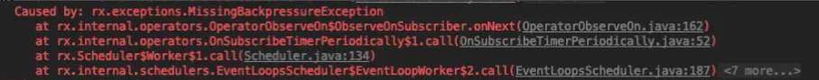

# 背压 (Backpressure)
这是一个工程用语, 指上游来的水流或水蒸汽过多了, 下游受不了, 就发生了逆流之内的非正常情况.
放到RxJava世界中也是类似, 就是上游发出来的数据过多了, 搞得下游处理不了这许多, 这种情况就叫背压. 

## 历史: 从RxJava1到RxJava2+
RxJava1的时代, 很多事件不能正确处理背压的情况, 从而会扔出`MissingBackpressureException`. 

比如说下面的RxJava1时代的代码: 
```kotlin
Observable.interval(1, TimeUnit.MILLISECONDS)
  .observeOn(Schedulers.newThread())
  .subscribe { Thread.sleep(1000); print("----> $it");}
```
这样当发出了第16个数据时, 接收方还在sleep, 这就引发了背压


=> 是的, 在RxJav1时代, 缓存池大小就是16. 超出来就会发生MissingBackpressureException. 

所以到了RxJava2+的时代, 为了更好地处理背压, RxJava引入了多种发生背压时的处理策略:
* 有创建一个cache先存着这些暂时处理不了的数据, 
* 或是处理不了的数据就丢弃这些新来的数据, 
* 或是处理不了时就报错
* ....

为了更好应用这些策略, RxJava破天荒地引入了`Flowable`的概念.
以前RxJava1时代的Observable, 现在成了` = Observable + Flowable`
* `Observable`是不含有背压处理的流
* `Flowable`是含有背压处理的流, 即自带了上面所说的各种处理策略. 

# Flowable 
口说无凭, 我们来看个例子就知道了
```kotlin
val upstream : Flowable<String> = Flowable.create({ FlowableEmitter<String> emitter -> 
  emitter.onNext(...)
}, BackpressureStrategy.ERROR);
```

看到了吧, Flowable的创建会自带背压策略的.  这里的策略可选值有以下几种: 
```kotlin
public enum BackpressureStrategy {
    //不指定背压策略
    MISSING,
    //出现背压就抛出异常
    ERROR,
    //指定无限大小的缓存池，此时不会出现异常，但无限制大量发送会发生OOM
    BUFFER,
    //如果缓存池满了就丢弃掉之后发出的事件
    DROP,
    //在DROP的基础上，强制将最后一条数据加入到缓存池中
    LATEST
}

```

# Processor

# 背压的操作符


# 总结