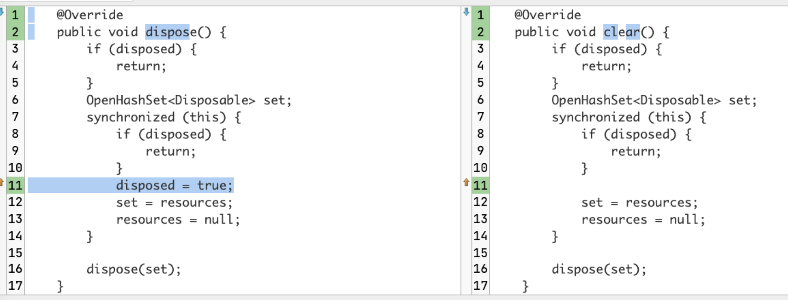
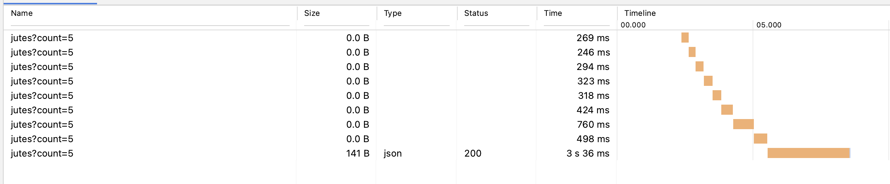
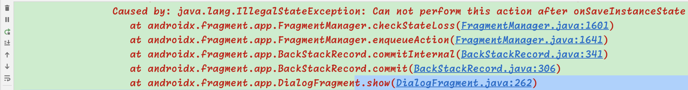

# 序章. "出门时关上门"
在以前学习Observer设计模式时, 我们就知道, 不能光是addListener. 在合适的时机, 我们也要removeListener. 不然就可能会因为对象还在而导致一些重要的类(如Activity, Fragment, ..)得不到GC释放, 从而造成内存泄露.  这就像是开了门出去, 那出去时要随手带上手是一样的. 

在RxJava中, 这个工作就是由`Disposable`来完成的. 
* 我们每次`subscribe`就会返回一个`Disposable`对象
* 在时机合适, 如页面被销毁时, 就调用`Disposable#dispose()`方法, 来释放掉这种订阅. 

# 一. 有多个Dispose要集体注销时, 使用CompositeDisposables
当然, 若我们一个Activity中有多个流以及它们的subscribe订阅, 那我们就要在onDestory中一一来dispose. 好累. 

所以更好的办法, 是使用 `CompositeDisposables`.  它内存有一个Set<Disposable>来存这些dispose. <br/>
到了要释放时, 就对这个set做for-each, 来一一释放这些dispose. 

举例来说, 一个Activity就是: 
```kotlin
class BaseActivity : Activity() {
  protected val disposables = CompositeDisposables()

  override fun onDestroy() {
    disposables.dispose()
    super.onDestroy()    
  }
}
```

## clear与dispose区别
上面是Activity的处理. 而对于Fragment可能有点不一样, 我们并不适合在onDestroyView中调用`disposables.dispose()` <br/>
因为Fragment对象可能在这时没有被销毁, 只是view被销毁了. 下次时机到了, 可能又重新走onCreateView()来开始工作. 

问题在于, 调用了`disposables.dispose()`之后, 再调用`disposables.add(...)`就不会成功了. 因为一个CompositeDisposables只能dispose一次. 


这时我们要用的其实是`disposables.clear()`方法. 这个方法就是清除disposables们, 但不设置isDisposed标记. 来源码: 



看这源码就知道为何clear更适合了

### Fragment的写法
```kotlin
class BaseFragment : Fragment() {
  protected val disposables = CompositeDisposables()

  override fun onStop() {
    disposables.clear();
    super.onStop();
  }

  override fun onDestroyView() {
    disposables.clear()  //<=  不要用dispose()方法
    super.onDestroyView()    
  }  
}
```

BaseActivity的onDestory用了`disposables.dispose()`, 这是因为这个Activity已经被清理了, 所以不会有被再利用的可能了. 

但BaseFragment不同. 我们的每一个Fragment在被replace时都会调用onDestoryView方法, 而且按back可能再回到这个Fragment. 所以不能直接用`dispose()`方法, 不然按back回来后这个disposables就无法再利用了. 

# 二. 串行场景下, 使用SerialDisposables

`SerialDisposable`:  你可以用它来add(dispose), 这时它会自动地把上一个Disposable给dispose掉. <br/>
也就是说, 它就像是一个size = 1的坑位一样, 只能接收一个Disposable. 来了新值, 旧值就要被自动地给dispose掉. 

它的应用场景其实不少, 说个简单的例子, 就是一个展示pop over dialog的stream.  <br/>
因为我们每次都只展示一个pop over在手机上, 所以我们可以用`SerialDisposable`来自动干掉上面一个pop over的订阅.

另一个场景, 比如说我们有一个按钮, 点击了就会进行复杂的运算, 耗时较久. 这时用户可能等不耐烦, 频繁去点那个按钮. 于是我们可以: 
```kotlin
val disposables = SerialDisposable()

val dis = btnCalculate.onClickStream.subscribe{....}
disposables.add(dis)
```
这样一来, 你点击多次也没用, 只有最新的一次能工作, 前面几次都被自动disposed掉了. 


当然, 它并不是万能的. 比如说, 我们有一个点赞按钮. 点击它就是点赞, 再点就是取消点赞. 这些都是要和后面通信点赞结果的. 这时就不适用使用SerialDisposable.


## 实例
现在我们有一个按钮, 点击就请求一个后台接口. 
```kotlin
    btn.setOnClickListener {
        val d = api.getUserList(5)
            .schedules()
            .subscribe { resp -> println("szww resp = $resp") }
        sd.set(d)
    }
```
但现在是弱网状态, 请求要过好几秒才返回. 我等得不耐烦了, 就多点了几下, 结果就是: 


是的, 前面的请求都没有结果了, 只有最后一次才有结果, 这是因为SerialDisposable会自动dispose掉前一个(若还在的话), 所以只有最后一次有结果了. 

备注: 要屏蔽短时间内的多次请求, 使用debounce()也是另一种方法啦. 

备注: 后台其实仍会收到多次请求啦, 但在Android端我们取消了之前的订阅, 只有最后一次请求会成功而已. 


# 三. 有用的extension方法
当然, 我们在自己使用中, 下面的代码就太累了
```kotlin
class SomeActivity : Activity() {
  protected val disposables = CompositeDisposables()

  override fun onCreate(bundle?) {
    super.onCreate(bundle)
    disposables.add(stream1.subscribe{..})
    disposables.add(stream2.subscribe{..})
    disposables.add(stream3.subscribe{..})
  }

  override fun onDestroy() {
    disposables.dispose()
    super.onDestroy()    
  }
}
```

于是我就做了下面的extension方法: 
```kotlin
fun Disposable.clearBy(disposableQueue: CompositeDisposable) {
    disposableQueue.add(this)
}

fun Disposable.clearBy(disposableQueue: SerialDisposable) {
    disposableQueue.set(this)
}
```

配合上面提及过的BaseActivity, 其中已经存在的protected val disposables成员, 于是我们就可以这样: 
```kotlin
class SomeActivity : BaseActivity() {

  override fun onCreate(bundle?) {
    super.onCreate(bundle)
    stream1.subscribe{..}.clearBy(disposables)
    stream2.subscribe{..}.clearBy(disposables)
    stream3.subscribe{..}.clearBy(disposables)
  }
}
```

是不是看起来更清爽了. 而且程序员不用写这么多重复代码, 心情也更好了. 

# 四. [案例] 延时Dialog引发的crash

## 引发的crash
我在一次工作中发现了一次crash, 简单来说就是:
* 在Fragment1中, 我要在20秒后显示一个BottomSheetDialogFragment
* 但当我马上从Fragment1跳到了Activity2去后, 在Activity2页里就发生了crash: 



## 思考
看一下这个crash说明就知道是在fragment已经不活跃了, 但仍然想去更新Fragment的UI, 所以报错了. 这个可以理解, Fragment的工作原理就是这样嘛. 

但我不能理解的是, 我明明有清除disposable啊: 

```kotlin
class BaseFragment : Fragment() {
  protected val disposables = CompositeDisposables()

  override fun onDestroyView() {
    disposables.clear()  //<=  不要用dispose()方法
    super.onDestroyView()    
  }  
}
```

于是我去做个实验
* 要是Fragment1跳Activity2, 会有上面的crash
* 但若是Fragment1跳Fragment3, 不会有crash !!!

再接着研究, 发现这两种不同的场景, 触发的生命周期方法也不一样
* Fragment1跳Fragment2时, Fragment1所触发的生命周期方法是: `onPause -> onStop -> onDestoryView`
  * 这里走了onDestroyView, 所以disposables被注销掉了, 自然就不会在20秒之后再显示dialog了, 所以就不crash
* Fragment1跳Activity3时, Fragment1所触发的生命周期方法是: `onPause -> onStop -> onSaveInstanceState`
  * 这里没走onDestoryView, 所以disposable们没有被清, 所以20秒后仍会想显示dialog, 所以就crash了. 


## 原因
其实多说一解码器, 那就是: 
* 若Activity1跳Activity2, 那Activity1所触发的生命周期方法也是: `onPause -> onStop -> onSaveInstanceState`

现在明显就是页面不在了, 就不要注册了. 这其实和LiveData类似了. 所以解法就有了: 
> : 即给onStop加一个`disposables.clear()`即可. 

```kotlin
class BaseFragment : Fragment() {
  protected val disposables = CompositeDisposables()

  override fun onDestroyView() {
    disposables.clear()  //<=  不要用dispose()方法
    super.onDestroyView()    
  }  

  // 新加这一个方法
  override fun onStop() {
    disposables.clear()  //<=  不要用dispose()方法
    super.onStop()    
  }  
}
```

## 注意1
注意, CompositeDisposable之类的方法, 有两个方法都可以用来清除注册
* `clear()`: 只是清理多个disposable, 能被多次调用
* `dispose()`: 清理多个disposable, 但只能用一次.

对于Fragment的实例来说, 我们肯定不想创建多个CompositeDisposable实例, 所以使用`clear()`在很多时候就很有用了.  

-> 若使用dispose方法, 那这个CompositeDisposable实例就无法再使用了. 因为dispose方法不能调用两次 <br/>
所以为了不想创建多个CompositeDisposable实例, 这时就可以用`clear()`方法

## 注意2
在debug时, 可能我们想知道何时rxjava流走到哪了, 这时就可以用以下几种方式来帮助我们: 

```kotlin
api.getUser()
  .doOnSubscribe {/* 下游注册了就会调用这. 相当于是冷流的开始了 */}
  .doOnCancel { /* 在disposable.dispose()时, 这个doOnCancel就会被调用到 */ }
  .doOnNext { item -> /* 每个数据都会走一次这里 */ }
  .doOnError {err -> /* 出错了走这里. 注意, 并不会catch住error, 只是一个监听而已 */ }
  .doOnFinally { /* 无论是complete还是error都会走一次这里. */ }
  . ... ....
```

本小节是讲Disposable的, 它的dispose方法被调用时, 就会触发 `doOnCancel`哦!

备注: RxJava2+后, 原来RxJava1时代的`doOnUnsubscribe`就改名成了`doOnCancel`.<br/>
原因嘛, 自然是rxjava 2+后, subscription细分成了: Subscription与Disposable两种了. 所以原名字就太偏了. 
