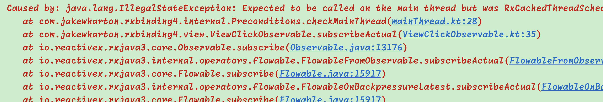
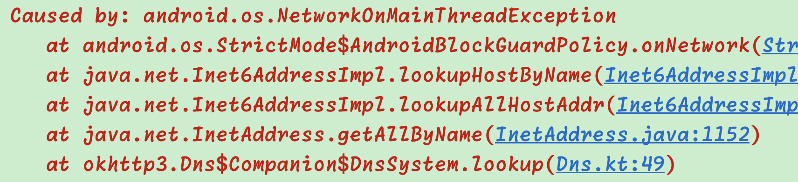
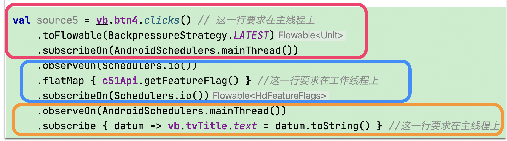

# 各式Scheduler
前面讲单元测试时, 我们讲过TestSchedulers, trampoline的scheduler. 下面我们来介绍一些其它的scheduler

```kotlin
  Scheduler.io()
  Scheduler.computation()
  Scheduler.trampoline()
  Scheduler.newThread()
  Scheduler.single()
  Scheduler.from(executor)
  AndroidSchedulers.mainThread()
```

其中
* computation()是根据CPU数目来限定线程池大小. 所以线程池注定不大, 不适用于忙碌的IO操作, 一般用于一些计算任务
* io()有一个线程池 (内部的线程数很大), 适用于一些网络请求, 数据库访问, 文件操作等IO工作
* trampoline()是在当前线程上以一个FIFO的队列来接/取任务
* mainThread()则是Android上的主线程, 一般用来刷新UI的
* from(executor)则是当你已经有自定义的ExecutorService时, 把它做为参数传入, 如:

```kotlin
val pool = Executors.newFixedThreadPool(10)
val myScheduler = Schedulers.from(pool)
```

# 初识 subscribeOn, observeOn
这两个其实就是用来切换线程的, 我们经常用到的一个场景就是: 
```kotlin
api.getUser()
  .subscribeOn(Schedulers.io())
  .observeOn(AndroidSchedulers.mainThread())
  .subscribe {user -> populateUI(user)}
  .clearBy(disposable)
```

我初学RxJava时, 觉得就是subscribe这一块在哪运行就看observeOn的; 其它的就看subscribeOn的.
这个错误在很多情况下不易察觉, 但其实这是错误的, 并且容易引发问题. 下面的"Rxbinding案例"就是一个出错的实例. 


# RxBinding引发的crash

## 最初的问题
先说表象哦. 下面的代码会引发crash, 
```kotlin
val source = vb.btn.clicks()
  .toFlowable(.LATEST)
  .flatMap {api.getUser()}
  .schedulers()

// 这个source其实有两个下游
source.map{..}.subscribe {...}  
source.map{..}.subscribe {...}  
```

其中的扩展函数是: 
```kotlin
fun <T: Any> Flowable<T>.schedules(): Flowable<T> =
        this.subscribeOn(Schedulers.io())
                .observeOn(AndroidSchedulers.mainThread())
```


这时一运行app, 都没有点btn就crash了: 



那原因是什么呢? 

## 另外一个问题
在尝试修复过程中, 我把代码改成了这样: 
```kotlin
val source = vb.btn.clicks()
  .toFlowable(.LATEST)
  .subscribeOn(AndroidSchedulers.mainThread())
  .flatMap {api.getUser()}
  .schedulers()
```

这样app运行没问题. 但只要一点btn就会crash, 还是不同的crash: 


咦, 这个好奇怪啊, schedulers里不是说了上面的归io线程嘛, 怎么 `api.getUser()`发生在了主线程上?

## 总结下问题
现在的问题明显就是线程调度不对引发的各种crash.
所以问题其实很简单, 就是: 
* subscribeOn是管线程调度, 它管的是哪一块范围?
* observeOn也是管线程调度, 那它管的是哪一块范围?


经过各种做实验, 其实就也是`doOnNext { print("${Thread.currentThread.name()"})}`啦, 我终于得到了最终结果: 

1). subscribeOn与observeOn全是用于切换线程的

2). subscribeOn改变的是其之前的代码的线程; 但是当我们有多个subscribeOn时, 只有第一个会起作用  

3). observeOn改变的是其之后的代码的线程; 当我们有多个observeOn时, 个个都能起作用


第2点其实就是为何问题2中的api.getUser会发生在主线程上. 因为只有第一个的 `.subscribeOn(AndroidSchedulers.mainThread())` 起作用了. 

所以正确的调度就是:


## 最佳做法
当然上面的subscribeOn与observeOn都成对出现, 减少了出错的可能性

但我们说了, `多次调用subscribeOn, 也只有第一次会成功`, 所以上面的代码是有点冗余的. 

真正正确, 且极简的, 代码是这样的: 
```kotlin
       val source4 = vb.btn4.clicks() //默认就在主线程上
            .toFlowable(BackpressureStrategy.LATEST)
            .observeOn(Schedulers.io())
            .flatMap { c51Api.getFeatureFlag() } //服从上面的obserOn(io)
            .schedules() //保证下方的subscribe发生在主线程
```