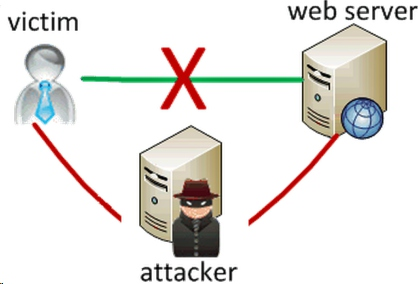

Today I read a post that introduce the man-the-middle attack. But I think this post does not tell the details vividly. So I write this post to tell you how MITM works.

Last post I explained how HTTPS works. And the MITM(man-in-the-middle) is particularly aim to the HTTPS system.

As I explained in the last post, HTTPS use asynmmetric + synmmetric cryptography to make sure the data is secure and fast-transfering. 

Remember this picture? The attacker obviously knows this picture too. One day, it's dawn on him that how about I play a double agent?

The attacker pretends as a server to the client (e.g. Rogue DNS points to attacker's server). At the same time, the attacker pretends as a client to the real server. 

1. This way, client thinks the attacker as the real server, so the attacker give the client his public key.
2. client believe it, and use this public key to encrypt its synmmetric key, and transfer the data to the attacker
3. The attacker now get the data from the client. These data coule be very private. Maybe these data are the password, the pin code, the personal information about our client. 
4. The attacker can act as a client, and then get the response from the server too. 

#### P.S.
Actually, Fiddler, the web debugging proxy tool is playing such a tool. He acts as a double agent, and then he can get to know what the client is passing to the server.

