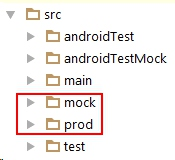
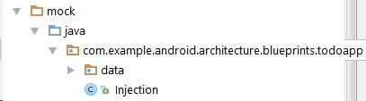
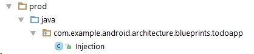
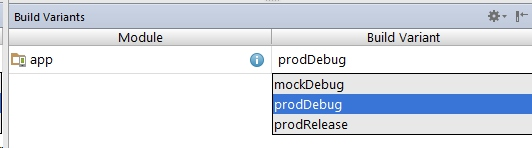

# Google's android-architecture

Google released the "andorid-architecture" in the early 2016. Obvious, google noticed the complex architecture in Android. Activity is usually a "God Object", and tests are usually missing, and so many architectures exist, like MVP, MVVC, Clean, ... 

Now google offers a same TODO application implementd using different architecture concepts and tools, including : MVP, Loader, ContentProvider, DataBinding, Clean, Dagger, and RxJava. 

I think the "todo-mvp" is the most important project, because some other projects are build on it. So I spend some time to learn the "todo-mvp" project and try to imitate it.  I have to say I learned a lot from that project. This post is one of them. 

# The test framework in the "todo-MVP"
I will only talk about the elegant architecture in the test framework. 
Just like the last two posts about Android Test, I came out a clean test framework by my self, because I realized that how hard is the test in real life. If we depends on the network, or the hardwork, which may fail sometime, or may take a while to responde, we may fail our tests some time, and that's not I expected. I really want all my tests pass every single time, regardless of the success of external dependencies.

The answer is Dependency Injection. That's what I did in the [last post](https://github.com/songzhw/songzhw.github.io/blob/master/test/2016-04-12-clean-test-project-2.md). Using the dependency injection, we definitely separate the test codes and the release codes.  

Google's "todo-MVP" now introduce another dependency injection framework : **Product Flavors**. 

Product flavors is a powerful feature of Andorid Gradle plugin that lets you swap Java clssess at compile time and doesn't require additional library. So you achieve your goal and do not need to worry about the 65536 problem. You do not need to take a considerable amount of time to set some kind of dependency injection framework up and understand how they work. 

### procedure
The procedure is simple:
1.create the flavors in your ${module}/build.gradle file
```groovy
 android {  
      productFlavors {  
           mock {   
                applicationIdSuffix = ".mock"  
           }  
           prod  
      }  
 } 
```

2.Create two directores : ${module}/src/ prod, ${module}/src/ mock


3.Add a "Injection" class to both directory with diffierent contents
In the mock/java/com.example.android.architecture.blueprints.todoapp, I use *Injection* to give out the fake data, that is needed in the test. 



And in the prod/java/com.example.android.architecture.blueprints.todoapp, I use *Injection* to give out the readl data from network or local database, that is needed in the release vesrion. 



4.When I want to switch the implementation of the *Injection* class, I can simple switch the build variants:



When you run the tests, the Gradle will only compile the Injection class which is in the mock directory. And when you want to distribute a release APK, the Gradle will make sure the Injection class in the prod directory will be compiled by javac. 


# Conclusion
Google's "todo-MVP" project uses product flavors to help them build a hermetic testing, which is brilliant. And I will leverage the same mechanism to improve my "clean-test" project in the next post. 

External Link:
[Leveraging product Flavors in Android Studio for hermetic testing](http://android-developers.blogspot.ca/2015/12/leveraging-product-flavors-in-android.html)
