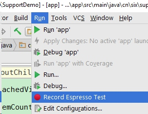
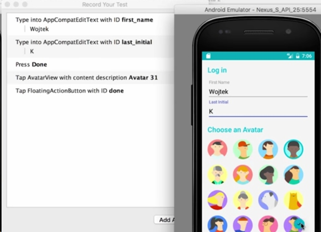
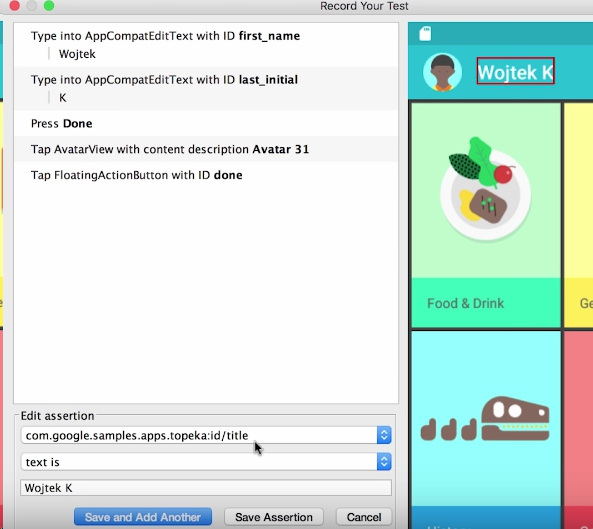
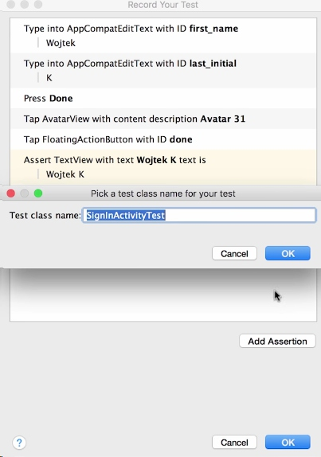
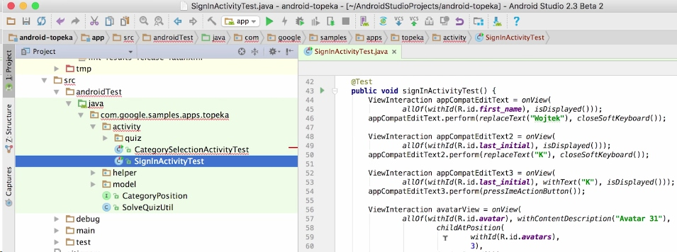

Android Studio 2.3 has a new feature called "Espresso Test Recorder". Years ago, my iOS colleague told me that iOS has such a recorder tool that record your actions, and can replay this script as a test. I was like, "what, that's awsome". Now I am proud that Android has such a test tool too. 

#### Espresso
For who is not familiar with Espresso, please [see here](https://developer.android.com/training/testing/ui-testing/espresso-testing.html). I've used Espresso to test a SDK in my previous company. Back then, with the help of Jacoco, we knew that our Espresso test cases covers more than 80% of source code, which made us very proud. My previous company had a KPI for us and asked us to cover at least 70% of source code, and we were fulfill this goal. In conclusion, all I want to say is I've used Espresso successfully, and I think Espresso is good enough for you to do UI test, so please use it. No more excuses for not adding tests.

#### Steps to use Espresso Test Recorder
Here is how to use Espresso Test Recorder:

step1.  "Run" menu --> "Record Espresso Test". Select an emulator or a device. And the recorder will run your app in debug mode.

step2. You can type, select, click as a normal user, and the recorder will record every action you made at the same time. At last, all you actions will generate a "*.java" test files.

step3. Add assertion
If there is only actions, this is not a test. You must add your assertion to know if the app runs well or not.

In Espresso Test Recorder, you have to click one view to add a assert:

step4. Generate the test file

And you will get a new file:

This is familiar if you wrote Espresso before, right?

