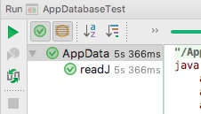
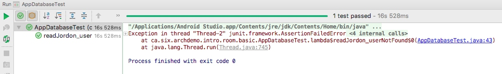

Room is a persistence library provided by Google. It provides an abstraction layer over SQLite to allow fluent database access. In short, it's like the Hiberate in the server development. This post is most focusing on the testing on Room.

### I. Test Room
Android released [one page to tell us how to test our database](https://developer.android.com/training/data-storage/room/testing-db.html). What it did is quite easy, and it just saving and reading from memory instead of a real database instead.

Here is one test code that is recommended by Android:
```java
@RunWith(AndroidJUnit4.class)
public class SimpleEntityReadWriteTest {
    private UserDao mUserDao;
    private TestDatabase mDb;

    @Before
    public void createDb() {
        Context context = InstrumentationRegistry.getTargetContext();
        mDb = Room.inMemoryDatabaseBuilder(context, TestDatabase.class).build();
        mUserDao = mDb.getUserDao();
    }

    @After
    public void closeDb() throws IOException {
        mDb.close();
    }

    @Test
    public void writeUserAndReadInList() throws Exception {
        User user = TestUtil.createUser(3);
        user.setName("george");
        mUserDao.insert(user);
        List<User> byName = mUserDao.findUsersByName("george");
        assertThat(byName.get(0), equalTo(user));
    }
}
```

### II. Why this is not enough?

Kotlin Coroutine has been released in 2019, which make ROOM thread code and the test against ROOM is much easier. Please see [my new blog](https://github.com/songzhw/songzhw.github.io/blob/master/and_archi/2019-12-26-room.md)


= = = = = = = = = = = = = = = = = = = =  DEPRECATED FROM HERE = = = = = = = = = = = = = = = = = = = = 

= = = = = = = = = = = = = = = = = = = =  DEPRECATED FROM HERE = = = = = = = = = = = = = = = = = = = = 

= = = = = = = = = = = = = = = = = = = =  DEPRECATED FROM HERE = = = = = = = = = = = = = = = = = = = = 

= = = = = = = = = = = = = = = = = = = =  DEPRECATED FROM HERE = = = = = = = = = = = = = = = = = = = = 

But I had to say, this is quite limited. First of all, to use "AndroidJUnit4", you will be asked to provide a device or emulator to run this test. Second, since it involves passing test to device/emulator, it takes more time than just pure JUnit test.

Okay, I had to admit that this is actually the down side of AndroidJUnit test. And that's also why I recommended Robolectric test. Robolectric requires no device or emulator, and it's pure JUnit test, which makes it very fast. If you have to run the test every day, you will know how much time you saved every single day.

So I tried to replace it with Robolectric test. However, things are not going as well as I expected.  I encoutered a couple of tricky problems. That's  actually this blog for, to tell you how to use Robolectric to test Room, and show you how to avoid the same mistakes I made.

### III.  Error01 : run DB on the main thread
Now I had a database to stroe information about users, and I wrote a test to make sure it works. The following code is the test I made. 
```java


@RunWith(RobolectricTestRunner.class)
@Config(constants = BuildConfig.class, sdk = 21)
public class AppDatabaseTest {
    private AppDatabase db;
    private UserDao dao;

    @Before
    public void setUp() {
        db = Room.inMemoryDatabaseBuilder(RuntimeEnvironment.application, AppDatabase.class).build();
        dao = db.userDao();
    }

    @After
    public void cleanUp(){
        db.close();
    }

    @Test
    public void readJordon_userNotFound() {
        User user  = dao.findByName("jorden");
        assertNull(user);
    }
    
}
```

After I run it, I got a error :
``` java
java.lang.IllegalStateException: Cannot access database on the main thread since it may potentially lock the UI for a long period of time.

    at android.arch.persistence.room.RoomDatabase.assertNotMainThread(RoomDatabase.java:164)
    at android.arch.persistence.room.RoomDatabase.query(RoomDatabase.java:192)
    at ca.six.archdemo.intro.room.basic.UserDao_Impl.findByName(UserDao_Impl.java:212)
    at ca.six.archdemo.intro.room.basic.AppDatabaseTest.readJordon_userNotFound(AppDatabaseTest.java:41)
    at org.junit.runners.model.FrameworkMethod$1.runReflectiveCall(FrameworkMethod.java:50)
    at org.junit.internal.runners.model.ReflectiveCallable.run(ReflectiveCallable.java:12)
    at org.junit.runners.model.FrameworkMethod.invokeExplosively(FrameworkMethod.java:47)
    at org.junit.internal.runners.statements.InvokeMethod.evaluate(InvokeMethod.java:17)
```

That's true. Robolectric is a tool to test UI, so every Robolectric test case is actually running on the main thrad.  Thus,  I decided to wrap a thread to run the test.


### IV.  Error02: add a thread
```java
    @Test
    public void readJordon_userNotFound() {
        Thread thread = new Thread( () -> {
            User user = dao.findByName("jorden");
            assertNull(user);
        });
        thread.start();
    }
```
This time, it works!




But really? Let's do some modification to the test. Now we just change the  `assertNulll(user)` to `assertNotNul(user))`. These two are obsolutely opposite. So the test should faild right now. Am I right?

```java
   @Test
    public void readJordon_userNotFound() throws InterruptedException {
        Thread thread = new Thread( () -> {
            User user = dao.findByName("jorden");
            assertNull(user);
        });
        thread.start();
    }
```

Weird, now the test also passed, with an error in the console. 



Now I realised, actually the test code in the thread never completed, so no matter what kind of assertation you add, it will always succeed. 

In fact, this could be explained by taking a look at  the source code of JUnit. In `JUnitCore` class,  we could see the test will call `System.exit`, not matter if your thread is finished or not. 

```java
JUnitCore

    public static void runMainAndExit(JUnitSystem system, String... args) { 
        Result result= new JUnitCore().runMain(system, args); 
        system.exit(result.wasSuccessful() ? 0 : 1); 
    }
```

In other words, JUnit will finish iitself and close the JVM once it execute one test case, even when you still have threads running. Once the JVM is closed, of course, our threads will stop by force. That's why our thread didn't finish in our case.

### V. wait the thread to finish
We had a couple of ways to wait one thread to finish. One is the "thread.join()",  and the other one could be the `CountDownLatch`. Here we just used `join` for simplicity.

```java
    @Test
    public void readJordon_userNotFound() throws InterruptedException {
        Thread thread = new Thread( () -> {
            User user = dao.findByName("jorden");
            assertNotNull(user);
        });
        thread.start();
        thread.join();
    }
```
This time the test  waited the completion of our thread and then exited. But , still, not matter which kind of asserstion I added, the test always passed too. So this wait is not a good solution for us. 

### VI. A work around
It appears the assertion in the worker thread does not work as we expected. So we move the assertion out of the worker thread. 

```java
    User user;
    @Test
    public void readJordon_userNotFound() throws InterruptedException {
        Thread thread = new Thread( () -> {
            user = dao.findByName("jorden");
        });
        thread.start();
        thread.join();
        assertNull(user);
    }
    
    @After
    public void cleanUp() {
        db.close();
        user = null;
    }
```
P.S. just remember to clean up the `user` field in the `@After` method since it may affect other test cases .

This time we really worked. If we use `assertNotNull(user)`, the test case will fail. Meanwhile if we use `assertNull(user)`, we passed the test.


### V. Conclusion
This problem we had above is just because Robolectric is a framwork to unit test UI, so it runs on UI thread. And our test is about the database, which should not run on the UI thread. This dilemna caused our problems.

The solution above solved our problem. However, someone may argue that eatch test should have its own instance of User, to ensure tests are started in a clean state. That's partly true. We've clean the User state in the cleanUp() method, so it should be fine. 

= = = = = = = = = = = = = = = = = = = =  DEPRECATED END HERE = = = = = = = = = = = = = = = = = = = = 

= = = = = = = = = = = = = = = = = = = =  DEPRECATED END HERE = = = = = = = = = = = = = = = = = = = = 

= = = = = = = = = = = = = = = = = = = =  DEPRECATED END HERE = = = = = = = = = = = = = = = = = = = = 