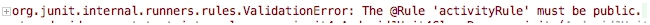
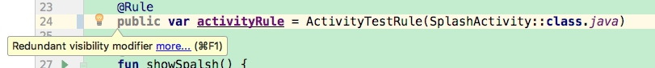
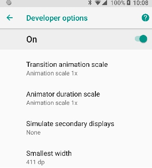

## I. Background
I've been using Espresso since 2015. I've imported Espresso to the project my company was making, and the test coverage is more than 80%.

As Kotlin becomes more and more popular, I started to write Espresso using Kotlin. However, I got some issues when I tried to use the new version of Epresso and new version of Kotlin. That are the reasons why I write this post. Help it helps.

## II. Import Espresso
From the [official document](https://developer.android.com/training/testing/ui-testing/espresso-testing), we know we could add Espresso by :

```groovy
dependencies {
    // Other dependencies ...
    androidTestImplementation 'com.android.support.test.espresso:espresso-core:3.0.2'
}
```

As a matter of fact, this is far enough for you to integrate Espresso.

You may say that Android Studio will generate the dependencies for you. 

```groovy
    androidTestImplementation 'com.android.support.test:runner:1.0.2'
    androidTestImplementation 'com.android.support.test.espresso:espresso-core:3.0.2'
```
You are, of course, right. The problem is the code generated by Android Studio is still not good enough for us to use Epsresso in our project. You may get some issues like you can not find the `ActivityTestRule` class. 

The correct dependencies you need to add should look like this:

```groovy
    androidTestImplementation 'com.android.support.test:rules:1.0.2'
    androidTestImplementation 'com.android.support.test:runner:1.0.2'
    androidTestImplementation 'com.android.support.test.espresso:espresso-core:3.0.2'
```

Of course, if you need to use espreso-intent, esperesso-webview, ... , you also needs to import these sepecific libraries. 

## III. @ActivityTestRule must be public ?!
If you follow the  [official document](https://developer.android.com/training/testing/ui-testing/espresso-testing) and run the test, 

```kotlin
@RunWith(AndroidJUnit4::class)
@LargeTest
class ChangeTextBehaviorTest {
    private lateinit var mStringToBetyped: String

    @Rule
    var mActivityRule: ActivityTestRule<MainActivity> = ActivityTestRule(MainActivity::class.java)

```

you probably will get an error:


The first time I got this issue, I was completely lost. I thought `var` memeber in Kotlin is public by default. That's why I got a warning when I added a `public` in front of `var`.



So I decompile the kotlin file, and finally find out the root cause.

After decompiling, the kotlin java turns into a java file just like as follow:

```java
public final class SplashTest {
   @Rule
   @NotNull
   private ActivityTestRule activityRule = new ActivityTestRule(SplashActivity.class);

   @NotNull
   public final ActivityTestRule getActivityRule() {
      return this.activityRule;
   }
```

Yes, the `activityRule` memeber is declared as `private`, and it's just got a public getter mehtod for you. 

Here is what you should add a `@JvmField` annotation to make this memeber public mandatorily:

```kotlin
    @Rule
    @JvmField
    var activityRule = ActivityTestRule(SplashActivity::class.java)
```

The above code will turns into as follow:

```java
public final class SplashTest {
   @Rule
   @JvmField
   @NotNull
   public ActivityTestRule activityRule = new ActivityTestRule(SplashActivity.class);
```

## IV. IdlingResource
One of the great benefit, and also the greatest challenge, of Espresso is the IdlingResources. You need to place the IdlingResource code carefully and elegantly, and also to make sure inject the idle flag without affecting your release code. Here, we are just about to talking about the deprecated methods: `Espresso.registerIdlingResource(idleRes)`.

Nowadays, this method and the corresponding `unregister` method are both depreacted. You should use `IdlingRegistry` instead.

Here is the correct and safe code:

```kotlin
        IdlingRegistry.getInstance().register(idle)

        onView(withId(R.id.rvHome))
                .check(matches(isDisplayed()))

        IdlingRegistry.getInstance().unregister(idle)
```

## V. Turn Off The Animation
The new version of Espresso now mentions one new thing we need to pay attention. I quote:

```
Turn off animations on your test device — leaving system animations turned on in the test device might cause unexpected results or may lead your test to fail. Turn off animations from Settings by opening Developer options and turning all the following options off:
* Window animation scale
* Transition animation scale
* Animator duration scale
```

Just turns three animation off:



