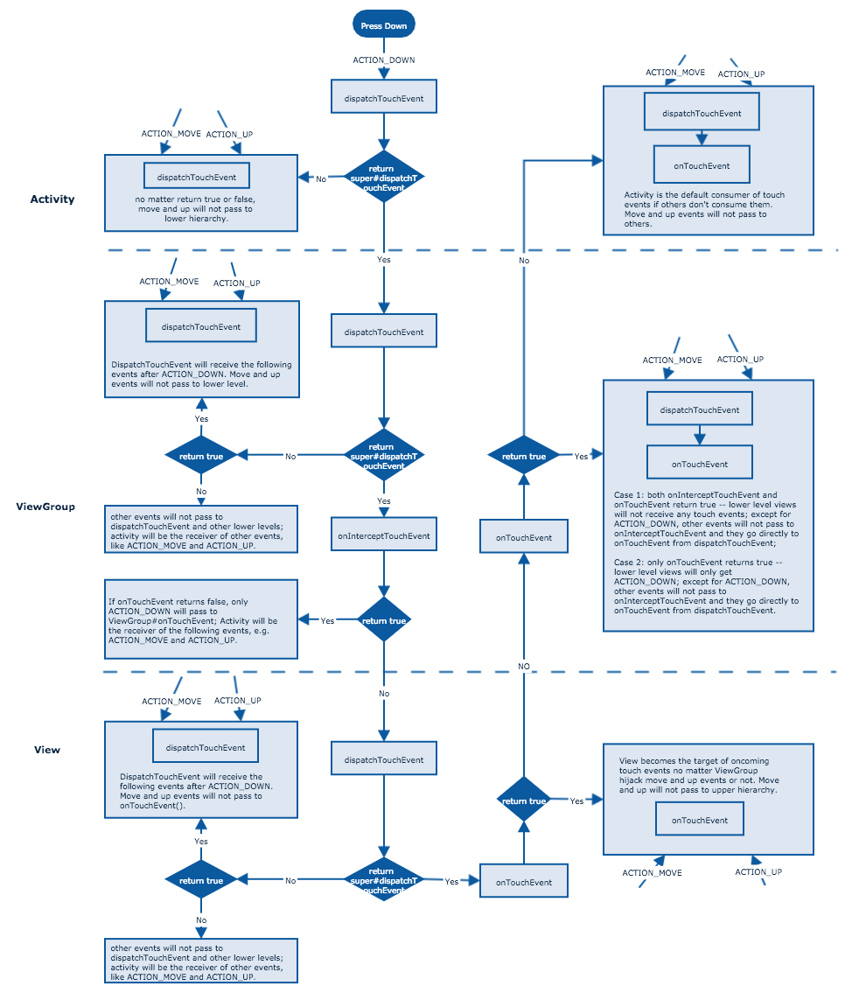

This may be the shortest post I've ever write. That's because there are tons of posts about the touch event on Android. But these post are mostly very complicated to understand. So here is just one picture to help you understand the whole touch event process.

copyright: This picture is made by [hellenxu](https://github.com/hellenxu).

