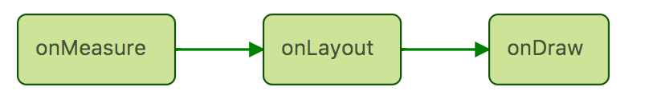

## Introduction
From now on, I will write a series of posts about how to custom a View (and a ViewGroup). I have to admit that customing a View that is meet your special need may be very difficult, and gotting what your need exactly needs a lot of practise and experience. At least, these series posts are a good start to do that. 

I know a lot of theory makes you want to sleep, believe me, I’ve read hundreds of such posts full of theory, and no example or few examples. So my series post would be different. I would like to import examples to help you understand each theory. 

Now let’s begin our beautiful and tough journey.

## How the view be drawn on your screen?
This topic may be talked many many times, but we still have to explain it at the very first place because this theory is far important than you think. This theory is so important that Android create a post to talk about it. [Here is the link](https://developer.android.com/guide/topics/ui/how-android-draws.html)

Now imagine you are a painter, you need to draw a desk and an apple in your painting. What should you do?
You must know where to draw the apple and the desk, and how big are they. When you get these information in your head, then you can start to draw them. 

That’s how Android does too. You want to draw a View in your screen, you must know how big is this view, and where to put it. After you get it, then you can start to draw it. 

In the code, then this view’s onMeasure() will called at first, followed by onLayout() and onDraw() method. 

At the end of the measure pass, your View has known it’s width and height, aka, size. 
In the layout pass, you tell the system where to put this view.
At last, you use your paint and canvas to draw it. (We do have Paint and Canvas class in Android~)

Thinks this is easy, just need to know the size and the position to put the View? 
I have to say, it would be wounderful if this is so easy. But it is not. 

In the measure pass, you have to calculate how big is this view, and is it too big for its parent layout? is it show the whole content? is it okay to have it so big that it is bigger than its parent layout? …

And how about the margin of views, and the padding of views? how about if this is a expanding and shrinking animation (like a heart beating animation), the measure and the layout need to be recalculated every 16ms?

I don’t want to terrify you, just to point out that customing a view is hard to do, and we need a lot of practice. 

