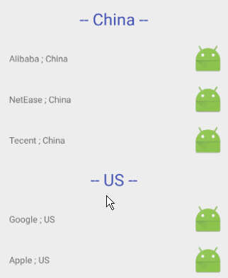
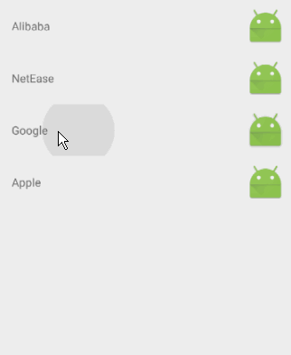

Drag & Drop featrue is since API 11. And for RecyclerView, we have ItemTouchHelper to make the Drag&Drop more easier.  There are quite a lot of post about how to implement drag & drop, like [this one](https://medium.com/@ipaulpro/drag-and-swipe-with-recyclerview-6a6f0c422efd).

But today what I want to post is the drag & drop between different groups. 




## 1. A simple example of Drag & Drop of RecyclerView
We use ItemTouchHelper.Callback to tell the Activity now one item has move from where to where. 

The code below implements the drag & drop of RecyclerView.
```java
public class DragRecyclerViewDemo extends Activity implements RvItemDragSwipeListener {

    private List<String> data;
    private DragDropRvAdapter adapter; // an adapter of my own

    @Override
    protected void onCreate(Bundle savedInstanceState) {
        super.onCreate(savedInstanceState);
        setContentView(R.layout.activity_drag_rv);

        RecyclerView rv = (RecyclerView) findViewById(R.id.rvDragDrop);
        rv.setLayoutManager(new LinearLayoutManager(this));
        this.data = new ArrayList<>();
        this.data.add("Alibaba");
        this.data.add("NetEase");
        this.data.add("Google");
        this.data.add("Apple");

        adapter = new DragDropRvAdapter(this.data);
        rv.setAdapter(adapter);

        ItemTouchHelper itemTouchHelper = new ItemTouchHelper(new RvItemDragSwipeCallback(this));
        itemTouchHelper.attachToRecyclerView(rv);
    }


    // =============== RvItemDragSwipeListener =================
    @Override
    public void onMove(int fromPosition, int toPosition) {
        if (fromPosition < toPosition) {
            for (int i = fromPosition; i < toPosition; i++) {
                Collections.swap(data, i, i + 1);
            }
        } else {
            for (int i = fromPosition; i > toPosition; i--) {
                Collections.swap(data, i, i - 1);
            }
        }
        adapter.notifyItemMoved(fromPosition, toPosition);
    }

    @Override
    public void onSwiped(int position) {    }

    @Override
    public void onFinishDrag() {    }
}
```

```java
[ItemTouchHelper.Callback]
public class RvItemDragSwipeCallback extends ItemTouchHelper.Callback {
    public RvItemDragSwipeListener listener;
    public RvItemDragSwipeCallback(RvItemDragSwipeListener listener) {
        this.listener = listener;
    }

    @Override
    public int getMovementFlags(RecyclerView recyclerView, RecyclerView.ViewHolder viewHolder) {
        int dragFlags = ItemTouchHelper.UP | ItemTouchHelper.DOWN;
        return makeMovementFlags(dragFlags, 0);
    }

    @Override
    public boolean onMove(RecyclerView recyclerView, RecyclerView.ViewHolder viewHolder, RecyclerView.ViewHolder target) {
        int fromPosition = viewHolder.getAdapterPosition();
        int toPosition = target.getAdapterPosition();
        listener.onMove(fromPosition, toPosition);
        return true;
    }

}
```
With the code above, we now get a simple drag & drop.



## 2. Now focus on two groups of items
We just treat the title of each group as a item too. That's the secret of why we could drag items across different group.

```java
[Adapter]
    @Override
    public int getItemViewType(int position) {
        Company company = data.get(position);
        return company.type;
    }

    @Override
    public RecyclerView.ViewHolder onCreateViewHolder(ViewGroup parent, int viewType) {
        if (viewType == TYPE_TITLE) {
            int layoutResId = R.layout.item_simple_tv;
            View itemView = LayoutInflater.from(parent.getContext()).inflate(layoutResId, parent, false);
            return new TitleViewHolder(itemView);
        } else {
            int layoutResId = R.layout.item_rv_drag_drop;
            View itemView = LayoutInflater.from(parent.getContext()).inflate(layoutResId, parent, false);
            return new ContentViewHolder(itemView);
        }
    }
```

But after you run the code, you could find out that the title also is draggable, which is not what we want. We want the title to be fixed. 

## 3. Make fixed items
Since there are items that are fixed, we then need to flag these itesm as no draggable.

The good place to put this logic is the `getMovementFlags()` method of `ItemTouchHelper.Callback()`. Now we just make dragFalg of some particular items as INVALID(aka. 0)

```java
[ItemTouchHelper.Callback]
    @Override
    public int getMovementFlags(RecyclerView recyclerView, RecyclerView.ViewHolder viewHolder) {
        System.out.println("szw getMovementFlags("+viewHolder.getAdapterPosition()+")");
        int noSwipeFlags = 0;
        int dragFlags;
        if(listener.isDraggable(viewHolder.getAdapterPosition())) {
            dragFlags = ItemTouchHelper.UP | ItemTouchHelper.DOWN;
        } else {
            dragFlags = 0;
        }
        return makeMovementFlags(dragFlags, noSwipeFlags);
    }
    
```

The activity which implements the listener itnerface could tell the Callback which item is draggable and which item is not.
```java
[Activity]
    @Override
    public boolean isDraggable(int position) {
        return  data.get(position).type == TYPE_TITLE;
    }
```

## 4. Change UI after move
After the change above, now we cannot drag title. Still, you drag Apple to china group, the text on Apple items is still "Apple, US", which is odd. Apple now belong to the China group, the text on it should be "Apple, China". This means we need to do something else to the data and UI. 

```java
[Activity]
    @Override
    public void onMove(int fromPosition, int toPosition) {
        ... // swap two items

        int secondTitleIndex = secondTitleIndex();
        if (toPosition < secondTitleIndex) {
            data.get(toPosition).country = Country_CHINA;
        } else {
            data.get(toPosition).country = Country_US;
        }

        adapter.notifyItemMoved(fromPosition, toPosition);
        adapter.notifyItemChanged(toPosition);
    }

    private int secondTitleIndex() {
        for (int i = 0; i < data.size(); i++) {
            Company company = data.get(i);
            if (company.type == TYPE_TITLE && company.name.contains("US")) {
                return i;
            }
        }
        return -1;
    }
```


