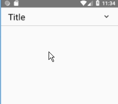

Last time when I went to an interview, I was asked to make a expandlable view, just like the ExpandableListView. I wrote down what I thought in the white board, which turns out true. But I am still interested in making a real one. So here it it.

## 1. What it looks like?


Every time you click the title, the layout will toggle to show or hide the content view. 

At our first glance, what might be the difficulties we have?
* How much height does the content view has?
* How to hide the content view at first, and then get its real height? 
* How to do the Animation?

## 2. Version 0.1 : static layout
It would be a good idea to just draw the static layout first when you try to draw a view and its animation. This way you break down the big issue into small issues.

Based on the layout of the title view and the content view, we obviously think that the layout could be a vertical LinearLayout. 

```java
public class ExpandableLayout extends LinearLayout {
        public void init() {  // called by constructors
            this.setOrientation(VERTICAL);
        }
}
```

Apparently every pages using ExpandableLayout may have different title view and content view. So the two children views should be customizable. Here, we leave it to the user. Users can add the children views they want in their layout xmls.

Hence, we require two, and only two, children views within this ExpandableLayout. Here is the code to get the children view. 

```java

```


